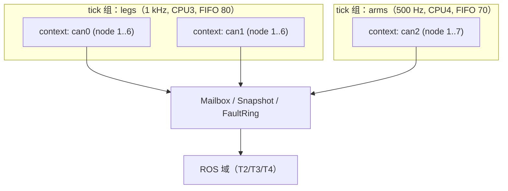
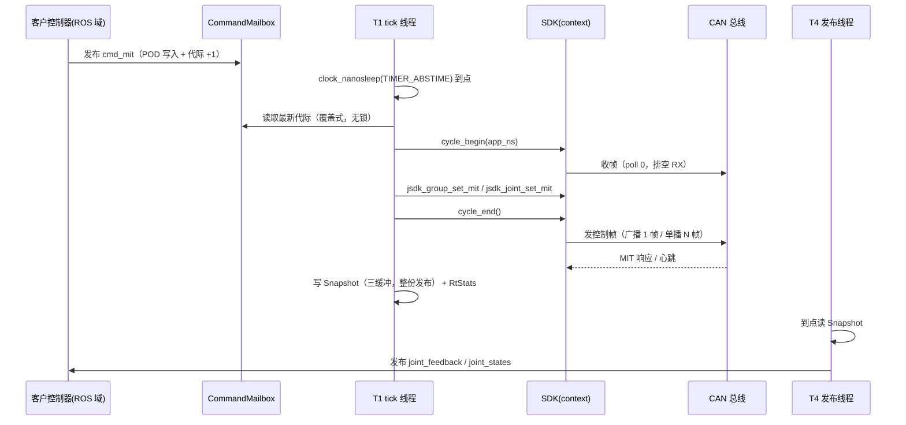
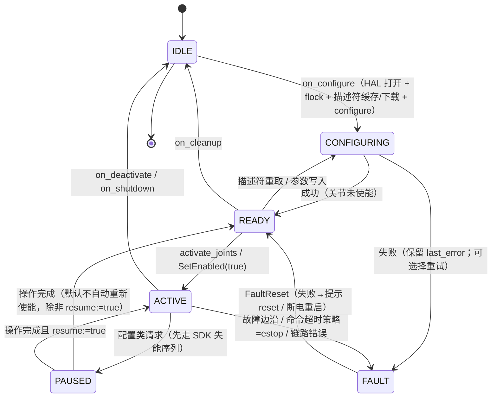

# CyberBeast Joint ROS 2 包（JointROS）设计方案

| 项 | 值 |
|---|---|
| 版本 | v0.1（评审稿） |
| 日期 | 2026-09-21 |
| 状态 | **评审中 —— 尚未编码**（本文档 + 用户确认是编码的前置条件） |
| 依赖 | `JointSDK`（CYBERBEAST / CAN 后端，`libjsdk_can`，`include/joint_sdk/joint_sdk.h`） |
| 主目标发行版 | ROS 2 **Lyrical**（最新 LTS）；**兼容 Jazzy 与 Humble** |

---

## 0. 文档说明

### 0.1 阅读顺序

1. §1 目标与范围 —— 先确认"我们要交付什么、不做什么"。
2. §2 约束：SDK 事实 → 设计边界 —— **本设计里所有硬约束都在这里，且有锚点**；不同意某条事实，后面的设计就要改。
3. §3 ADR —— 逐条决策的理由与代价，**这是需要重点评审的部分**。
4. §5~§8 —— 运行时架构、接口契约、性能、安全。
5. §9~§11 —— 兼容性、测试、工作包与验收标准。

### 0.2 术语

| 术语 | 含义 |
|---|---|
| **SDK** | `JointSDK`（CYBERBEAST CAN 后端）。纯 C99，零 malloc 核心，**不建线程** |
| **context** | `jsdk_context_t`：**一条 CAN 总线**的会话（含握手、描述符、关节、记账） |
| **关节（joint）** | 一个关节模组 = 总线上的一个 `node_id`。**注意与 URDF joint 的区别**（本设计里 URDF joint 一律写 `urdf joint`） |
| **tick** | 一次控制周期（`cycle_begin` → 写目标 → `cycle_end`） |
| **tick 组** | 共享同一 RT 线程与同一时间基准的一组总线（默认：一条总线一个组） |
| **RT 域 / ROS 域** | 前者是 `SCHED_FIFO` 的 tick 线程（无 DDS/无锁/无分配）；后者是 rclcpp 执行器线程 |
| **描述符** | 设备侧 JSON 端点表（实测 41029 B）。端点 ID 跨固件漂移率 86%，故 SDK 不内置静态表 |
| **M 端 / 输出端** | 电机端（turns）/ 关节输出端（rad）。SDK 统一对外给**输出端** |

### 0.3 与 SDK 文档的对应

| 本设计引用的 SDK 文档 | 用途 |
|---|---|
| `JointSDK/docs/DESIGN.zh-CN.md` | 协议事实（§2）、看门狗（§6.3）、使能序列（§6.4）、反馈来源（§6.5）、描述符（§6.6） |
| `JointSDK/docs/CLI.zh-CN.md` | 安全闸、退出码、`--json` 字段契约（我们沿用同样的哲学） |
| `JointSDK/docs/PORTING.zh-CN.md` | HAL 契约、描述符缓存两条路线、上电重试 |
| `JointSDK/docs/FIRMWARE_ISSUES.zh-CN.md` | 已知固件问题（F19/F28/F29 等），本设计的运维面必须把它们**显式暴露**给客户 |
| `JointSDK/docs/UNITS.zh-CN.md` | 单位与 `kp/kd` 换算（§6.6 的接口语义直接引用它） |

---

## 1. 目标与范围

### 1.1 目标

| # | 目标 | 可验证的成功判据 |
|---|---|---|
| G1 | **5 分钟可用**：客户拿到包 → 一条 `ros2 launch` → 关节按指令运动 | 新用户仅凭 README + 一条 launch 命令即可在真机跑通 MIT 控制（无自定义代码） |
| G2 | **高控制带宽** | 每 tick 组 1 kHz 起步、可配到 2 kHz；10 分钟压测**零丢 tick**（tick 数 = 期望值） |
| G3 | **低延迟** | 进程内 RT Hook 路径：命令产生 → 帧上线 ≤ 1 tick + 帧在网时间（§7.2 给出实测表） |
| G4 | **强并行** | 多条总线互不干扰（一条总线阻塞/报错不影响其它组 tick）；状态发布与诊断**不进** RT 路径 |
| G5 | **标准生态可用** | `ros2_control` 组件可直接配 `JointTrajectoryController` / `JointGroupPositionController`；`sensor_msgs/JointState` 可喂 RViz / MoveIt |
| G6 | **安全出厂** | 冷启动**不自动使能**；节点退出走 SDK 安全失能序列；有独立的"命令超时"闸；`estop` 语义明确 |
| G7 | **可诊断** | 任意故障都能在 `/diagnostics` + `~/faults` 里定位到**原始位**（不靠 `CAN_TIMEOUT` 这类摘要） |
| G8 | **零重复造轮子** | 协议/帧/端点/序列**全部**经 SDK；本包不出现任何 CAN 帧编码、端点硬编码 |
| G9 | **不欺骗** | 所有写操作返回 `requested` / `value`（读回）/ `verified` 三元组；不可知的量一律显式标"未知/无法校验" |

### 1.2 非目标（明确不做）

| # | 非目标 | 理由 |
|---|---|---|
| N1 | 不实现协议栈、不看 CAN 帧、不做端点表 | G8；SDK 已覆盖，重复实现必然分叉 |
| N2 | 不做运动学/步态/WBC 算法 | 客户自己的领域；我们只提供**通道**（含 RtHook） |
| N3 | 不做 EtherCAT（IgH/SOEM）后端 | SDK ADR-1：同符号、**互斥链接**。本包与 EtherCAT 版不可同进程 |
| N4 | 不做网页/图形化上位机 | 有 `jsdk-cli`/Python 绑定；本包只出 ROS 原生工具 |
| N5 | 不替客户改设备配置（看门狗、心跳、node_id）除非显式开关 | SDK `enable_watchdog_hint` 默认 0 的同一态度 |
| N6 | 不保证 Windows 上的生产实时性 | Windows 仅作为开发/调试平台（§9.3） |
| N7 | 不提供跨主机的多主站同步 | 协议本身是"末次 master 胜出"；同总线多主站是**错误用法**（§8.7） |

### 1.3 客户画像与首要诉求

| 客户 | 首要诉求 | 本设计的对应 |
|---|---|---|
| **人形** | 20~30 关节、双腿/WBC 1 kHz、关节同步、总线规划容易踩坑 | 多总线 + 同步 tick 组（§5.2）；每总线 ≤7 关节的**硬性规划建议**（§7.1）；广播下发（§7.1） |
| **机器狗** | 4 腿 12 关节、跳跃需要瞬时高力矩/低延迟、电池电压/温度监控 | 广播 + 心跳反馈（§7.1）；`vbus/ibus/温度` 进 `joint_feedback`；`estop` 一键（§8.4） |
| **外骨骼** | 左右腿跨总线同步、柔顺力控（SI 刚度/阻尼）、安全第一 | 同步 tick 组；`MIT` 的 SI 增益模式（§6.6）；命令超时 → 泄力（§8.3） |
| **工业机械臂** | ros2_control + MoveIt、位置/速度/力矩模式、参数与标定流程规范 | `ros2_control` 组件（§3 ADR-6）；CSP/CSV/CST 模式接口；标定/回零/参数服务（§6.2） |

---

## 2. 约束：SDK 事实 → 设计边界

> 每条都注明**证据来源**。凡"未实测"的，本设计不当作既成事实（§12 未决项）。

### 2.1 线程模型

| 事实 | 来源 | 设计后果 |
|---|---|---|
| SDK **不创建任何线程**、控制路径不阻塞 | `joint_sdk.h` 头注释「线程模型」 | RT 线程由**我们**建；SDK 只在其中被调用 |
| 一个 `jsdk_context_t` **必须只被一个线程**访问 | 同上 | 每个 context 绑定**唯一** owner 线程；服务类阻塞调用必须"让出所有权"（§5.4 状态机） |
| 控制循环 = `cycle_begin(app_time_ns)` → 写目标 → `cycle_end()`，全过程 RT 安全（无锁/无分配/无日志） | `jsdk_context_cycle_begin/end` 注释 | RT 路径里**只能**出现这几个调用（§5.5 禁则清单） |
| 配置类 API **阻塞**，且 `desc_fetch/calibrate/home/param` 在**关节使能时禁止调用** | `jsdk_context_configure/desc_fetch` 注释、`jsdk_joint_calibrate` 注释 | 必须实现"安全暂停序列"（先失能 → 执行 → 恢复）；见 §5.4 |
| `jsdk_context_activate()` 是阻塞且内部**自己跑周期** | `jsdk_context_activate` 注释 | 与 tick 线程**互斥**，绝不能并发调 |

### 2.2 总线与寻址

| 事实 | 来源 | 设计后果 |
|---|---|---|
| 一个 context = 一条 CAN 总线 | `jsdk_hal_*_open` 工厂 + HAL 契约 | 多总线 = 多 context（§5.1/§5.2） |
| 同一总线若有**两个 master 进程**，设备只会记住"最后见到的 master_id" | DESIGN §2.6 第 5 条 + 现场经验 | **单 master 纪律**：`flock` 锁 + 明确报错（§3 ADR-9、§8.7） |
| 广播（`0x80..0x83`）用 `Dest` 位图寻址，**只有 node_id 1..7 可被寻址**；MIT FD 槽位号 = `node_id`，帧长 = `(max_id+1)×8`（node 1..6 → 56 B；1..7 → 64 B） | DESIGN §2.6 第 4 条、`src/core/jsdk_group.c` 文件头 | 同步广播**每总线上限 7 关节**；>7 必须拆总线（写成客户硬性规划建议） |
| 广播**永不回复** | DESIGN §2.3 注、`cb_ctrl_expects_response` | 反馈只能靠心跳 / 单播控制帧的 MIT 响应 / 主动查询（§7.1 策略） |
| `JSDK_MAX_JOINTS_STATIC` 默认 **8**，`JSDK_CONTEXT_MAX_SIZE` 6144（两者必须一起改） | `joint_sdk.h` §5.5 注释 | 我们**不假设**编译期常量：启动时用 `jsdk_context_size()` 精确分配（§3 ADR-12）；同时要求 SDK 以 `JSDK_MAX_JOINTS_STATIC ≥ 每总线关节数` 编译，并在 `add_joint` 返回 `NO_MEMORY` 时给出可操作报错 |
| `master_id` 禁止 0（设备将完全不回复） | DESIGN §2.6 第 6 条 | 参数校验：`master_id ∈ 1..254`，非法直接 fail-fast |

### 2.3 控制与反馈

| 事实 | 来源 | 设计后果 |
|---|---|---|
| MIT 响应的回复 MsgType 仍是 `0x00`，且**必须容忍"未请求的 MIT 响应"** | DESIGN §2.1「响应解复用规则」 | 反馈不能依赖"一问一答"的时间对齐 → 我们只信 `age_ms` 与 `valid`（§6.1） |
| 心跳 `0x48`：默认 100 ms，端点 `heartbeat_rate_ms` 可配，**0 = 关闭**；含 pos/vel(电机端)/温度/Vbus/Ibus/子系统错误位 | DESIGN §2.3；`dump-config` 实测字段 | 心跳是**最便宜的均匀反馈源**（每帧约 90 µs @FD-18B）→ 反馈策略的核心选项（§7.1） |
| 坐标系陷阱：MIT 响应/查询是**输出端**；心跳与 `QUERY_POS_VEL` 是**电机端 turns** | DESIGN §2.3 注 | 我们**只**用 SDK 已归一化的输出端值，绝不自己换算 |
| 4-bit `ErrorCode` 是**摘要**（`ERROR_ESTOP_REQUESTED` 与 `CAN_BUS_FAILED` 都报成 `CAN_TIMEOUT`；过压报成 `UNDER_VOLTAGE`） | DESIGN §2.4 | 诊断里**必须**同时上报摘要与原始位（`hb_error` 位图、`axis_error` 32-bit）；`err_name` 类摘要在 UI 里降级为"提示"，不作结论 |
| 看门狗：只有 `MsgType ≤ 0x03` / `0x80..0x83` 刷新计时；`CURRENT_CONTROL(0x04)` **不喂狗**；超时动作 = `ERROR_CAN_BUS_FAILED` + `disarm` | DESIGN §2.5 | `CURRENT` 模式必须显式告警；自动 keepalive 只在设备侧超时 > 0 时有意义（§7.3 第 4 条） |
| `break_timeout` 语义在 SDK 文档内**不一致**：DESIGN §2.5 说"0 当 100 ms 且无法关闭"（旧），公共头说"0 = 禁用"（新固件 `auto_stop_if_timeout()` 首句 return） | `docs/DESIGN.zh-CN.md` §2.5 vs `joint_sdk.h` §12 `jsdk_joint_set_watchdog_ms` 注释 | **我们按"0 = 禁用"实现**，并在 UI/诊断里显示"设备侧协议超时：关闭"；同时把这条文档矛盾报给 SDK 侧订正（§12 U2） |
| `jsdk_context_estop()` = `MsgType 0xC0` + `Dest=0xFF`（**全局广播**），载荷被忽略 | `src/core/jsdk_context.c` | 语义 = **整条总线所有节点**；文档与 UI 必须写清（§8.4） |
| estop 锁存后 `CLEAR_ERRORS` **清不掉**（真机 fw1545），只有 `reset`/断电可清；`error` 可写 0 但 ~120 ms 后回弹 | 现场实测（SDK 记忆/交付注记） | `estop` 服务的响应必须带**恢复指引**；不提供"自动重试等它好"的假象（§8.6） |

### 2.4 端点与描述符

| 事实 | 来源 | 设计后果 |
|---|---|---|
| 端点 ID 跨固件漂移 86%（v8：594 端点 / 0.5.13：480；471 共有路径中 405 个 ID 不同） | DESIGN §2.6 第 9 条 | 我们**绝不**在代码里写端点 ID；参数服务一律按**路径**（§6.2） |
| 描述符 41029 B：FD 1+662 帧（0.1~0.2 s）、Classic 1 M 1+6839 帧（1~2 s）；全量保留 ~24.9 KB RAM | DESIGN §6.6 实测表 | **必须缓存**：路线 B（原始 JSON + `(fw_version, crc)` 键）为默认（§3 ADR-10） |
| 下载期间禁止使能（50 帧/ms 灌入会挤掉控制帧触发看门狗） | `jsdk_context_desc_fetch` 注释 | 描述符获取只能发生在 `ACTIVE` 之前（状态机强制） |
| 同一总线 `(fw, crc)` 相同的节点只下载一次（`share_by_crc` 默认开） | `jsdk_desc_config_t` | 多关节总线上启动时间与帧数按"每总线一次"估 |
| 端点 ID 与类型来自描述符：`endpoint_lookup` **未命中返回 NOT_FOUND，不猜** | `jsdk_endpoint_lookup` 注释 | 参数服务的错误语义沿用："路径不存在"就是不存在，不做模糊匹配 |

### 2.5 交付面与许可

| 事实 | 来源 | 设计后果 |
|---|---|---|
| 安装后 `find_package(jsdk_can)` → 目标 `jsdk::can`；头文件装到 `include/joint_sdk/` | `cmake/jsdk_canConfig.cmake.in`、`CMakeLists.txt` install 段 | 默认走 `find_package`；另提供子模块/FetchContent 兜底（§3 ADR-15） |
| 许可证 **专有**（ADR-7） | DESIGN §3 ADR-7 | 本包同许可；**不引入**要求再分发的强 copyleft 依赖（§3 ADR-16） |
| 与 IgH/SOEM EtherCAT 版**同符号、互斥链接** | SDK 头「家族关系（重要）」 | 构建期 `JSDK_BACKEND_TAG` 守卫 + 文档明示禁止同进程；我们的 CMake 不做 EtherCAT 探测 |
| SDK 有 `jsdk_backend_name()` / `jsdk_abi_version()` / `jsdk_abi_types()` 自检面 | `joint_sdk.h` §0 | 节点启动**必须**自检（§8.1 第 2 步），沿用 Python 侧 `check_abi()` 的 fail-fast 哲学 |

---

## 3. 架构决策记录（ADR）

### ADR-1 包划分与命名：4 个包，前缀 `jr_`

**决策**：
- 命名前缀 **`jr_`**（`j` = joint，`r` = ros2；与 SDK 的 `jsdk_`/`jsdk-cli` 同风格）。
- 四个包：`jr_interfaces` / `jr_ros2`（RT 核心库 + 驱动节点 + 工具）/ `jr_ros2_control` / `jr_bringup`。
- `jr_ros2` 内部用**目标**（而非再拆包）隔离分层：实时核心 = 目标 **`jr_core`**（C++ 命名空间 `jr`，头文件 `include/jr_ros2/rt/`，**不链 rclcpp**）；节点层 = 目标 `jr_node` + 可执行 `jr_bus`；工具 = `jr_ctl` / `jr_hw_verify` / `jr_gen_config` / `jr_bus_plan` / `jr_latency_bench`。
- 话题默认命名空间 `/<robot>/jr/<bus_name>/…`；全局急停 `/jr/estop_all`；诊断 id `jr:<bus>` / `jr:<bus>/<joint>`；参数根键 `jr`；锁文件 `/var/lock/jr-<if>.lock`；缓存目录 `~/.cache/jr/`。

**理由**：
- `interfaces` 必须独立：客户自研控制器只依赖它（rosidl 生成规则要求独立包）。
- `ros2_control` 独立：不用 ros2_control 的客户（人形 WBC 自研）不必装 `hardware_interface`。
- 核心库（无 rclcpp 依赖）必须能让 **RT Hook** 与 `ros2_control` 组件共用同一份实时逻辑，杜绝"两套实现分叉"；但"分层"用**编译目标**隔离即可，不必为此再付一个包的样板成本（`jr_core` 后续需要时可零成本提升为独立包）。

**代价**：4 个包仍有 `package.xml`/CMake 样板；用 `jr_bringup` 作为唯一需要客户改的包来抵消。`jr_core` 的"不链 rclcpp"由 CI 断言守住（检查链接行里没有 `rclcpp`，变异测试：故意加一次依赖 → 断言必须失败）。

### ADR-2 RT 域与 ROS/DDS 域**彻底解耦**

**决策**：tick 由**自建线程**驱动，不是 ROS timer；两域之间只用无锁信箱/快照交换 POD。

**理由**：
- ROS 执行器回调调度不可预测（控制器数量、DDS 反压、参数回调都会拉长周期）；
- SDK 明确"一个 context 一个线程"，DDS 线程碰 context 就是数据竞争；
- RMW 选型（Fast-DDS/Cyclone/Zenoh）不应影响控制周期。

**代价**：命令最多晚 1 个 tick 生效（§7.2）；需要自己维护无锁交换原语与故障环（测试要覆盖**撕裂读**）。

### ADR-3 tick 组：默认"一总线一组"，可选**跨总线同步组**

**决策**：`tick_group` 是调度单位，包含 1..N 条总线；默认每组 1 条总线。

**理由**：跨总线的关节（外骨骼左右腿、人形髋膝分线）需要同一时间基准；同组内顺序执行 `cycle_begin/end`，`t0` 相同、差异可测（记录组内偏斜）。

**代价**：同组内总线数越多，单个 tick 越长（帧序发送），可能拖低最高频率 → 用"组内预算"检查（§7.1）在启动时给出上限建议。

### ADR-4 命令入口：MIT 为一级，模式化为二级

**决策**：主命令话题 `cmd_mit`（MIT：pos/vel/kp/kd/tau），另有 `cmd`（CSP/CSV/CST/CURRENT + 限制量）。

**理由**：CYBERBEAST 的能力核心是 MIT；人形/狗/外骨骼的客户控制器普遍用 MIT 语义；机械臂用 ros2_control 走 pos/vel/effort 接口。

**代价**：两条命令路径需要一致的安全策略（同一条"命令超时"闸）。

### ADR-5 `kp/kd` 的双语义**显式化**

**决策**：MIT 消息里带 `gain_mode`（`0 = WIRE` 原样透传 / `1 = SI` 按输出端真实刚度阻尼）。SDK 侧分别映射 `jsdk_joint_set_mit()` / `jsdk_joint_set_mit_stiffness()`。

**理由**：`kp` 在固件里作用在**电机端 turns 误差**上（等效输出端刚度 = `kp × gear_ratio / 2π`），这是客户最容易搞错的地方（SDK DESIGN §2.6 坑 #1）。让接口**无法含糊**，比在文档里写一句警告有效。

**代价**：消息多一个字段；文档必须给出换算示例。

### ADR-6 `ros2_control`：`SystemInterface` + `tick_source` 可配

**决策**：
- 提供 `jr_ros2_control`（`hardware_interface::SystemInterface`），导出 `position/velocity/effort` + 自定义 `kp/kd/torque` 命令接口（MIT 必需）。**该包是 P0 最优先交付项（§11）**。
- **命令接口按 `joints[].mode` 导出**（v0.11 落地，见 §13.4）：MIT → 三件套 + **一组**增益；
  CSP → 只 `position`；CSV → 只 `velocity`；CST → 只 `effort`。**帧里没有的物理量不导出**——
  导出了就是“写了没用”（客户在 YAML 里配刚度、控制器里写 kp/kd，然后什么也没发生）。
- ⚠ 两处硬约束（都是实测踩出来的，详见 §13.3-33）：
  ① URDF 里 `<command_interface>` 必须与导出集**逐一对上**——controller_manager 会拿它对账，
     对不上直接拒初始化硬件（`Discrepancy between robot description file (urdf) and actually
     exported HW interfaces`）；
  ② **同一控制器不能混模式**（JTC 默认 claim `position+velocity` ⇒ 混模式时必须拆控制器或只 claim 子集）。
- `CURRENT` **不映射**到 `effort`：单位会从 N·m 变成**电机端 A**（差 gear×kt，等于在接口里撒谎），
  且 CURRENT 帧不喂设备看门狗（F19）⇒ 初始化**直接拒绝**并指向 `~/cmd`。
- `tick_source` 参数：
  - `internal`（**默认**）—— 组件内部起 RT tick，`read()/write()` 只做信箱交换（常量时间，不做 I/O）；
  - `controller_manager` —— 由 controller_manager 的 update 线程驱动 `cycle_begin/end`（简单、时序单一，但抖动取决于控制器链与 CM 配置）。

**理由**：`internal` 让 CAN 周期与 CM 周期解耦（CM 100~500 Hz，CAN 可 1 kHz），并且同一个 context 能被非 ros2_control 的客户同时使用（同一进程内）；`controller_manager` 模式给"要最简、可接受的抖动"的客户和调试用。

**代价**：`internal` 模式下 `write()` 只入信箱 → 命令生效最多晚 1 tick（§7.2 已计入）。

### ADR-7 阻塞服务与 RT 的**互斥**：安全暂停状态机

**决策**：`BusStateMachine` 显式定义 `IDLE / CONFIGURING / READY / ACTIVE / PAUSED / FAULT`；任何阻塞型 SDK 调用都经 `ConfigQueue` 排队，由 tick 线程**在安全点**执行：先走 SDK 失能序列 → 置 `PAUSED` →（必要时）由非 RT 线程接管 context 执行阻塞调用 → 完成后恢复。

**理由**：SDK 明确禁止在使能时下载描述符/标定/改参数；且"一个 context 一个线程"的约束要求所有权显式转移。

**代价**：需要严格的所有权移交协议 + 超时兜底（避免服务把总线卡死）；服务响应时间受 tick 周期影响（~ms 级，可接受）。

### ADR-8 参数/端点服务：`requested / value / verified` 三元组 + 闸门

**决策**：
- 读：全开放（`ReadParams` / `ListEndpoints` / `LookupEndpoint`）。
- 写：必须 `confirm=true`；写后**读回验证**并**分别**返回 `requested`、`value`、`verified`、`persisted`。
- Flash 持久化（`CONFIG_SAVE`）需要**独立**开关 `allow_flash_persist`。

**理由**：SDK 的历史教训——"把请求值当结果打印"就是"说得比知道的多"；且 `break_timeout` 这类端点**读回恒为 0**（F28），必须让上层能看到"无法校验"这个事实。

**代价**：消息/服务结构略复杂；客户要理解三个字段的差别（文档 + 示例覆盖）。

### ADR-9 单 master 纪律：`flock` + 明确报错

**决策**：打开 HAL 前对 `/var/lock/jr-<if>.lock`（可配，Windows 下用 `%LOCALAPPDATA%`）取排他 `flock`；取不到 → 拒绝启动并**打印持有者 PID 与建议**。

**理由**：同总线两个 master 的症状（心跳乱跳、控制断续、参数偶发写不进）**极难现场定位**，而根因在部署方式。

**代价**：客户若真要多进程（例如调试工具并行），必须显式 `allow_shared_bus:=true`（并在诊断里持续告警）。**锁只能防本机**，跨机冲突靠文档（§8.7）。

### ADR-10 描述符缓存：路线 B（原始 JSON）默认

**决策**：`~/.cache/jr/<sanitized-serial-or-fw-crc>/desc.json` + 小头文件 `{fw_version, crc}`；启动时 `desc_import_raw()`，失败才下载，下载成功后写缓存。缓存目录、是否启用、最大容量均可配。

**理由**：路线 B 的失效键只有 `(fw, crc)` 两个，**改 filter / 升级 SDK 都不用重新下载**；路线 A（已解析结果）与 `retain/filter_paths/SDK 格式`三者绑定，现场最容易变成"缓存不命中但不报错"。缓存下载要求 `stop_when_satisfied = 0`，我们必须显式设置并校验 `desc_info.complete == 1` 后才落盘。

**代价**：缓存文件约 41 KB/设备型号；需要处理"写缓存失败"（只警告，不影响启动）。

### ADR-11 发行版兼容：**Lyrical 主目标，Jazzy/Humble 兼容**

**决策**：
- 基线语言：**C++17**（Humble/Jazzy/Kilted 的最低要求都是 C++17）。若 Lyrical 要求更高标准，用发行版分支探测（`CMAKE_CXX_STANDARD` 按 `${ROS_DISTRO}` 取），**不写死**。
- 构建：`ament_cmake`；依赖链接用 `target_link_libraries(x rclcpp::rclcpp ...)` 这类**目标式**写法（`ament_target_dependencies` 在新发行版里逐步退场）。
- 发行版差异点集中在一个适配层文件（`src/compat/distro_compat.hpp|.cpp`），条件编译只允许出现在那里（§9.2）。
- CI 三发行版矩阵（Humble/Jazzy/Lyrical 容器）**全绿**才算通过。

**理由**：客户分布在 Humble（存量）到 Lyrical（新项目），单一代码库 + 集中适配层是维护成本最低的方案；把 `#if` 散落到各处会变成灾难。

**代价**：`ros2_control` 的 API 在新发行版有变更（如 `HardwareComponentInterfaceParams`），适配层要写两套 `on_init` 分支（§12 U3）。

### ADR-12 内存与分配：配置阶段分配，RT 路径零分配

**决策**：所有 RT 需要的缓冲（信箱、快照、故障环、CAN 帧池）在 `on_configure` 一次性分配；context 存储用 `jsdk_context_size(&cfg)` **精确分配**（而非依赖 `JSDK_CONTEXT_MAX_SIZE` 常量）；描述符 arena 也用 `jsdk_desc_arena_size()`。

**理由**：SDK 的编译期常量（`JSDK_MAX_JOINTS_STATIC` / `JSDK_CONTEXT_MAX_SIZE`）会随编译选项变化；用运行时查询的结果分配，**避免"库与头文件常量不一致 → 静默写溢出"**这一类最危险的回归。

**代价**：启动时多一次分配；需要 `mlockall` 覆盖（已包含在 RT 初始化里）。

### ADR-13 故障：**只上报，不自动"修好"**

**决策**：
- 故障边沿（SDK `set_fault_callback`）→ RT 侧只写 SPSC 环；非 RT 线程发布 `~/faults` + 更新 diagnostics。
- 恢复动作**只有**三种，均由参数显式开启：`none`（默认）/ `disable_joint` / `estop_bus`；`fault_reset` 只允许由服务显式触发（可配一次性自动重试 + 退避）。

**理由**：estop 锁存清不掉（§2.3）；"自动重试直到好"会把确定性故障掩盖成间歇故障，正是 SDK 文档反复反对的做法。

**代价**：客户要自己接 `~/faults` 做策略（`bringup` 里给一个参考实现）。

### ADR-14 度量是一等公民

**决策**：节点内置 `RtStats`（tick 抖动、cycle 耗时、命令→发帧、信箱覆盖、丢 tick）+ `BusStatus`（帧计数、总线占用估计、反馈最老 age），10 Hz 发布并同时映射到 diagnostics。

**理由**："性能要强悍"必须**可证伪**：任何优化都要拿出抖动/延迟数字；客户现场也能自证"我是不是没绑核/没设权限"。

**代价**：RT 路径要读一次单调钟并做常数时间更新（亚 µs 级开销，可接受）。

### ADR-15 JointSDK 的获取方式：`find_package` 为主，三种并行支持

**决策**：`jr_ros2`（含 `jr_ros2_control`）的 CMake 按优先级探测：
1. `find_package(jsdk_can CONFIG REQUIRED)` —— 已安装的 SDK（**推荐**，客户/产线）。
2. `JSDK_SOURCE_DIR` 指向 SDK 源码目录 → `add_subdirectory`（开发阶段、需要把 `JSDK_MAX_JOINTS_STATIC` 加大时）。
3. `FetchContent`（可选开关，便于 CI 拉固定版本）。

三种方式都**必须**打印实际用到的 SDK 路径与版本并在启动自检里核对 ABI。

**理由**：客户的交付形态不一（源码集成 / deb / 内部镜像）；同时强制"SDK 路径可见"能避免"链到旧库"这类事故（我们已经在 Python 绑定上踩过 ABI/旧 DLL 的坑）。

**代价**：CMake 稍复杂；需要在文档里把三种方式各写一遍（且都要真跑过）。

### ADR-16 许可与分发

**决策**：本包与 SDK 同许可（**专有**，仅授权客户随产品分发）；不引入 GPL/AGPL 类依赖。`jr_interfaces` 也随包专有，不单独放公开仓库（除非后续商务决定开放）。

**理由**：与 SDK ADR-7 一致；避免"接口包开源、实现专有"带来的许可/分发复杂度与法务审查成本。

**代价**：不能在公开论坛贴完整代码求助（答案需脱敏）；`rosdep` 无法从公共源解析本包与 SDK（私有 apt 源/压缩包交付，文档写清）。

---

## 4. 包结构与依赖

```
JointROS/
├── README.md
├── docs/
│   ├── DESIGN.zh-CN.md              # 本文档
│   ├── INTEGRATION.zh-CN.md         # 客户集成指南（P0 交付物）
│   ├── SAFETY.zh-CN.md              # 安全清单与上电/下电 SOP
│   ├── PERF.zh-CN.md                # 性能实测报告（模板 + 复现命令）
│   └── TROUBLESHOOT.zh-CN.md        # 现场故障手册（含 SDK 已知固件问题）
├── jr_interfaces/                   # msg/srv（仅依赖 std_msgs / builtin_interfaces）
├── jr_ros2/
│   ├── include/jr_ros2/
│   │   ├── rt/                      # ★无 rclcpp 依赖
│   │   │   ├── bus_rt.hpp           # context 所有权 + tick 循环
│   │   │   ├── mailbox.hpp          # 命令信箱（覆盖式 + 原子代际）
│   │   │   ├── snapshot.hpp         # 状态快照（三缓冲发布）
│   │   │   ├── fault_ring.hpp       # SPSC 故障环
│   │   │   ├── tick_group.hpp       # 多总线同组调度
│   │   │   ├── rt_sched.hpp         # SCHED_FIFO / 绑核 / mlockall
│   │   │   ├── bus_plan.hpp         # 总线预算模型
│   │   │   ├── rt_hook.hpp          # 客户控制器插件接口
│   │   │   └── compat/distro_compat.hpp
│   │   └── ros/                     # 节点层
│   ├── src/rt|ros|tools/
│   └── test/                        # gtest 单元/集成（虚拟总线）
├── jr_ros2_control/                 # SystemInterface 插件
├── jr_bringup/                      # launch / config / urdf / demo 控制器
└── tools/                           # 构建与自检脚本（与 SDK 同风格）
```

| 包 | 依赖（关键） | 说明 |
|---|---|---|
| `jr_interfaces` | `rosidl_default_generators`, `std_msgs`, `builtin_interfaces` | 客户可只装它 |
| `jr_ros2` | `rclcpp`, `rclcpp_lifecycle`, `rclcpp_components`, `diagnostic_updater`, `jsdk::can` | 核心库目标 `jr_core` **不依赖** rclcpp（只有 `src/ros/` 依赖）；工具可执行文件都在本包 |
| `jr_ros2_control` | `hardware_interface`, `pluginlib`, `jr_ros2`(核心库 `jr_core`), `jsdk::can` | 同进程内**只能有一个** owner 持有总线（ADR-9 的进程内版本：`flock` 会挡住自己 → 用进程内注册表检测重复 owner） |
| `jr_bringup` | `launch`, `launch_ros`, `robot_state_publisher`, `joint_state_broadcaster`, `joint_trajectory_controller`（示例用） | 客户唯一需要改的包 |

---

## 5. 运行时架构

### 5.1 线程与优先级（每 tick 组）

| 线程 | 调度 | 职责 | 禁止 |
|---|---|---|---|
| **T1 tick 线程** | `SCHED_FIFO`（默认优先级 80）、绑核、`mlockall` | `ConfigQueue` 安全点检查 → 命令信箱取最新目标 → `cycle_begin` → 写目标（`jsdk_joint_set_mit` / `jsdk_group_set_mit`）→ `cycle_end` → 写状态快照 + 度量 | DDS、日志、`mutex`、`malloc`、`printf`、异常、条件等待 |
| **T2 ROS 执行器** | CFS | 订阅/发布/服务/参数（除配置类服务） | 触碰 `jsdk_context` |
| **T3 配置执行器** | CFS | 配置类阻塞 SDK 调用（在 T1 让出所有权后） | 在 `ACTIVE` 状态直接执行 |
| **T4 发布计时器** | CFS | 抽稀发布 `joint_feedback` / `joint_states` / `bus_status` / `rt_stats` | 触碰 `jsdk_context` |

线程数上限：`1 + 3` 每 tick 组（默认一总线一组）。可用 `single_threaded_ros:=true` 把 T2/T3/T4 合成一个执行器（低配板子）。

### 5.2 tick 组与多总线



规则：
- 一个 `context` **只属于一个** tick 组；
- 组内 tick 顺序固定（按配置顺序），记录**组内偏斜**（`t0` 到各 context `cycle_begin` 的差）并上报；
- 组内总线数 × 每总线帧数 × 帧时间 ≤ `tick 预算 × 60%`（启动检查，§7.1）。

### 5.3 一次 tick 的时序



关键点：**命令生效最多晚 1 tick**；`T4` 的发布频率与 `T1` 完全无关（可 500 Hz 发布 1 kHz 的数据）。

### 5.4 总线状态机



**所有权移交协议**（`ACTIVE → PAUSED`）：

1. ROS 域把请求写入 `ConfigQueue`（含 `request_id`），置 `pending=1`；
2. T1 在安全点看到 `pending`：调用 SDK 失能序列（`jsdk_joint_hold_position` → 等 2 周期 → `request_disable` → 等 `IDLE`）→ 写 `owner = ROS` → 置 `ready=1` → **暂停自己**（不再碰 context）；
3. T3 执行阻塞调用（`desc_fetch` / `param` 读写 / `calibrate` / `home` / `reset_device` 等）；
4. T3 完成后置 `done=1` + 结果 → T1 恢复 `owner = RT`；
5. 按 `resume` 决定回 `ACTIVE`（重新走 SDK 使能序列）还是留在 `READY`。

超时兜底：`T3` 卡死超过 `service_hard_timeout_ms`（默认 180 s，`calibrate` 需要）→ 强制回 `READY` 并标记 `FAULT`，服务返回超时错误（不静默）。

### 5.5 RT 路径禁则清单（评审与 code review 的硬性检查项）

| 禁止 | 原因 | 替代 |
|---|---|---|
| `publish()` / `spin` / 任何 rclcpp 调用 | 不可预测延迟、可能分配 | 写快照，T4 发布 |
| `malloc/new` / `std::string` / `std::vector` 扩容 | 分配器可能锁/缺页 | 预分配 POD 数组 |
| `mutex` / `condition_variable` / `future` | 优先级反转 | 无锁信箱/快照、原子标志 |
| `printf` / `RCLCPP_*` / `rosout` | 系统调用、可能阻塞 | 写 SPSC 日志环，非 RT 线程输出 |
| `throw` / 异常路径 | 非确定 | 返回码 + 状态位 |
| 文件/网络/`sleep` | 阻塞 | — |
| 直接访问 `jsdk_context_t` 以外的共享状态 | 数据竞争 | 只经 mailbox/snapshot |

---

## 6. 接口契约

### 6.1 消息（`jr_interfaces`）

> 消息类型引用一律写作 `jr_interfaces/msg/<Name>`；服务为 `jr_interfaces/srv/<Name>`。

**`JointFeedback.msg`**（快照的逐关节投影；`valid` 表示**本周期有新数据**）

| 字段 | 类型 | 单位/说明 |
|---|---|---|
| `header` | `std_msgs/Header` | `stamp` = tick 起始的单调时刻换算（§6.6） |
| `name` | `string` | 关节名（与 YAML/URDF 对齐） |
| `position` / `velocity` / `effort` | `float64` | rad / rad·s⁻¹ / N·m（**输出端**，`effort` 为估算值） |
| `current` | `float64` | 电机端 A（解码 MIT 响应电流；依赖 `torque_constant`） |
| `motor_temperature` / `fet_temperature` | `float64` | °C |
| `bus_voltage` / `bus_current` | `float64` | V / A（来自心跳） |
| `age_ms` | `uint32` | 距上次有效反馈 |
| `status_flags` | `uint32` | SDK `JSDK_JF_*` 位（含 `FEEDBACK_STALE`、`WATCHDOG_RISK`、`WATCHDOG_UNVERIFIED`、`TARGET_REJECTED` …） |
| `mode_state` | `uint16` | 固件原始 nibble（0..7），排障用 |
| `error_code` | `uint8` | MIT 4-bit 摘要 |
| `heartbeat_error` | `uint8` | 心跳 5-bit 子系统位图（**原始位，优于摘要**） |
| `axis_error` | `uint32` | 32-bit 子系统错误位（来自 `QUERY_ERROR`，未查则为 0） |
| `online` / `enabled` / `calibrated` / `valid` | `bool` | 状态谓词 |

**`JointFeedbackArray.msg`**：`header` + `JointFeedback[] joints`。

**`MitCommand.msg`**

| 字段 | 类型 | 说明 |
|---|---|---|
| `name` | `string` | 关节名 |
| `gain_mode` | `uint8` | `0 = WIRE`（`kp/kd` 原样透传）/ `1 = SI`（`stiffness/damping` 输出端物理量） |
| `position` / `velocity` | `float64` | rad / rad·s⁻¹ |
| `kp` / `kd` | `float64` | 仅 `WIRE` 模式使用 |
| `stiffness` / `damping` | `float64` | 仅 `SI` 模式使用（N·m·rad⁻¹ / N·m·s·rad⁻¹） |
| `torque` | `float64` | N·m 前馈 |
| `enable` | `bool` | `true` = 本条命令同时请求使能（可选，见 §8.1） |

**`MitCommandArray.msg`**：`header` + `MitCommand[]`。**语义**：只更新列出的关节；未列出的关节保持上一次目标（**不**自动泄力——泄力由命令超时策略负责，§8.3）。

**`JointCommand.msg` / `JointCommandArray.msg`**：模式化命令（`~/cmd`）。`mode ∈ {CSP=8, CSV=9, CST=10, CURRENT=11}`，字段 `target`（单位随模式：输出端 rad / rad·s⁻¹ / N·m，CURRENT 是**电机端** A）、`velocity_limit`（CSP；0 = 不限制）、`current_limit`（CSV/CURRENT；0 = 不限制）；换算责任都在 SDK 侧，本包逐字透传。**规则**：`mode` 必须与该关节使能时的模式（`joints[].mode`）一致 —— 不一致的命令被**拒绝并计数**（`RtStats.cmd_rejected`），不静默改模式（切模式是 disable→enable 的阻塞动作，ADR-7 窗口才能做）。CURRENT 另有两处特殊性：设备对该帧**不回响应**（不是 `is_ctrl`），且它不喂设备侧 `break_timeout`（SDK F19）—— 见 §13.3-32。

**`BusStatus.msg`**

| 字段 | 说明 |
|---|---|
| `bus`, `link_up`, `nodes_online` | 身份与链路 |
| `tx_frames` / `rx_frames` / `tx_failed` / `rx_dropped` / `keepalive_sent` / `link_errors` | SDK `jsdk_bus_state_t` 原样映射 |
| `last_rx_age_ms` / `hal_bus_flags` | 链路新鲜度与 HAL 自报状态位 |
| `bus_load_estimate` | `float32`，0..1（按 §7.1 模型估计，**声明为估计值**） |
| `tick_overruns` / `command_overwrites` | 丢 tick 次数 / 命令被覆盖次数（实时性健康度） |

**`RtStats.msg`**：`rate_hz`、`period_ns`、`jitter_ns`（min/mean/max/p99）、`cycle_ns`（min/mean/max）、`cmd_to_tx_ns`（mean/p99）、`snapshot_to_pub_ns`、`missed_ticks`、`config_pauses`。

**`JointFault.msg`**：`name`、`event ∈ {APPEARED=1, CLEARED=2}`、`error_code`、`heartbeat_error`、`axis_error`、`motor_error`/`encoder_error`/`sensorless_error`/`controller_error`/`system_error`、`text`（SDK `jsdk_joint_describe_fault()` 的一行文本）、`advice`（见下表）。

`advice` 枚举（把 SDK 的经验固化成客户可编程的信号）：`NONE / RETRY_FAULT_RESET / NEEDS_DEVICE_RESET / CHECK_BUS_TERMINATION / CHECK_BUS_CONFIG / REDUCE_RATE_OR_RAISE_WATCHDOG / CHECK_TEMPERATURE / CHECK_SUPPLY_VOLTAGE / CALIBRATION_REQUIRED`。

### 6.2 服务（`jr_interfaces`）

通用返回约定：`bool success` + `string message`（含 SDK `last_error` 原文）+ 每项结果数组（**批量优先**）。

| 服务 | 请求 | 响应要点 |
|---|---|---|
| `SetEnabled` | `string[] joints`, `bool enable`, `bool resume`, `uint32 timeout_ms` | 逐关节 `result[]` + `last_error[]`；`enable=false` 走 SDK 安全失能序列（幂等） |
| `Calibrate` | `string[] joints`, `uint32 timeout_ms`（默认 180000，**≥ SDK 的 120 s**） | 前置条件：未使能（服务内部暂停）；完成后读回 `pre_calibrated`，**读回为 true 才算成功** |
| `Home` | 同上 | — |
| `SetZero` | `string[] joints` | 不落 Flash；响应注明 |
| `SaveConfig` | `string[] joints` | 需要 `allow_flash_persist=true` |
| `ResetDevice` | `string[] joints`, `bool confirm` | 之后需重新握手/configure（服务内部处理）；`advice` 提示可能回旧 node_id |
| `SetNodeId` | `string name`, `uint8 new_id`, `bool persist` | 沿用 SDK 的总线**冲突探测**；冲突 → 失败 + 说明"会产生两个同号设备" |
| `FaultReset` | `string[] joints`, `bool allow_device_reset` | 失败时 `advice = NEEDS_DEVICE_RESET`（estop 锁存实测清不掉） |
| `ReadParams` | `string[] joints`, `string[] paths` | 逐项 `{path, type, value_*, status}`；混合类型用独立字段 + `type` 判别 |
| `WriteParams` | `ParamWrite[] writes`, `bool persist`, `bool confirm` | 逐项 `{path, requested, value, verified, persisted, status}`（ADR-8） |
| `ListEndpoints` | `string bus`, `string filter`, `uint32 max` | 端点 `{path, id, type, access}`；`filter` 支持 SDK 的精确/前缀/段前缀语义 |
| `LookupEndpoint` | `string bus`, `string path` | `{found, id, type, access}`（未命中即 `found=false`，**不猜**） |
| `GetDeviceInfo` | `string bus`, `string joint` | `{hw_version, fw_version, serial, classic}` |
| `GetBusStats` | `string bus` | `BusStatus` 同构 |
| `GetDescriptorInfo` | `string bus` | `{total_len, crc, fw_version, endpoint_count, parsed_total, frames_rx, complete, mode_used, shared_hit, from_cache}` |
| `ExportDescriptor` / `ImportDescriptor` | `string bus` → `uint8[] data` + `uint16 crc` + `uint32 fw_version`；导入再加 `uint16 crc` / `uint32 fw_version`（**必填的语义**）与 `bool persist` | 产线预烧与离线检查。⚠ `crc`/`fw_version` 是**设备侧属性**，从 JSON 正文推不出来 —— SDK 的 `jsdk_context_desc_import_raw()` 要求 hint **非空**（`!hint` ⇒ `INVALID_ARG`，值可为 0）。⚠ `persist`（写设备 Flash）**本 SDK 版本无此能力** ⇒ 传 true 会被**明确拒绍**（不静默忽略）。响应里 `crc` = 版本 CRC（回显），`data_crc32` = 导入字节的 CRC32（两者不是一回事） |
| `Jog` | `string joint`, `float64 position`, `float64 kp/kd/torque`, `float64 duration_s`（硬上限 10 s）, `bool confirm` | 限时 + 需确认；对标 CLI 的 `--yes --hold`；返回实际执行时长与退出原因 |
| `PublishHeartbeatHint` | `string bus`, `uint32 rate_ms`, `bool persist` | **不自动执行**：只回建议值与影响评估（帧/秒、总线占用增量）（ADR-5/§8.5） |

> ⚠ **表里写的是服务
> **类型名**（`SetEnabled`），节点实际注册的是 **snake_case** 名字
> （`~/set_enabled`）。这是个容易把人坑掉的双重命名：`ros2 service list` / `ros2 service call`
> 用后者，而文档/头文件里的是前者。`jr_ctl` 用一个很小的 `snake_case_of()` 做转换，
> 并由端到端用例（`jr_ctl_services`，真起节点）守住两边一致；
> **排障时以 `ros2 service list` 为准，不要信任任何"应当叫这个名字"的推测**（§13.3-36）。

### 6.3 话题与 QoS

| 话题（`~/` 下） | 类型 | QoS | 频率 |
|---|---|---|---|
| `cmd_mit` | `MitCommandArray` | `reliable`, depth=1, `keep_last` | 客户控制器率 |
| `cmd` | `JointCommandArray` | `reliable`, depth=1 | 同上 |
| `joint_feedback` | `JointFeedbackArray` | `best_effort`, depth=1 | 默认 500 Hz（可配） |
| `joint_states` | `sensor_msgs/JointState` | `best_effort`, depth=1 | 默认 100 Hz |
| `bus_status` | `BusStatus` | `reliable`, depth=1 | 10 Hz |
| `rt_stats` | `RtStats` | `reliable`, depth=1 | 10 Hz |
| `faults` | `JointFault` | `reliable`, depth=10 | 事件边沿 |
| `estop` | `std_msgs/Bool`（`true` = 触发） | `reliable`, depth=1 | 事件 |
| `/jr/estop_all` | `std_msgs/Bool` | `reliable`, depth=1 | 事件（**所有**总线节点订阅；各总线依次广播，§8.4） |

**为什么 `depth=1` + `best_effort`（状态类）**：实时控制里"旧的关节状态"没有价值，队列积压只会增加延迟。命令也用 `depth=1`：覆盖式语义（ADR-2）与之一致。

### 6.4 参数（YAML）

```yaml
jr:                              # 参数根键 = 包前缀
  # ── 调度与实时 ────────────────────────────────────────────────
  rt:
    enabled: true                 # false = 纯 CFS（调试用，抖动不保证）
    policy: fifo                  # fifo | other | deadline(P2)
    priority: 80
    mlock: true
    cpu_affinity: [3, 4]          # 每个 tick 组依次取一个
    warn_if_throttled: true       # 检查 /proc/sys/kernel/sched_rt_runtime_us
  tick_groups:
    - name: legs
      rate_hz: 1000               # 1 kHz 起步，最高 2000
      buses: [can0, can1]         # 同组 = 同一时间基准（§5.2）
    - name: arms
      rate_hz: 500
      buses: [can2]
  buses:
    - name: can0
      type: socketcan             # socketcan | pcan | slcan | virtual
      interface: can0
      is_fd: true
      master_id: 1                # 1..254（0 会被 SDK 拒绝）
      bitrate: {nominal: 1000000, data: 5000000}   # 仅用于与链路核对
      joints: [FL_hip, FL_knee, ...]               # ≤7（广播同步上限，§7.1）
    - name: virt
      type: virtual               # 无硬件：SDK 内置设备模型（CI/演示）
      spec: "0:id=1,gear=16.5,pmax=12.5,vmax=65,tmax=50,hb=10,timeout=30000,fd"
  joints:
    - {name: FL_hip, bus: can0, node_id: 1}        # 量程/gear_ratio 从设备读（不手抄）
      # mode: mit | csp | csv | cst | current（默认 mit）。**使能时**的模式，运行期不可改：
      # 命令面必须与它一致（`~/cmd`），否则命令被拒并计入 `RtStats.cmd_rejected`。
      # ros2_control 也支持非 MIT 模式（按模式导出接口，v0.11）：CSP/CSV/CST 可用，
      # CURRENT 会被拒绝（effort 的单位语义），此时请用 `~/cmd` 或改 `mode: mit`。
  limits:                                          # 可选：URDF 对齐的软限位（越界策略见 §8.3）
    FL_hip: {position: [-0.7, 0.7], velocity: 20.0, effort: 40.0, stiffness: 200.0, damping: 5.0}
  feedback:
    source: broadcast_plus_heartbeat               # broadcast_plus_heartbeat | unicast_poll | heartbeat_only | unicast_only
    heartbeat_ms: 5                                # 仅作为"建议值"，除非 arm_device_config=true
    poll_period_ms: 10                             # unicast_poll：轮转周期
    publish_hz: 500
    joint_state_hz: 100
  command:
    interpolation: none                            # none | linear（tick 率高于控制器率时用）
                                                   # linear = 核心在 tick 上把**运动量**从旧目标线性推到新目标
                                                   #   （MIT 的 pos/vel/tau、CSP 的 pos、CSV 的 vel、CST 的 tau、CURRENT 的 A）；
                                                   #   增益与限制量**不插值**（按最新值立即生效）；首条命令一律立即生效
    timeout_ms: 100
    timeout_action: hold                           # hold | zero_torque | disable | estop
  safety:
    auto_enable: false                             # 冷启动不使能（G6）
    require_calibrated: true                       # 未标定 → 拒绝使能并提示
    arm_device_watchdog: false                     # ↔ SDK enable_watchdog_hint，默认不动客户设备
    clamp_target: false                            # ↔ SDK clamp_target_position
    on_exit_action: disable                        # hold | zero_torque | disable | estop | none
    fault_action: none                             # none | disable_joint | estop_bus
    fault_auto_reset: {enabled: false, max_attempts: 1, backoff_ms: 1000}
  params:
    allow_write: false                             # 参数写服务总闸（ADR-8）
    allow_flash_persist: false
  descriptor:
    cache_enabled: true
    cache_dir: ~/.cache/jr
    timeout_ms: 5000
    retries: 3
    retry_backoff_ms: 100
    retain: filtered                               # filtered | all
  bus_lock:
    enabled: true
    lock_dir: /var/lock
    allow_shared: false                            # 显式并行（诊断里持续告警）
```

### 6.5 诊断契约

| `hardware_id` | 关键项 |
|---|---|
| `jr:<bus>` | `link_up`、`tx/rx/tx_failed/rx_dropped/last_rx_age`、`hal_bus_flags`（含 listen-only/error-passive/bus-off）、`nodes_online`、`bus_load_estimate`、`tick_overruns`、`rt_throttled`、`descriptor_complete`、`descriptor_from_cache`、`lock_owner` |
| `jr:<bus>/<joint>` | `online`、`enabled`、`calibrated`、`age_ms`、`position/velocity/effort`、`温度`、`vbus`、`mode_state`、`error_code(含文本)`、`heartbeat_error(位名)`、`axis_error(最低位 + 位名)`、`status_flags` 逐位、`tx_rejected`、`watchdog_state(关闭/已武装/未校验)` |

设计原则：**诊断里出现的每个结论都必须能追到原始数据**（位图、计数、读回值）；摘要文本一律附在原始值之后。

### 6.6 单位、符号与时基约定

| 项 | 约定 |
|---|---|
| 单位 | 一律 SI / ROS 约定：rad、rad·s⁻¹、N·m、A、V、°C（输出端）。**不**暴露度/RPM/0.01A 等线上单位（逃生通道见 `cmd` 的 `CURRENT` 模式；文档注明"电机端 A"） |
| 符号 | 与设备一致（SDK 已归一化）；本包**不做**方向翻转，翻转属于 URDF/机械安装的职责 |
| `header.stamp` | tick 起始的**单调**时刻换算到 ROS 时间基（启动时记录一次 `steady↔ros` 偏置；`use_sim_time=true` 时**拒绝**以仿真时间做控制，仅在状态里打标记） |
| 时延口径 | 所有 `*_ns` 度量用 `CLOCK_MONOTONIC` 差值；跨主机/跨设备的时间戳**不**参与控制判定，仅作记录 |

---

## 7. 性能设计

### 7.1 总线预算模型（客户规划工具 + 启动强制检查）

**帧在网时间**（`jr_bus_plan` 的实现值；含 SOF/仲裁/CRC/ACK/EOF/IFS，填充位按**平均**估计，
即每 5 个可填充位约 1 个 stuff 位 —— 因此是**工程估计值**而非最坏情况上界）：

| 帧型 | 帧时间（实现值） |
|---|---|
| Classic 1 Mbps，8 B（含 29-bit ID） | **155 µs** |
| FD 1 M/5 M，8 B | **80.6 µs** |
| FD 1 M/5 M，18 B（心跳） | **100.6 µs** |
| FD 1 M/5 M，56 B（广播，node 1..6） | **173.6 µs** |
| FD 1 M/5 M，64 B（广播，node 1..7） | **189.0 µs** |

**场景对比：6 关节 @ 1 kHz（FD 1 M/5 M，`jr_bus_plan` 实测输出）**

| 反馈/下发策略 | 帧/s | 总线占用 | 每关节反馈率 | 结论 |
|---|---|---|---|---|
| 全单播 MIT | 6000 TX + 7200 RX | **118.1%** | 1000 Hz | ❌ 物理不可能 |
| **广播 + 轮询 1 关节** | — | **39.5%** | ≈167 Hz + 心跳 | ✓ |
| **广播 + 心跳 5 ms**（默认） | — | **29.4%** | 200 Hz 均匀 | ✓✓ |
| Classic 1 M 全单播 | — | **232.1%** | — | ❌ 物理不可能 |

**由此得出两条强制建议（2026-09-21 已确认；写进集成指南，并由启动预算检查强制执行）**：
1. **生产必须 CAN FD**；Classic 仅用于上电与调试（slcan 更只适合配置/低速）。
2. **每条总线 ≤7 关节**（广播同步上限）；>7 请拆总线——这既是协议限制，也避免把总线推到 80% 以上。

**启动强制检查**：按配置算出 `占用 = Σ(帧时间 × 每 tick 帧数 × rate) / 1 s`，与 `max_bus_load`（默认 0.6）比较：
- 超限 → **拒绝启动**并给出**可操作建议**（换策略 / 降频 / 拆总线 / 提速率）；
- 60%~80% → 允许启动但 WARN，并在 `bus_status` 里持续显示；
- 该模型同时用于 `jr_gen_config` 与 `jr_bus_plan` 工具，让客户**先算再上机**。

### 7.2 延迟预算（1 kHz，FD，空闲总线）

| 路径 | 组成 | 期望 | 实测（待填） |
|---|---|---|---|
| **RtHook（进程内，同 tick）** | 控制器计算 → 同 tick 发帧 | ≈ 帧在网 + 驱动（0.2~0.3 ms） | — |
| **RtHook（相位对准** `tick_phase_us`**）** | 同上，命令在 tick 前写入 | ≈ 0.3 ms | — |
| 进程内 DDS（intra-process） | + 1 tick（≤1 ms）+ 10~30 µs | ≤ 1.05 ms | — |
| 跨进程 DDS（loopy/udp） | + 1 tick + 100~500 µs | ≤ 1.5 ms | — |

> 说明：`cmd_to_tx_ns` 度量的是"ROS 域写入信箱时刻 → `cycle_end` 发出帧时刻"，与上表口径一致；实测值在 `PERF.zh-CN.md` 里按发行版/内核/RMW 三种组合各出一份。

### 7.3 措施清单

1. **自建 tick + 绝对时间睡眠**（`clock_nanosleep(CLOCK_MONOTONIC, TIMER_ABSTIME)`）→ 无累积漂移。
2. `SCHED_FIFO` + 绑核 + `mlockall(MCL_CURRENT|MCL_FUTURE)`；启动检查 `sched_rt_runtime_us`（= -1 才不节流），不满足 → WARN + 诊断标记。
3. RT 路径零分配、零锁、零 DDS（ADR-12 + §5.5）。
4. **自动 keepalive 与设备看门狗的协同**：仅在"设备侧超时 > 0"时由 SDK 补喂；设备侧为 0（禁用）时不补帧也不置风险位。我们**不擅自**武装客户设备（`arm_device_watchdog` 默认 false），但会计算并提示"该周期下建议的 `break_timeout`"。
5. **广播下发**（`jsdk_group_set_mit`）默认开启；组内不满足条件时 SDK 会**降级单播**——我们把降级原因**周期上报**（否则客户以为还在广播）（SDK 文档明确要求这一点）。
6. **反馈策略可配**：`broadcast_plus_heartbeat`（默认）/ `heartbeat_only` / `unicast_poll`（轮转）/ `unicast_only`（`tx_rejected`、`age_ms` 逐关节可观测）。
7. 发布与 RT 解耦 + 抽稀 + 可选 intra-process；`joint_states` 与 `joint_feedback` 可分别配率。
8. `runtime_ipc` 用**覆盖式信箱**（无队列积压）；覆盖次数进 `RtStats`。
9. SocketCAN 调优：`CAN_RAW_RECV_OWN_MSGS=0`、`SO_RCVBUF/SO_SNDBUF` 放大（避免 ENOBUFS 被记成 `tx_failed`）、可选 `CAN_RAW_ERR_FILTER`；**不**修改链路位定时（与 SDK 姿态一致）。
10. 可选 **RtHook**（§7.4）：客户的控制器直接跑在 T1 里，端到端无 DDS。
11. P2：`recvmmsg` 批量收 + 内部 RX 环的薄 HAL 包装（契约允许内部缓冲，"取一帧"语义不变）；`SO_TXTIME` 定时发送；硬件时间戳。

### 7.4 RtHook（可选、进程内、零 DDS）

```cpp
namespace jr::rt {
struct StateView {          // 只读、无锁、本 tick 快照
  uint64_t tick; uint64_t t_ns; unsigned joint_count;
  const JointState* joints; // POD 数组
  const BusStats*   buses;
};
struct CommandWriter {      // 写本 tick 目标（SDK 调用由核心库负责）
  void mit(unsigned idx, double pos, double vel, double kp, double kd, double tau);
  void mit_si(unsigned idx, double pos, double vel, double stiff, double damp, double tau);
  void estop();
};
class RtHook {
public:
  virtual ~RtHook() = default;
  virtual bool init(const HookConfig&, std::string& err) = 0;      // 非 RT
  virtual void step(const StateView&, CommandWriter&) noexcept = 0; // RT：禁分配/禁锁/禁 I/O
  virtual void shutdown() noexcept = 0;
};
}
```

- 加载方式：`pluginlib`（ROS 生态一致）或静态链接（客户自研）；参数 `rt_hook.plugin`。
- 提供**示例实现**（正弦扫频 / PD 保持）+ 抖动基准测试，让客户照抄。
- 约束：`step()` 不得抛出、不得分配；`init()` 可分配。核心库在 hook 前后插入 `RtStats` 采样，hook 耗时单独计一列（`hook_ns`），便于定位"是我的算法慢还是 CAN 慢"。

### 7.5 性能验收阈值（P0 必须达标）

| 指标 | 目标 | 测试条件 |
|---|---|---|
| tick 抖动 p99 | ≤ 50 µs | 1 kHz，PREEMPT_RT，绑核，7 关节广播 + 心跳，负载 50% CPU，10 分钟 |
| 丢 tick | 0（10⁶ tick） | 同上 |
| `cycle` 耗时（含 CAN I/O） | ≤ 150 µs（mean）、≤ 300 µs（max） | 同上 |
| `cmd_to_tx_ns` p99 | ≤ 1.2 ms | 进程内 DDS，1 kHz |
| 发布 500 Hz 时的抖动影响 | p99 抖动增量 ≤ 10 µs | 对比开关 `joint_feedback` 发布 |
| 总线占用（默认策略） | ≤ 25% | 6 关节 @1 kHz，FD 1 M/5 M |

---

## 8. 安全设计

### 8.1 启动序列（`on_configure` → `on_activate`）

1. 解析参数并**校验**（`master_id ∈ 1..254`、joint 数 ≤ 每总线上限、每个 node_id 唯一且未被复用、`rate_hz` 与 `timeout_ms` 合法）。
2. **SDK 自检**：`jsdk_backend_name() == "cyberbeast-can"`、`jsdk_abi_version()` 匹配、`jsdk_abi_types()` 尺寸对拍 → 不符**立即失败**（不"带病启动"）。
3. 取 `flock`（ADR-9）→ 打开 HAL → 报告实际链路（FD/Classic、位定时核对、`CAN_RAW` 状态）。
4. 描述符：`import_raw`（缓存）→ 失败则 `desc_fetch`（默认 3 次重试、100 ms 退避，对应 slcan 首帧丢失 ~1/10 的现场现实）→ 成功后落缓存（校验 `complete == 1`）。
5. `configure()`：读 `gear_ratio` / `mit_max_*` / `torque_constant`；若 `unit_scale.valid == 0` → 判为**未标定**，打印明确指引（`SetZero`/`Calibrate` 服务）。
6. 总线预算检查（§7.1）+ 设备 `heartbeat_rate_ms` / `break_timeout` **现状报告**（只说事实与建议，**不改**）。
7. 若 `limits` 与设备 `mit_max_*` 冲突（URDF 比设备量程大）→ **拒绝启动**（防"上电就撞限"）；仅内部软限位更紧时 → WARN。
8. 启动 tick 线程 → `READY`。**只有** `auto_enable: true` 才继续走 `activate_joints`。

### 8.2 退出序列（`on_deactivate` / `on_shutdown` / 析构）

按 `on_exit_action`：
- `disable`（默认）：`jsdk_context_deactivate()`（安全帧 → 等 2 周期 → `STOP_MOTOR` → 等 IDLE）；
- `hold`：`jsdk_joint_hold_position_pd()`（PD 锁位，**会继续出力**，需显式选择）；
- `zero_torque`：`jsdk_joint_hold_position()`（泄力）；
- `estop`：广播 `0xC0`；
- `none`：什么都不做（**仅**调试用，文档标红：会留下抱力关节或看门狗故障码）。

无论哪种，都先停止接受新命令、再停 tick、最后关 HAL；SIGINT/SIGTERM 走同一路径（`rclcpp` 的 `on_shutdown` + 信号处理），并保证**幂等**（重复调用安全）。

### 8.3 命令超时与陈旧反馈

| 检查 | 默认 | 动作 |
|---|---|---|
| 命令超时（无新 `cmd*`） | 100 ms | `hold`（PD 锁位，用 `limits.stiffness/damping`，缺省则用上一次的 kp/kd）；可配 `zero_torque` / `disable` / `estop` |
| 反馈陈旧（`age_ms` 超阈值） | 20 ms（≥3 tick） | 置 `FEEDBACK_STALE`、诊断 ERROR、`faults` 上报；**不**自动动关节（除非 `fault_action` 开启） |
| 目标越界 | 与 SDK 一致 | 默认**拒绝 + 本周期发安全帧**（SDK 语义）；可选 `clamp_target` 静默钳位；两种情况都计数并在反馈里可见 |
| 链路错误 | — | `hal_bus_flags`（bus-off/error-passive/listen-only）→ 诊断 ERROR + `advice = CHECK_BUS_TERMINATION/CONFIG`；RT 侧按 SDK 语义继续按周期尝试（不退出进程） |

### 8.4 `estop` 语义（必须写清楚，避免客户误解）

- `estop` 是**整条总线的全局广播**（`Dest=0xFF`）：**该总线上所有节点**（包括不是我们管的设备）都会收到并 `disarm`。
- RT 路径可直接触发：`estop` 话题收到后由 T1 在**下个 tick** 发出（比服务更快，且不依赖服务响应）。
- 触发后节点状态转 `FAULT`，**不自动恢复**（ADR-13）；`FaultReset` 服务尝试 `CLEAR_ERRORS`，失败时返回 `advice = NEEDS_DEVICE_RESET`（真机实测 estop 锁存只能靠 `reset`/断电清）。
- `/jr/estop_all`：所有总线节点订阅，各自广播；文档明确"各总线按各自 tick 依次发出，**不保证跨总线同时**"。

### 8.5 写操作闸门

| 操作 | 闸门 |
|---|---|
| 运动类（`Jog`、`cmd_mit` 生效） | `auto_enable`/`activate_joints` + `SetEnabled`；`Jog` 另需 `confirm=true` + 限时 |
| 参数写 | `params.allow_write=true` **且**请求 `confirm=true` |
| Flash 持久化（`save`/`persist`） | `params.allow_flash_persist=true` **且** `confirm=true` |
| 改设备通讯配置（`heartbeat_rate_ms`、`break_timeout`、`node_id`） | 上述两条 + `advice` 影响评估（预计帧率/总线占用变化） |
| `ResetDevice` / `estop` | `confirm=true`（estop 的**话题**路径不需要确认——安全动作不该因为少个字段而失败，与 SDK CLI 同哲学） |

### 8.6 故障恢复手册（随包交付，`TROUBLESHOOT.zh-CN.md` 的核心内容）

| 现象 | 首要判据 | 处理 |
|---|---|---|
| 使能失败（`bad-state` / `timeout`） | `joint_feedback.axis_error` 原始位 + `advice` | `FaultReset` → 仍失败 → `ResetDevice` / 断电重启 |
| `error_code = CAN_TIMEOUT` | **不要**直接当作通信问题：estop 与看门狗都会映射成它 | 查 `heartbeat_error` 位与 `axis_error` 位；查 `watchdog_state` 与 `break_timeout` |
| 命令周期性报 `control period ≥ break_timeout` | SDK 的周期校验 | 降到 ≤ `break_timeout/2` 或由客户显式关掉/放大设备超时（我们只建议，不擅自改） |
| 写入成功但值不变 | `verified=false` | 看 `requested/value/verified`；`break_timeout` 属已知"读回恒 0"（F28）→ 显示"无法校验"而不是"失败" |
| 关节不动但一切正常 | `mode_state`（是否 MIT/POS）、`tx_active`、是否被**降级单播** | 查 `bus_status.command_overwrites` 与降级原因文本 |
| 抖动大 / 丢 tick | `rt_stats` + `rt_throttled` | 绑核、`sched_rt_runtime_us=-1`、提高优先级、减少同核负载 |

### 8.7 单 master 与多机

- 同机：`flock` 强约束（ADR-9）。
- 跨机（两台 PC 接同一条 CAN）：**不支持**。协议层"末次 master 胜出"会导致心跳/响应交错、参数写偶发失败；文档明示，并在诊断里检测"收到非我方 master 的心跳 Dest"这种迹象（可做，P1）。
- **不能在节点运行时再跑 `jsdk-cli`**：这是最常见的现场误用 → README/手册**首屏**写明，并说明"节点运行时的诊断请用 `jr_ctl`（走服务）"。

---

## 9. 兼容性与平台矩阵

### 9.1 发行版（ADR-11）

| 发行版 | 定位 | 平台基线 | 语言基线 | 状态 |
|---|---|---|---|---|
| **Lyrical**（最新 LTS） | **主目标**：新项目、性能与特性验收基准 | Ubuntu **26.04**；CMake **4.2.3**；gcc **15.2.0** | C++17（实测可编）/ Python **3.14**；默认 RMW 仍为 Fast-DDS（`rmw-fastrtps-cpp` 9.4.x） | **已实测**（容器）：`ctest` 10/10 + `colcon test` **11 tests/0 failures**（§13.2）；旧签名兼容经编译探测自动切到新签名 |
| **Jazzy** | 兼容（Tier 1 支持） | Ubuntu 24.04；CMake 3.28.3；gcc 13.3；Fast-DDS 2.14 / Cyclone 0.10.4 | C++17 / Python 3.12 | **已实测**：`ctest` 9/9 + `colcon test` 11 tests/0 failures（§13.2，容器） |
| **Humble** | 兼容（存量客户，支持到 2027-05） | Ubuntu 22.04；CMake 3.22.1；gcc 11.4；Fast-DDS 2.6 / Cyclone 0.9 | C++17 / Python 3.10 | **已实测**：`ctest` 9/9 + `colcon test` 11 tests/0 failures（§13.2，容器） |
| Kilted | 顺带（不承诺） | Ubuntu 24.04 | C++17 | 若 CI 能过就声明支持 |

CI：三发行版容器矩阵；每发行版跑 `colcon build` + 单元/集成测试；性能报告**只在 Lyrical + PREEMPT_RT** 上作为正式数据（其余为参考）。

### 9.2 发行版 API 差异清单（**只允许**出现在 `compat/distro_compat.hpp|.cpp`）

| 差异点 | Humble | Jazzy / 更新 | 处理 |
|---|---|---|---|
| `hardware_interface` 初始化签名 | 只有 `on_init(const HardwareInfo&)` | Jazzy 两个都有（旧的 `[[deprecated]]`）；**Lyrical 起旧签名已删** | 适配层 `OnInitParams` + `info_of()` + `make_params()`；**判定交给编译器**（`__has_include` 判新签名参数类型的头 + 静态断言确认该签名真是基类虚函数），**不猜版本号、不用 CMake 探测**（§13.3-18） |
| `project()` 的 `LANGUAGES` | 可不写 `C` | **CMake 4 起**：语言未声明就查编译器特性 → 硬报错 *No known features for C compiler* | 所有含 C 源（`jsdk`）的包写 `project(<name> C CXX)` |
| `hardware_interface::CallbackReturn` / `return_type` | 一致 | 一致（注意 `::ERROR` vs `::FAILURE` 的语义细节） | 统一映射 |
| CMake 依赖写法 | `ament_target_dependencies` 可用 | 逐步退场 | 统一用 `target_link_libraries` + 显式 `find_package` |
| `generate_parameter_library` | Humble 有，但版本较老 | 成熟 | **P0 手写**参数解析；P1 评估迁移（避免一上来被工具版本绑死） |
| RMW 默认/可用集 | Fast-DDS 2.6、Cyclone 0.9 | Fast-DDS 2.14、Cyclone 0.10、Kilted 起 Zenoh Tier 1 | RMW 选择交给客户；性能报告标注 RMW |
| `rclcpp` intra-process / 执行器 | 基本可用 | 有改进（含回调组/执行器行为调整） | 只用最稳定的 API 面；RtHook 不受影响（不走 DDS） |

### 9.3 平台

| 平台 | 定位 | 说明 |
|---|---|---|
| **Ubuntu + PREEMPT_RT** | **生产** | 唯一给出正式性能数据的平台（§7.5） |
| Ubuntu（通用内核） | 可用 | 抖动更大；节点会在诊断里标记 `rt_throttled`/未绑核等 |
| WSL2 | **开发** | 可编译、可跑虚拟总线、可连 USB-CAN（需 usbipd）；**不保证**实时性能，性能测试结果不作数 |
| Windows 10/11 | 仅开发/调试（N6） | ROS 2 在 Windows 可跑；PCAN/slcan 后端可用；**不建议**生产 |
| ARM64 SoC（客户主控）/ Yocto | 目标（P1 验证） | 用 SDK 的 SocketCAN 后端；交叉编译文档 + `rosidl` 交叉编译注意事项 |

### 9.4 交叉编译与嵌入式注意

- SDK 是纯 C99、零 malloc 核心 → 与客户的根文件系统无冲突；我们的核心库为 C++17，需在目标上有 `libstdc++`。
- `colcon` 交叉编译：参考 ROS 2 的 `cross_compile` 方案（`CMAKE_TOOLCHAIN_FILE` + sysroot）；本包**不引入**除 SDK 外的本地依赖。
- 若客户主控算力有限：可用 `single_threaded_ros:=true` + 降低发布频率 + 关闭 `joint_feedback` 的高频发布（保留 `joint_states`）。

---

## 10. 测试与验证策略

### 10.1 分层

| 层 | 手段 | 覆盖 | 运行环境 |
|---|---|---|---|
| L1 单元 | 自写测试骶架 + **虚拟总线**（SDK 内置设备模型） | 三缓冲/SPSC 撕裂读（多线程压力）、总线预算模型、参数校验、超时策略、状态机迁移（含非法迁移拒绝） | CI，无硬件 |
| L2 集成 | `launch_testing` + 虚拟总线 | 节点生命周期、话题/服务契约、诊断项存在性与取值合理性、`estop` 路径、退出动作（发到"设备模型回读"层面） | CI，无硬件 |
| L3 契约 | 与 SDK 文档逐条对照的**表驱动测试** | 单位换算、`gain_mode` 两种语义、`requested/value/verified` 语义、错误码映射 | CI |
| L4 真机分层自检 | `hw_verify`（对标 SDK `tools/hw_verify.sh`） | 只读巡检 → 描述符 → 心跳 → 单关节读 → 批量读 → 写探针（**写原值+Δ → 校验 → 无论成败恢复 → 再校验**）→ 运动（需 `--motion` 显式开关 + 自限时） | 客户现场/我们的台架 |
| L5 性能 | `latency_bench` | §7.5 全部阈值 + CPU 占用 + 内核/RMW 维度对比 | PREEMPT_RT 台架 |
| L6 变异测试 | 主动注入缺陷 | 例：把 mailbox 改成非原子（应触发撕裂读用例失败）；把超时策略关掉（应触发安全用例失败）；把广播降级原因上报删掉（应触发"降级必须可见"用例失败） | CI |

### 10.2 必须存在的"证伪"用例（**否则不算完成**）

| 断言 | 为什么必须 |
|---|---|
| 冷启动后**没有任何控制帧**发出（用虚拟总线抓帧计数证明） | 防"上电即驱动" |
| 退出（含 SIGINT）后，设备模型回到 IDLE 且无"停发即看门狗故障" | 防现场留故障码 |
| 命令超时触发后，动作与配置一致，且 `faults`/诊断可见 | 防"静默失控" |
| 广播被降级为单播时，`bus_status`/日志里**必定**出现原因 | SDK 文档明确要求 |
| `WriteParams` 在 `verified=false` 时**不得**返回 success | 防"说得比知道的多" |
| 描述符下载被中断 → 缓存**不落盘**（`complete==0` 时拒绝写缓存） | 防用坏缓存启动 |
| 同接口二次启动节点 → 第二个进程**拒绝启动**且提示锁持有者 | 防双 master |
| 参数越界/非法 `master_id` → 启动失败并打印可操作信息 | 防"带病运行" |

### 10.3 CI 矩阵

`{Lyrical, Jazzy, Humble} × {no-hardware 全部测试}` + 单独 job：`{Lyrical} × {真机冒烟(自托管 runner)}`；性能 job 手工触发（需要 RT 内核机器）。

---

## 11. 工作包与验收标准

| WP | 内容 | 验收标准 |
|---|---|---|
| **WP0** 骨架与构建 | 4 包骨架、CMake（SDK 三种获取方式）、发行版矩阵、ABI 自检、`README` | 三发行版容器 `colcon build` 全绿；ABI 自检对"故意链旧库"场景**必须失败**（变异验证） |
| **WP1** RT 核心库 | `bus_rt`/`mailbox`/`snapshot`/`fault_ring`/`tick_group`/`rt_sched`/`bus_plan`/`rt_hook` | L1 全绿；多线程撕裂压测 10⁶ 次无错；预算模型与手算表格一致（§7.1 数字对拍） |
| **WP2** 驱动节点 | lifecycle 节点、话题/服务/诊断/参数、单 master 锁、描述符缓存 | L2 全绿；§10.2 全部用例存在并通过 |
| **WP3** ros2_control（**P0 最优先**） | `SystemInterface`（含 `kp/kd/torque`）、`tick_source` 两模式 | 三发行版各跑通 `JointTrajectoryController` 示例（虚拟总线）；发行版适配层编译通过；**与 WP2 并行**（先冻结 `jr_core` 接口，两侧消费者同时开工） |
| **WP4** 工具 | `jr_ctl`（对标 `jsdk-cli` 子命令但走服务）、`jr_gen_config`、`jr_bus_plan`、`jr_hw_verify`、`jr_latency_bench` | 工具自身有测试；**能跑虚拟总线（因此可进 CI）**；`jr_gen_config` 生成的 YAML 能被节点直接加载。 **已落地（v0.12）：`jr_hw_verify` + `jr_gen_config`**；**（v0.14）：`jr_bus_plan` + `jr_ctl`**（前者同属非 ROS 薄 CLI，后者走 19 个服务跑在**真节点**上）。三条验收口径的**逐条证据**：① 工具测试 = ctest `tools_virtual` + `jr_ctl_services`；② 虚拟总线 = 后端由配置 `type: virtual` 决定（**不是** `--if` 开关，见 §13.4），`tools_virtual` 与 `jr_ctl_services` 跑的都是虚拟总线，三发行版绿；③ 生成配置→**节点** = `jr_ctl_services` 第 ⑦ 段（生成 → 起 `jr_bus` → configure+activate → 关节 `j3` 被识别）。`jr_latency_bench` **仍未实现**：P1，要有真机才有意义（不做虚假的“闭环性能已验”） |
| **WP5** 运维修补 | 描述符导出/导入、参数批量、故障建议码、心跳/看门狗建议值 | 服务契约测试全绿 |
| **WP6** 文档 | `INTEGRATION` / `SAFETY` / `TROUBLESHOOT` / `PERF` / README（含"不要与 jsdk-cli 同跑"首屏警告） | 文档里的**每条命令都在真机/虚拟总线上跑过**（沿用 SDK 的硬规矩） |
| **WP7** 示例 | 虚拟总线 demo、单关节 demo、人形 2 总线示例、（可选）MoveIt 示例、URDF 片段生成说明 | `ros2 launch` 一条命令可复现；示例有 CI 冒烟。 **已落地（v0.16）**：新包 `jr_bringup`（launch/config/urdf/docs）+ ctest `launch_smoke`。逐条证据：① *一条命令可复现* = `ros2 launch jr_bringup vbus_demo.launch.py`（2 关节）/ `joints:=1` / `jog:=true` / `humanoid_2bus.launch.py`，都是**真跑**（见 `launch_smoke` 的 4 段）；② *CI 冒烟* = `launch_smoke` 在 colcon 阶段跑，断言"节点真的走到 active + 服务/话题真的建起来 + `jr_ctl` 真的调得通"。**未做**（如实登记）：MoveIt 示例、JTC demo 的 launch 包装（`jr_ros2_control/test/jtc_demo/run.sh` 已是端到端入口，含 launch 文件；再包一层 `ros2 launch` 留待 WP8 之后） |
| **WP8** 测试与性能 | L1~L6 + §7.5 阈值 | 性能报告出数字；未达标项**必须**记录在案并给出后续动作（不允许"看起来还行"） |
| **WP9** 交付与发布 | 版本策略（与 SDK 版本绑定表）、私有 apt/tarball 交付说明、`rosdep` 私有源说明 | 在一个干净容器里按文档从零装到跑通（**真跑一遍**） |

**优先级**（2026-09-21 二次评审确认）：
- **P0 最优先 = WP3（`ros2_control` 组件）**；与 WP2 并行推进，前置动作是**冻结 `jr_core` 接口**。
- P0 其余 = WP0 → WP1 → WP2 → WP4(`jr_ctl`/`jr_hw_verify`) → WP6/WP7/WP8 的基线部分（+WP3 收尾）。
- P1 = WP4 其余工具、WP5、RtHook、跨总线同步组。
- P2 = §7.3 第 11 条的 CAN 侧优化（`recvmmsg`/`SO_TXTIME`/硬件时间戳）、`SCHED_DEADLINE`、Zenoh/多机文档。

**WP4 的收尾口径（v0.14 定稿，避免"看起来做完了"）**：WP4 行的三条验收口径逐条对证据 ——
① *工具自身有测试*：ctest `tools_virtual`（4 个工具中的 3 个非 ROS 工具）+ `jr_ctl_services`（真起节点，19 个服务）；
② *虚拟总线可进 CI*：后端由配置 `type:` 决定，两条 ctest 跑的都是虚拟总线，三发行版绿；
③ *`jr_gen_config` 生成的 YAML 能被节点直接加载*：`jr_ctl_services` 第 ⑦ 段真跑
"生成 → 起 `jr_bus` → configure + activate → 识别到只存在于生成文件里的关节 `j3`"
（此前只证到加载器级别，v0.14 补上节点级别）。同一条 ctest 的断言清单用 `ctest -V` 数出
**60 项检查 / 0 失败**（`ctest` 对通过的用例不打印输出）。

因此 **WP4 的收尾 = 上述三条 + 4/5 工具**；**不算进收尾**的三项如实登记：
- `jr_latency_bench`（P1：实时性能要有真机才有意义）；
- `jr_hw_verify --write-probe`（写进 `--help` 的**非目标**：体检工具不写设备，保持只读）；
- §13.4 的偏差只剩一条：`calib` / `home` 的**真机**路径未验证（`ImportDescriptor` 往返已在 v0.15 修好并加了回滚护栏）

---

## 12. 风险与未决项

| # | 项 | 影响 | 计划 |
|---|---|---|---|
| U1 | **Lyrical 的具体平台/语言基线未实测**（REP-2000 抓取被反爬拦截） | 兼容性矩阵与 C++ 标准分支 | **已关闭（2026-09-22）**：容器实测 Ubuntu 26.04.1 / gcc 15.2.0 / CMake 4.2.3 / Python 3.14，C++17 够用；已回填 §9.1。**C++ 标准不写死分支**（实测不需要） |
| U2 | **SDK 文档内部矛盾**：`DESIGN §2.5` 说"`break_timeout=0` 当 100 ms、无法关闭"，公共头说"0 = 禁用" | 客户会误判"设备有保护" | **暂不处理（用户决定 2026-09-21）**：本包按"0 = 禁用"实现并在 UI/文档明示"设备侧协议超时：关闭"；不作为阻塞项 |
| U3 | `ros2_control` 在新发行版的初始化 API 变更 | WP3 适配层工作量 | **已缓解（2026-09-22）**：不猜版本号、也不靠 CMake 探测，而是用**编译器事实**判定（`__has_include` + 静态断言）；三发行版实测各自走到正确分支（Humble=legacy，Jazzy/Lyrical=modern）并跑通组件测试 + JTC 端到端。下一发行版再改签名时，静态断言会**带人话**立刻报错（§13.3-18 証伪记录） |
| U4 | SDK `JSDK_MAX_JOINTS_STATIC`（8）是否可配/加大 | 单总线关节数上限 | **暂不处理（用户决定 2026-09-21）**：本包用 `jsdk_context_size()` 运行时精确分配 + 启动自检 + 可操作报错兜底，不依赖它是否可配 |
| U5 | `break_timeout` 读回恒 0（F28）/ estop 锁存清不掉（F29） | 现场"以为修好了" | 沿用 SDK 语义：区分 `verified` 与 `requested`、给出 `advice`；文档写清 |
| U6 | 协议硬限制：广播 ≤7 关节/总线、跨总线不同步 | 客户机械/电气规划 | §7.1 写成**强制建议**（已确认）；`jr_bus_plan`/`jr_gen_config` 工具把规划错误**提前拦住** |
| U7 | 抖动目标（p99 ≤ 50 µs）在客户主板 + 通用内核上不可达 | 期望管理 | 明确"正式性能数据只在 PREEMPT_RT + 绑核下给出"，并提供 `rt_throttled`/绑核状态诊断 |
| U8 | slcan 后端帧率低（Classic 100~500 fps） | 客户用 CANable 想跑 1 kHz | 启动预算检查会**直接拒绝**这种组合并解释原因（而不是跑起来再报错） |
| U9 | 私有许可下的分发（deb/私有 rosdep 源） | 交付便利性 | WP9 交付演练；与商务确认分发范围 |
| U10 | 是否要支持"同进程内同时使用 ros2_control 组件与驱动节点" | 会变成两个 owner | **禁止**：同接口只允许一个 owner；进程内注册表 + `flock` 双重检测（P0 实现） |

---

## 13. 实现进展与已验证范围（WP0 / WP1）

### 13.1 已实现

| 文件 | 内容 |
|---|---|
| `jr_ros2/include/jr_ros2/jr_status.hpp` | 状态码 + **可编程恢复建议**（Advice）+ Result |
| `jr_ros2/include/jr_ros2/jr_config.hpp` | 配置模型 + 默认值 + `validate_config()`（唯一闸门） |
| `jr_ros2/include/jr_ros2/jr_command.hpp` | 命令集（POD，掩码语义 = 只更新列出的关节） |
| `jr_ros2/include/jr_ros2/jr_snapshot.hpp` | 快照 POD（关节/总线/RT 度量，含组级与总线级备注分开） |
| `jr_ros2/include/jr_ros2/rt/jr_triple_buffer.hpp` | 无锁三缓冲（命令信箱与状态快照共用）+ `has_value()` |
| `jr_ros2/include/jr_ros2/rt/jr_spsc_ring.hpp` | 故障事件环（满时**丢新**并计数） |
| `jr_ros2/include/jr_ros2/rt/jr_bus_plan.hpp` | 总线预算模型（帧在网时间 + 场景评估 + 可操作建议） |
| `jr_ros2/include/jr_ros2/jr_abi_check.hpp` | SDK ABI 自检（头文件尺寸 ↔ 库自报表对拍） |
| `jr_ros2/include/jr_ros2/rt/jr_rt_sched.hpp` | 时钟 / SCHED_FIFO / 绑核 / mlock / 无漂移睡眠器 |
| `jr_ros2/include/jr_ros2/rt/jr_bus_lock.hpp` | 单 master 纪律（flock / LockFileEx + 持有人 PID） |
| `jr_ros2/include/jr_ros2/rt/jr_desc_cache.hpp` | 描述符缓存（路线 B，原始 JSON + CRC32 自校验） |
| `jr_ros2/include/jr_ros2/rt/jr_bus_runtime.hpp` | 一条总线的运行时（context 所有权 + 状态机 + 安全序列 + 广播下发） |
| `jr_ros2/include/jr_ros2/rt/jr_tick_group.hpp` | RT 线程 + 无锁交换 + **安全暂停协议** + 命令超时闸 |
| `jr_ros2/include/jr_ros2/rt/jr_rt_hook.hpp` | 客户控制器插件接口（零 DDS） |
| `jr_ros2/include/jr_ros2/jr_param.hpp` | 参数类型与文本编解码（**不猜宽度、超值域就拒**） |
| `jr_ros2/include/jr_ros2/rt/jr_ops.hpp` + `src/rt/jr_bus_ops.cpp` | 运维面：参数读写（写后读回）、端点枚举、标定/回零/置零/存 Flash/复位/改 node_id、限时点动 |
| `cmake/jr_sdk.cmake`、`CMakeLists.txt` | 构建（SDK 三种获取方式、容量宏注入、ROS/纯 CMake 双模式） |
| `jr_ros2/include/jr_ros2/rt/jr_tick_group.hpp` 的 `start_external()` / `step()` | **外部驱动 tick**（`tick_source=controller_manager` 所需）；两模式共用同一条周期体（`run_cycle()`）与同一条阻塞调用守卫（`blocking_op_allowed()`） |
| `jr_ros2/include/jr_ros2/jr_config_yaml.hpp` + `src/config/jr_config_yaml.cpp`（目标 `jr_config_yaml`） | YAML → `Config` 加载器（DESIGN §6.4 schema，节点/ros2_control/工具**共用**；未知键报错并带键路径；节点层键如实报出） |
| `jr_ros2_control/`（包，**WP3**） | ros2_control `SystemInterface`：`tick_source` 两模式、`gain_mode` 两单位、生命周期与安全落点；`src/compat/distro_compat.*` 是**唯一**允许出现发行版差异的地方（§9.2） |
| `jr_interfaces/`（包，**WP2**） | 16 个 msg + 19 个 srv（§6.1/§6.2 的契约）；只依赖 `std_msgs`/`builtin_interfaces`（客户自研控制器只装它） |
| `jr_ros2/include/jr_ros2/ros/jr_bus_node.hpp` + `src/ros/jr_bus_node.cpp` + `jr_bus_main.cpp`（WP2） | lifecycle 驱动节点（一个节点 = 一条总线）：配置加载/校验、`open→configure`、命令话题→信箱、快照→消息、退出序列；ROS 回调组把状态发布与阻塞服务隔开 |

> **WP2 已完整落地**：生命周期 + 命令 + 状态发布 + 单 master 锁 + 描述符缓存 + **19 个服务**
> （ADR-7 安全暂停窗口、§8.5 写闸门、逐关节使能）+ **§6.5 诊断**，三发行版实测
> `ctest` **12/12**、`colcon test` **21 tests / 0 failures / 0 告警**（“+1” 是 WP4 的 `tools_virtual`、“+1” 是 `jr_ctl_services`）、JTC 端到端 **mit + csp 两种模式** PASS；
> §10.2 的证伪用例**全部**有可自动执行的用例（含跨进程的「双 master 抢总线」，见 §13.2c）。

### 13.2 验证结果（三套环境）

| 环境 | 构建 | 测试 | 备注 |
|---|---|---|---|
| Windows + MinGW gcc 13.2 + CMake 4.4（**无 ROS**） | `-Wall -Wextra -Wpedantic -Wshadow -Wconversion` + `-DJR_WERROR=ON` 全绿 | **10/10 通过，529 项断言** | 一条命令 `tools/build_dev.sh`；⚠ 本机无 yaml-cpp ⇒ `test_config_yaml` 与三个非 ROS 工具（`jr_hw_verify`/`jr_gen_config`/`jr_bus_plan`）**不参与**本机这一栏，`jr_ctl` 需要 ROS 也不参与 |
| Ubuntu 24.04 + gcc 13.3 + **ROS 2 Jazzy**（Docker） | 同上（容器内 `-O2`） | **12/12 通过**（`ctest`）；`colcon test`：**21 tests, 0 errors, 0 failures** | 两种模式都验：② 强制 `-DCMAKE_DISABLE_FIND_PACKAGE_ament_cmake=ON` 走**无 ROS** 路径（含 WP4 的 `tools_virtual`——工具不需要 ROS/硬件）；③ colcon 走 **ament** 路径；**JTC 端到端 PASS（mit + csp）**（§13.2b）；④ 节点级测试（真 DDS）PASS |
| Ubuntu 22.04 + gcc 11.4 + **ROS 2 Humble**（Docker） | 同上 | **12/12 通过**；`colcon test`：**21 tests, 0 errors, 0 failures** | 存量客户目标；用法见 `docker/README.md`；**JTC 端到端 PASS（mit + csp）**；节点级测试 PASS |
| Ubuntu **26.04** + gcc **15.2** + **ROS 2 Lyrical**（Docker，**主目标**） | 同上（容器内 `-O2`） | **12/12 通过**（`ctest`）；`colcon test`：**21 tests, 0 errors, 0 failures** | CMake **4.2.3**：`project()` 必须声明 `C`；`on_init(HardwareInfo)` 已**移除** → 编译期能力判定（§13.3-18/19）；**JTC 端到端 PASS（mit + csp）**；节点级测试 PASS |

> 三发行版均已实测；Lyrical 的实测量回填在 §9.1。

#### 13.2b `JointTrajectoryController` 端到端（WP3 验收，三发行版）

容器内 `bash jr_ros2_control/test/jtc_demo/run.sh --mode mit|csp`（虚拟总线 2 关节，`tick_source=internal`）：
起 `robot_state_publisher` + `ros2_control_node` → 加载 JSB/JTC → 发一条 1.5 s 的
`FollowJointTrajectory`（j0 0→0.30、j1 0→−0.20）→ 断言。
`mit` = 三件套 + 增益（控制律在增益上）；`csp` = **只导出 `position`**（位置环在驱动器里）。

| 模式 | 发行版 | `goal_status` | 终点反馈 | 终点误差 | `/joint_states` 样本 | 耗时 |
|---|---|---|---|---|---|---|
| mit | Humble | **4**（SUCCESSFUL） | j0 0.308028 / j1 −0.192189 | 0.008029 / 0.007811 rad（≈0.46°） | 271 | 2.7 s |
| mit | Jazzy | **4** | j0 0.308028 / j1 −0.192227 | 0.008029 / 0.007773 rad | 263 | 2.8 s |
| mit | Lyrical | **4** | j0 0.308028 / j1 −0.192227 | 0.008029 / 0.007773 rad | 262 | 3.1 s |
| csp | Humble | **4** | j0 0.299649 / j1 −0.200084 | 0.000351 / 0.0000837 rad | 268 | 2.7 s |
| csp | Jazzy | **4** | j0 0.299649 / j1 −0.200084 | 0.000351 / 0.0000837 rad | 262 | 2.8 s |
| csp | Lyrical | **4** | j0 0.299649 / j1 −0.200084 | 0.000351 / 0.0000837 rad | 262 | 2.8 s |

> 上表取**最后一轮**（2026-09-23）三发行版各跑**两种模式**的原样日志（`[e2e]` 行）；
> mit 三边终点误差相差 3.8e-5 rad，csp 三边**逐位相同**。`样本数`/`耗时` 只反映主机调度，
> **不构成判据**。

> ⚠ **别读成“CSP 比 MIT 准 20 倍”**：两条路径的稳态误差来源不同 —— mit 的误差是 JTC 增益作用
> 在虚设备线性模型上的稳态残差；csp 的误差来自**虚设备自己的位置环**（设备侧闭环，收敛更快）。
> 真实设备上这两个数都会变，能迁移的结论只有“两种模式的链路都通、都能收敛”。

> 断言口径：终点误差 < 0.20 rad **且** 位移 > 0.10 rad **且** 样本 ≥ 10 —— 只要链路
> 有一环错了（没使能/没写入/轨迹没跑/URDF 与导出接口对不上）都不可能过。
> 三发行版数值一致 = 行为可迁移（csp 的误差三边逐位相同，正是“设备侧闭环与主机调度无关”的体现）。

#### 13.2c `jr_bus` 节点级测试（WP2，三发行版）

`test_jr_bus_node` 起**真 DDS**（两个节点 + 多线程执行器），驱动 lifecycle 迁移后断言：

| 用例 | 断言 | 为什么必须 |
|---|---|---|
| 冷启动（`auto_enable=false`） | 200 个周期内**发送帧增量 = 0**（口径见下）；`tick_count` 在涨；关节 `online=true, enabled=false` | §10.2 ①「上电即驱动」防线 |
| 退出 | 失能后发送帧**不再增长**，总线回 `kReady`，`cleanup` 后 tick 组已释放（锁已归还） | §10.2 ②：不留「停发即看门狗」 |
| `auto_enable=true` | 关节真的 `enabled`，且开始发控制帧 | 后面的「关节会动」才有意义 |
| 命令链路 | 发 `~/cmd_mit`（SI 增益，j0 → 0.2 rad）→ 快照位置 **> 0.10 rad**；`~/joint_feedback` 有样本 | 验话题名/QoS/回调组/信箱/RT/设备整条链 |
| 命令超时 | 停发 100 ms 后快照备注出现 `timeout`（且动作按 `timeout_action=hold`） | §10.2 ③：超时不能「静默失控」 |
| 非法配置 | `master_id=0` → `configure` 失败且停在 `UNCONFIGURED`；总线名写错 → 同样拒绝 | §10.2 ⑧：不带病启动 |
| **服务闸门** | `allow_write=false` 时写参数被拒**且点名缺哪个开关**；缺 `confirm=true` 被拒；`jog` 时长 > 10 s 被拒（不“帮你截断”） | §8.5：闸门在**服务层**，不靠客户自觉 |
| **逐关节使能** | `SetEnabled(joints=[j0])` 之后 **j0 enabled / j1 仍 disabled**，返回里只有 1 条结果 | ADR-7：暂停窗口只动被选中的关节（“顺带全使能”是事故源） |
| **服务/参数/统计可用** | 19 个服务全部在 `~/` 下出现（用**清单**断言，不靠调用碰运气）；`ReadParams` 读到 `gear_ratio` 且类型不是 UNSUPPORTED；`GetBusStats.status.bus == "vbus"` | 服务不是“建了就行”：要真的能被调通 |
| **广播降级可见** | `node_id=9`（位图寻址不到）时总线备注必须含 `broadcast`/`unicast` | §10.2 ④：降级不能让客户只看到“关节不动” |
| **双 master 抢总线（跨进程）** | 第二个进程 `configure` **失败**（rc=3）且日志点名**持有者 PID** 与逃生舱；持有者退出后新进程立刻能拿到锁；`allow_shared=true` 时两个进程确实能共存 | §10.2 ⑦ + ADR-9：锁必须**跨进程**才测得到（同进程两个节点永远测不出），且不能“崩一次就要人工清锁” |
| **`~/cmd` 模式化命令** | j0 配 `mode: csp` 后：`~/cmd` 的 CSP 目标把关节控到 0.25 rad；用 MIT 模式发同一条话题/发 `~/cmd_mit` 都被**拒绝**且 `rt_stats.cmd_rejected` 增长；被拒的目标不改变关节位置 |ADR-4：二级接口必须真能控，且失败必须**可观测**（客户只会看到「关节不动」） |
| **诊断真的发出来** | 订阅 `/diagnostics`：3 个 `hardware_id`（`jr:vbus` / `jr:vbus/j0` / `jr:vbus/j1`）在 6 s 内出现（1 Hz）；总线条目带 `link_up`/`tx_frames`/`bus_load_estimate`/`lock_held`，关节条目带 `online`/`enabled`/`position_rad`/`error_code_raw`/`tx_rejected`；且**总线条目里不含关节量** | §6.5：「建了 updater」不等于「客户收得到」；按 `hardware_id` 过滤时不能读到脏数据 |

> ⚠ 断言口径：`buses[].tx_frames` 是**所有**发送帧（含 configure 阶段的描述符/参数帧、
> 失能时的安全帧），所以「没发控制帧」必须用**增量**（先取基线→等→再取），
> 不能用绝对值等于 0 —— 第一版就是这么误判的（`got 29, expected 0`）。

最后一轮的**计数**（三发行版一致，无失败）：

| 用例 | 检查项 | 说明 |
|---|---|---|
| `test_jr_bus_node`（真 DDS + 多线程执行器） | **99 项 / 0 失败** | 冷启动、退出、命令链路、超时可见、服务闸门、逐关节使能、广播降级、诊断、`~/cmd` 模式化命令、非法配置 |
| `double_start`（跨进程，§10.2 ⑦） | **8 项 / 0 失败** | 第二进程 rc=3 + 持有者 PID + 逃生舱提示 + 退出释放锁 + `allow_shared` 真能共存 |

> 本机（无 ROS）的核心库测试 **10/10、529 项断言**记在 §13.2 的 Windows 行 —— 那些数字
> **只维护一处**，避免同一组数字在三张表里各写一遍后互相漂移。

| 项 | 结果（Windows 实测量） |
|---|---|
| 构建 | `-Wall -Wextra -Wpedantic -Wshadow -Wconversion` 下 **0 告警**；`-DJR_WERROR=ON` 也全绿（**必须带 `-O2`**，见 §13.3-⑧） |
| 测试 | **10/10 通过，共 529 项断言**（全量一轮） |
| 稳定性 | 端到端集成测试（虚拟总线）**各连跑 10 轮**全过；满载（20 核跑满）下也全绿 |
| **WP3 组件（Jazzy + Humble + Lyrical 均实测）** | `jr_ros2_control` 三发行版都编译通过并跑通组件测试：**112 项断言**（含 CSP/CSV/CST/CURRENT 逐模式用例）；`colcon test` 三发行版均 **11 tests, 0 errors, 0 failures**；JTC 端到端三发行版 **mit + csp 都 PASS**（§13.2b） |
| **WP3 安全断言** | 使能后 3 拍发 3 帧；**失能后 5 拍一帧不发**（`tx_frames` 不变）；URDF 未知关节 / 缺 `config_file` / 未知 `tick_source` / 未知 `gain_mode` 均**拒绝启动**并说明原因 |
| **WP3 单位二选一** | `gain_mode=wire` 导出 `kp/kd`（线上值）；`si` 导出 `stiffness/damping`（N·m/rad、N·m·s/rad），**不会同时导出**（单位搞错比 claim 失败危险，ADR-5） |
| YAML 加载器 | `test_config_yaml` **100 项断言**，含拼错键名 / 枚举写错 / 引用不存在的关节与总线 / 缺必填键 / 文件不存在等**证伪用例**（Linux 行：阶段② **10 tests / 486 断言**；colcon **11 tests / 560 断言**） |
| 广播实效 | 2 关节下 **1.02 帧/tick**（广播生效；若降级单播会是 ~2.0） |
| 证伪用例 | §10.2 中 6 条已可自动验证：未使能零控制帧 / 安全暂停 / 广播降级可见 / 命令超时可见 / 超规划拒绝启动 / 单 master 锁；
另加运维面的：`confirm` 闸门（且设备值真的不变）/ 路径不存在即 `kNotFound`（不模糊匹配）/ 类型不符拒绝并指出声明类型 / 只读端点拒绝 / 未校验不得报成功 / 未标定设备仍能标定（鸡生蛋） |
| 脏堆用例 | `test_open_after_dirty_heap`：把进程分配器换成返回脏内存，验证"上下文存储必须由我们清零"（§13.3-⑨） |

#### 13.2d WP4 工具（`jr_hw_verify` / `jr_gen_config`，三发行版）

ctest `tools_virtual`（`jr_ros2/test/test_tools.sh`，**7 组检查 / 0 失败**）三发行版均通过；
下面是各组检查的**期望 vs 实测**（虚拟总线，无需硬件）：

| 检查 | 期望 | 实测 |
|---|---|---|
| `jr_hw_verify --config <正常 1 关节>` | rc=0，且量程必须是**设备读回**值 | rc=0；`gear=7.7500`（库默认是 16.0 ⇒ 硬编码会被抓出来）、`break_timeout=100 ms`、`全部 1 个关节已标定` |
| 配置声明 `node_id: 5`（线上不存在） | rc=1 且**点名是哪个节点** | rc=1；`关节 'j1' 声明 node_id=5，但总线上没有应答` |
| `jr_gen_config` 扫两台设备（gear 7.75 / 16.5；第二台量程**故意非默认** 6.25/32/25） | rc=0，量程与设备一致 | rc=0；生成 `position: [-6.2500, 6.2500]`（设备值）、`node_id: 3` 入表 |
| 生成的配置回喂 `jr_hw_verify` | rc=0 | rc=0；`12 通过 / 1 告警 / 0 失败` —— 告警是**真的**：node 3 的 `break_timeout=0` ⇒ 设备侧超时未武装 |
| 变异：`node_id: 0` | 加载器必须拒绝 | rc=1；`joints[0].node_id: must be 1..254 (0 makes devices never reply)` |
| 变异：删掉 `tick_groups` | 加载器必须拒绝 | rc=1；`tick_groups: missing (at least one group is required)` |
| 重复写同一个 `--out`（不带 `--force`） | 拒绝覆盖 | rc=1 |

> ⚠ 这个用例**跑得飞快**（0.28~0.30 s）是正常的：虚拟后端开了 autotick，"被动听 200 ms 心跳"
> 与"描述符 5 s 超时"都在**虚拟时间**里走完。判断它有没有真跑，看断言里的**具体字符串**
> （`gear=7.7500` 只可能来自设备读回；空跑命中不了）。

#### 13.2e WP4 工具（`jr_bus_plan` / `jr_ctl`，v0.14）

**`jr_bus_plan`**（非 ROS 薄 CLI，复用核心 `plan_bus()`；与 13.2d 的两个工具同属 ctest `tools_virtual`）：

| 检查 | 期望 | 实测 |
|---|---|---|
| 1 关节 / 经典 CAN | rc=0（可行）且报出负载/帧率/每拍耗时 | rc=0；**13.2% 负载、1100 TX 帧/s、132 µs/拍** |
| 8 关节 / 经典 CAN | rc=1（不可行）且**给出可执行建议** | rc=1；明确写出 `Split this bus`，并点名超广播上限的 `node_id=8` |
| `--quiet` | 只给结论、不带细节 | 通过 |

**`jr_ctl`**（ROS 侧，**只走服务** ⇒ 可以在节点运行时用；ctest `jr_ctl_services`）：
测试真起一个 `jr_bus`（虚拟总线），走 `ros2 lifecycle set … configure` → `activate`，
然后跑完整子命令矩阵（**60 项检查 / 0 失败**）。⚠ 这个数不是“我以为”：`ctest` 对**通过**的用例
不打印输出（§13.3-36 撞过），所以是另跑一次 `ctest -V -R jr_ctl_services`、把断言清单打出来数出来的。
含下列**证伪**用例：

| 检查 | 期望 | 实测 |
|---|---|---|
| 节点没起时任何子命令 | rc=**4**（服务不可达）并提示“可能是节点没 activate” | rc=4；提示同时点名“节点名/命名空间可能不对，请用 `ros2 node list` 核对” |
| `--help` | rc=0，且**不需要 DDS**（在 `rclcpp::init` 之前处理） | rc=0；用法里写明退出码约定（0/1/2/4） |
| 闸门：`write` / `save` / `reset` / `desc-import` / `node-id` / `jog` 不带 `--confirm` | rc=2 且**真的没写设备** | 全部 rc=2；`jog --duration-s 20` 也被拒（硬上限 10 s） |
| `write` 写回原值 | rc=0，且打印 `requested/value/verified` 三段 | rc=0；`verified=true`（**写后必须读回再下结论**） |
| `desc-export` → `desc-import` | 往返必须成立（v0.15 修好：真因是核心库把 SDK 的 `hint` 传成 `nullptr`，而 SDK 要求 hint **非空**） | ✓ 导出 3115 B（crc=`0xfa7d`，fw=`0x00000506`）→ 导入 rc=0、`device_reconfigured=1`；**证伪**：截断 JSON 必失败（rc=1）、`--persist` 必被明确拒绝（rc=1）、**失败导入之后 `read`/`write` 仍可用**（回滚护栏，§13.3-39） |
| `ep-lookup` 不存在的路径 | rc=1 且**不猜** | rc=1；message 明说 `no approximate matching`，并给出脚本可判别的 `found=false` |
| `calib` / `home`（虚拟设备） | 见 §13.4：仿真不实现这两个状态机 ⇒ **如实失败** | rc=1 + `CAN_BUS_FAILED` 原文与被拒绝的状态号（3 / 11） |
| 节点被 kill 之后 | 回到 rc=4（不留半死状态） | rc=4 |
| **生成的配置 → 节点**（第 ⑦ 段，§11 的第三条验收口径） | `jr_gen_config` 生成 → 起 `jr_bus` → configure + activate → **只存在于生成文件里**的关节被认出来 | ✓ 生成（两台虚拟设备，node 3 量程故意非默认）；生成文件按发现顺序编出 `j1`/`j3`；**★ 节点 configure + activate 成功**；`info --joint j3` rc=0（`fw=` 有值）。~ 此前只证到**加载器**级别（同一个 `load_config_yaml` + 回喂 `jr_hw_verify`），这一步补上**节点**级别 |

> ⚠ 这个用例**必须真起节点**：`jr_bus` 是**生命周期节点且没有 autostart** —— `ros2 run` 之后
> 进程“活着”但不建任何服务（服务在 `on_activate` 里才创建），客户端只会看到 `服务不可达`。
> 这是 v0.14 花掉最多时间的一个“看起来像工具坏了”的坑（§13.3-36）。

#### 13.2f WP7 示例（`jr_bringup`，v0.16）

验收口径两句：**「`ros2 launch` 一条命令可复现」** + **「示例有 CI 冒烟」**。逐条对证据：

**① CI 冒烟真的在跑（三发行版）**：`colcon test` 里 `jr_bringup` 的**测试阶段耗时**
（`Starting/Finished <<< jr_bringup`）在三个发行版分别是 **31.3 s / 29.8 s / 36.0 s**，
而同包**构建**阶段只有 0.25–0.41 s —— 这 30 多秒就是 `launch_smoke` 在真起 launch。
`colcon test` 汇总：**22 tests / 0 errors / 0 failures / 0 skipped**（比 v0.15 多 1 个 = `launch_smoke`）；
`ctest`（无 ROS 路径）仍 **12/12**，JTC 端到端 mit + csp 仍 PASS，三发行版 `run.sh` **全 rc=0**。

**② 用例有牙齿（变异测试）** —— “示例有冒烟”这句话必须能被证伪，否则只是又一个绿灯：

| 步骤 | 操作 | 期望 | 实测 |
|---|---|---|---|
| ① 基线 | 好文件，`ctest -R launch_smoke` | 绿 | ✓ `Passed 29.3 s`；用例自报 **15 通过 / 0 失败** |
| ② 变异 | 把 launch 里的匹配器换回**最初那个坏写法**（`getattr(node,'node_name',None)`，§13.3-40） | **必须红** | ✓ `***Failed 375.4 s`；用例自报 **2 通过 / 12 失败**（`wait_active` 4 段各耗满 60 s 预算才是这 375 s 的来源） |
| ③ 复原 | 好文件打回 | 必须重新绿 | ✓ `Passed 29.3 s`、15 通过 / 0 失败 —— **按测试结果判定**，不看“文件已还原”这种间接证据 |

**③ 用例断言清单（15 项）**：① 一条命令 → `/vbusrp active`；② `jr_ctl status` rc=0（服务真的建起来了）；
③ `nodes_online=2`；④ `read --joints j1,j2` 两个关节都能寻到；⑤ `/vbusrp/joint_states` 话题存在；
①b `jog:=true` → active、`exit_reason` 出现且不是 `failed`（实测 `jog finished on 'j1': 500 ms / 454 ticks`）、
无子进程意外退出；② `joints:=1` → active、`nodes_online=1`、`read` 可调；
③ 人形双总线 `/leg_left` 与 `/leg_right` 都 active、左侧服务可调、`robot_description` 已发布。

> ⚠ 这份清单里的每一条都写成了**有据可查**的形式：比如“2 个关节”不是去 `status` 输出里找关节名
> （那是**总线级快照**，根本没有关节名表 —— 第一版就是这么写错的，§13.3-43），
> 而是 `nodes_online=2` + 逐关节 `read`。同理 `jog:=true` 是**README 里写了的开关**，
> 写了的就必须真跑（§13.3-43 末）。

#### 13.2h 真机联调（Ubuntu 22.04 + PREEMPT_RT + **真实关节**，v0.17）

在客户同款测试机（`5.15.0-1112-realtime`、4 核、MCS CyberBeast USB2CAN → `/dev/ttyACM0`、
**Classic @1 Mbps**、真实电机+驱动器、**空载可自由旋转**）上做了一轮"能动的都动一遍"，
暴露并修掉 **4 个仿真/CI 永远看不到**的缺陷（§13.3-46…50）。证据全部落在"**同一时刻两个实现对拍**"上：

| 项 | 观测方式 | 结果 |
|---|---|---|
| RT 调度真的生效（§9.1 的真机口径） | 节点自报 + 实测 | 配 `limits.d/99-jointros.conf`（rtprio 99 / memlock unlimited）+ `kernel.sched_rt_runtime_us=-1` **之前**：`SCHED_FIFO` **EPERM**、实测 `SCHED_OTHER`、`throttled=1`；**之后**：`measured policy=SCHED_FIFO(prio=80)`、**`throttled=0`** |
| 链路可靠性（slcan，非估计值） | `scan` / `info` / 读参数各 10~14 次 | `scan` **10/10**；`info` **11/14**（≈1/10 的**首帧丢失**是 slcan 的固有特性，重试即可）；所有成功读回的数值**互相一致**，没有"rc=0 但值是垃圾" |
| **F9：所有 uint32 端点读出恒 0** | 三源对拍（SDK CLI / 自写 C 探针 / 我们节点内部打印），详见 §13.3-48 | **已修**：宽度矩阵 26 个端点修前 3 处不一致 → 修后 **24 一致**；剩 2 条是 `encoder.shadow_count`/`count_in_cpr`，同一路径连读 10 次得 `849…854` ⇒ **活计数器**，不是解码错 |
| **F10：零增益点动"成功"** | 真关节：`jr_ctl jog --confirm`（不带增益） | **已修**：修后 `rc=1` + `actual_duration=0.00 s`，被拒后设备仍可读、`current_state=1`（**守卫生效在碰设备之前**）；对照 `--kp 2 --kd 0.2` → `300 ms / 272 ticks`，收尾失能（§13.3-49） |
| **F11：反馈帧 pos/vel 与真值不一致** | 我们的 `/joint_feedback` vs 端点真值 vs SDK `mon`（§13.3-50） | **未修（如实登记）**：SDK 自己就报 `FEEDBACK_STALE`（`status_flags=8`），帧里的值**冻结在早先时刻**（`fet_temperature=30.0` 而真值已 32.1）；而**端点轮询这条路是好的**（`pos_estimate`/`vel_estimate` 每次自洽）⇒ 是"这条源不供数"，不是我们解码错 |
| `calib` / `home` 的真机路径 | — | **未验证**（如实登记）：真机上被 `estop` 锁存挡住（§13.4）；虚拟设备上这两个状态机没实现 ⇒ 这一格目前**两边都没有正例** |

> ⚠ 这一轮最有价值的不是"发现了 bug"，而是**找到 bug 的方法**：凡是"设备看起来不对"，
> 先做**同一时刻的对拍**（SDK CLI ↔ 自写探针 ↔ 我们节点内部打印），把范围从"设备/固件/我们"
> 三段收敛到一段，**再**动代码。§13.3-46…50 五条都是这么定位的。
> 反面教材也在同一轮里：我从 `health.vbus_V=0` 两次误判"总线没上电"，真值是端点
> `vbus_voltage=23.09 V`（§13.3-50 记录了同一类"两条源"的坑）。
>
> ⚠⚠ **测试机卫生（本轮又踩一次）**：长会话里反复 `kill`/`pkill` 后残留的 `jr_bus` 进程
> **抱着 `/var/lock/jr-<bus>.lock`**，下一个 `launch` 起来的节点就到不了 `active` ——
> 症状是 `launch_smoke` 里一片 `[FAIL] xxx 没到 active`，**看起来像 launch/示例坏了**，
> 实际是环境里躺着一个旧节点。同时 `/dev/shm/fastrtps_port*` 也会积一堆
> （`open_and_lock_file failed` 的 SHM 报错会出现，但它**在通过的用例里也出现** ⇒ 是噪声，
> 不是判据）。做法：跑冒烟前先 `pgrep -x jr_bus`（**用 `-x`**，`pkill -f jr_bus` 会打到自己的
> shell —— §13.3-43 那条坑的同族），必要时清 `/dev/shm/fastrtps_port*`。
> 判据只能看**测试结果**，不能看"我觉得是环境问题"。

### 13.3 实现期撞到的真问题（已修，记录以免重犯）

1. **Windows 的排他字节范围锁会挡住其它句柄读**（连未曾锁定的字节也读不到）。
   原本想"PID 写在锁文件里、锁住另一个区间"让失败方读到——**实测不成立**（probe 复现 `fscanf` 返回 -1）。
   定案：PID 写进**不加锁的伴随文件** `jr-<bus>.owner`。
   顺带一个自己的错：写入端 `"pid %lu"`、读取端 `"%ld"` → `fscanf` 在 `'p'` 上匹配失败，
   症状是永远显示"未知持有人"（**格式串必须两端一致**）。
2. **三缓冲在"首次发布之前"没有有效数据**：读者会拿到自己的未初始化缓冲（全零），
   在真实系统里就是"上电瞬间关节位置全变 0"。已加 `has_value()`，
   且 `TickGroup::acquire_snapshot()` 在首个 tick 前**返回 nullptr**。
3. **丢帧计数的不变量**：SPSC 环丢帧会在接收序列里留一个"断档"，但**尾部被丢不留断档**。
   精确等式是 `dropped == gaps + (produced - max_received)`（测试用这个，而不是想当然的 `gaps == dropped`）。
4. **一次编辑失误**：去掉调试块时连带删掉了 `handle_ = h`，导致 Windows 下锁**永不释放**
   （测试里表现为"release 后别人拿不到锁"）——所以锁语义必须有测试盯住。
5. **`fail()` 只转发两个参数**，而多处格式串用了 3 个实参（超值域提示）→ **未定义行为**。
   已改成真变参 + `format(printf)` 属性让编译器盯 —— 这类错误单跑一次很难碰出来。
6. **整数解析不能用 `base = 0`**：那样 `"010"` 会被当八进制 8。定案：只认 `0x/0X` 前缀，
   其余一律十进制。
7. **`requested_state` 类"写进去就被固件立即消费"的端点**：读回必然不同，但这**不是失败**。
   已单独表示为 `consumed_by_firmware`（不算未校验、不算失败，提示改看结果状态）。
   ⚠ 虚拟设备不复刻这个行为，所以该分支目前**只有单元逻辑与代码审阅覆盖**，待真机验证。
8. **“本机开发构建不带 `-O2`”漏掉了一整类告警**：Linux 容器（`-O2` + `-Werror`）一跑就报两处
   `-Wformat-truncation`（`jr_bus_plan.cpp` 的建议文本、`jr_bus_ops.cpp` 的 message），
   即**真实的 snprintf 截断风险**（用户会拿到被砍断的排障建议）。
   - 教训 1：`tools/build_dev.sh` 现在默认 `RelWithDebInfo`（= `-O2`）。
   - 教训 2（实测得出，与直觉相反）：**级别 1 的 `-Wformat-truncation` 与“是否使用返回值”无关
     —— 只要理论最大输出放不下就报**。所以消音办法不是“检查返回值”，而是让上界真的放得下：
     浮点改用**整数定点渲染**（`fmt_num`，把 `%f` 的 ~309 位上界变成 `%u` 的 10 位），
     并按**算出来的**上界定 `BusPlanResult::text`（224 → 320）。
   - 附带一条不变量：文本真实长度 ≤170（否则会在 `Result::message`(192 B) 里被静默截断），
     已写成断言守住。
9. **⚠⚠ 最大的一条：上下文存储没清零 → 偶发 `context init failed: invalid-argument`**（真 bug，已修）。
   现象：`tg.open_buses()` 失败并**级联整个启动流程全红**（10+ 条断言），
   一天里只出现在“全量重建后立刻跑测试”时，极像“负载抖动”——**其实与负载无关**。
   根因：`jsdk_context_init()` 用首字段 magic 做 ABI 守卫
   （`magic != 0 && magic != JSDK_CTX_MAGIC` → `INVALID_ARG`，含义是“调用方给了脏存储”），
   即它**要求存储是全新的（全零）**；而我们是 `::operator new` 拿的**未初始化**内存，
   复用到非零脏堆块就中招。SDK 示例用静态数组（天然零初始化），所以这个坑只在动态分配时出现。
   修法：分配后 `memset` 清零；并把失败信息改成**自诊断**的
   （带上 `storage[0..3]` 的原始字节与 arena 尺寸 —— 否则 6 个 `INVALID_ARG` 分支根本分不清是哪一个）。
   回归措施：`test_open_after_dirty_heap`。⚠ 注意**取证过程本身三次失败**：
   手工“污染几个尺寸的堆块再 open”的写法（8 个整数尺寸 / 256 B 粗网格 / size±512 的 8 B 精确带）
   **全都打不中**（假绿），换 cwd 又时红时不红；最后改成**测试内替换 `operator new` 返回 0xAA 脏内存**
   才变成确定性红→绿。教训：**要测“不依赖堆初始内容”这类不变量，就别去撞分配器行为，直接把分配器换掉。**
10. **测试自身也会“拿墙钟当进度”** —— 实测：满载 20 核时 `test_triple_buffer` 的
    `reads > 1000` 直接读到 0（写线程是 200k 次紧循环，Windows 调度量子 ~15.6 ms，
    读线程可以整个量子都拿不到时间片）。修法：改**会合（rendezvous）**——写侧一直发到读侧取够 N 次为止；
    读侧即使写侧已停也补齐 N 次（保证“读路径真的被测过”，`torn==0` 才不空洞）。
    同族的“睡固定毫秒 → 断言进度”一并改成**等到够为止**（`wait_ticks`）；确实只能在特定前提成立的检查
    （如“1 s 命令超时未到”）先**测前提**，不成立就报 `[ENV]` 跳过（单独计数），而不是假红。
    另加 `[HOST]` 探针：每次测试摘要都打“5×sleep(1ms) 实测耗时”——时间敏感结论有没有资格作为证据，一目了然。
11. **容器/colcon 四条坑**（`docker/` 脚本现已全部处理并把原因写进注释）：
    ① `set -u` 撞 ROS `setup.bash`（它引用未定义变量）→ source 前后临时 `set +u`；
    ② `--log-base` 是 colcon **全局**选项，必须写在动词之前；
    ③ **仓库根目录也有 `CMakeLists.txt`（纯 CMake 开发入口），colcon 会把它当成一个 `cmake` 包
       并且不再深入子目录** → 后果是真正的 ament 包 `jr_ros2` 根本没被构建
       （`colcon list` 只输出 `jointros_dev  .  (cmake)`；`ament_package()` 没跑；
       `ros2 pkg list` 里看不到）——**而 9 个测试却照样跑了**（那个 dev 项目 `add_subdirectory` 了 `jr_ros2`），
       不看日志根本发现不了。修法：`colcon --base-paths jr_ros2`（客户把它放进自己工作区的 `src/` 时无此问题）；
    ④ ament 包需要 `ament_package()`，且 `ament_export_targets` 声明的导出集必须有人填
       （`install(TARGETS jr_core EXPORT jr_core ...)`），否则 CMake 生成阶段报
       `INSTALL(EXPORT) given unknown export "jr_core"`。
12. **`jsdk::can` 别名只在"安装后"存在**：SDK 自己的导出写的是
    `install(EXPORT jsdk_canTargets ... NAMESPACE jsdk::)`，而源码模式（`add_subdirectory`）
    下只有一个裸的 `jsdk_can`。后果：`ament_export_targets(jr_core)` 会把 `jr_core` 的链接依赖
    按 SDK 的**导出名**记成 `jsdk::can` → 消费包 `find_package(jr_ros2)` 直接失败：
    "The following imported targets are referenced, but are missing: jsdk::can"。
    修法：在 `jr_sdk.cmake` 的两个源码分支里补 `add_library(jsdk::can ALIAS jsdk_can)`，
    并在**只有已安装 SDK 时**才 `ament_export_dependencies(jsdk_can)`。
13. **ament 导出集：顺序就是依赖顺序**。`ament_export_targets()` 按调用顺序写进 `<pkg>_TARGETS`，
    消费方 config 按这个顺序 `include()`；先 include 的导出文件如果引用了后面才定义的目标，
    消费方 `find_package` 会失败："missing: jr_ros2::jr_core"（真实踩过：先导出了
    `jr_config_yaml`，而它 PUBLIC 依赖 `jr_core`）。修法：先 `ament_export_targets(jr_core ...)`。
14. **两个链接/命名坑**：① 静态库必须 `-fPIC`，否则被链进 `.so` 时链接器直接拒
    （"relocation R_X86_64_PC32 ... can not be used when making a shared object"）
    —— 已在我们自己的 `CMakeLists` 里统一开 `CMAKE_POSITION_INDEPENDENT_CODE`（含 SDK 子目录）；
    ② ament 导出后目标名带**包名前缀**（`jr_ros2::jr_core`），消费方写成裸 `jr_core` **不报错**，
    但拿不到 include 目录 → 症状是编译时 "jr_ros2/jr_command.hpp: No such file"。
15. **⚠ 自相矛盾的守卫（我自己造的）**：`TickGroup::activate()` 要求"先 `pause()`"，
    而外部驱动模式下 `pause()` 明确不支持 → **外部模式永远无法使能**。
    一个能编译、能建起来、永远使不上能的组合，比直接报错危险得多。
    修法：把规则抽成具名守卫 `blocking_op_allowed()` 并按模式分支 ——
    内部模式“所有权在 tick 线程手里，先 pause”；外部模式“调用方就是所有者，只要没有并发 `step()`”。
16. **测试时序**：`enabled`/`mode_state` 这些是**设备反馈位**，`activate()` 返回只代表握手完成，
    快照要**跑过周期**才反映（我第一版在 activate 后立刻读快照，三条断言全红；
    修正后同一断言反而成了强证据：使能后 3 拍 3 帧、失能后 5 拍 0 帧）。
17. **CMake 4 起：语言没声明就不许问编译器特性**。`jr_ros2_control` 含 C 源（`jsdk`），
    但 `project()` 只写了 `CXX` → CMake 4.2.3 直接硬报错
    *"No known features for C compiler, version ..."*（CMake 3.x 只是忽略）。
    修法：`project(<name> C CXX)`（`jr_ros2` 同样处理）。
18. **⚠ 不要按版本号猜 API；也**别**只靠 CMake 探测（真踩过，代价最大的一条）**。
    需求：Humble 只有 `on_init(const HardwareInfo&)`、Jazzy 两个都有（旧的标了
    `[[deprecated]]`）、Lyrical 起只剩 `on_init(const HardwareComponentInterfaceParams&)`。
    而且**基类的 `on_init` 不是纯虚**（有默认实现）→ 写一个"对应不上基类虚函数"的重载会
    **隐藏**基类那个虚函数 → 框架走基类默认实现 → **我们的初始化逻辑静默不执行**
    （"编得过、跑得起来、什么都没做"）。所以必须**精确匹配**签名。
    第一版做成了 CMake 探测（`check_cxx_source_compiles` + 只给 `hardware_interface`
    目标自己的 include 目录）→ 迷你工程**拿不到传递依赖的头**
    （`rcpputils/pointer_traits.hpp` 缺失）→ 探测在**三个发行版上全部失败**；
    而 `check_cxx_source_compiles` 失败时变量是**空串**（不是 `FALSE`）→ `#if` 把空串当 0
    → 全走了"新签名"分支 → 直到 Humble 报 "`HardwareComponentInterfaceParams` 不是类型"才暴露
    （Jazzy/Lyrical 恰好有这个类型，所以**看起来是绿的** = 假绿）。
    **最终做法：把判定交给编译器**（`compat/distro_compat.hpp`）：
    ① 新签名参数类型声明在 `<hardware_interface/types/hardware_component_interface_params.hpp>`
       → 用 `__has_include` 判该头是否存在（Humble 无、Jazzy/Lyrical 有，**实测核对过**）；
    ② 再用**编译期静态断言**确认"我们选的参数类型确实是基类上的那个虚函数"
       （`static_cast<CallbackReturn (SystemInterface::*)(const P&)>(&SystemInterface::on_init)`）。
    两个好处：判定与真实编译**同条件**；判定错了**立刻带人话报错**（下面的证伪记录）。
19. **⚠ 特性探测"只编不链"还不够**。`check_cxx_source_compiles` 若带
    `CMAKE_REQUIRED_LIBRARIES=hardware_interface::hardware_interface`，会把 rcl 的
    `c_std_99` 接口需求带进只启用了 CXX 的迷你工程 → 在**探测脚本里**报
    "No known features for C compiler"（看起来像我们的代码有问题）；
    改成"只给 include 目录、不链接"（`CMAKE_TRY_COMPILE_TARGET_TYPE STATIC_LIBRARY`）之后，
    又撞上第 18 条的"拿不到传递 include" → 于是我们彻底不用 CMake 探测。
    **教训**：探测脚本自带一套环境，天然可能与真实编译不同；要么让它与真实编译同源，
    要么就别用它做判定。**用编译器事实（`__has_include` / 静态断言）比用构建系统探测更稳**。
20. **⚠ 基础镜像与 apt 仓库可能"错批"（构建全绿、运行即挂）**。Lyrical 镜像
    （`ros:lyrical-ros-base`，2026-08 那批）里的
    `libservice_msgs__rosidl_typesupport_fastrtps_c.so` **不导出**
    `has_buffer_fields_service_msgs__msg__ServiceEventInfo`，而我们 `apt install`
    到的 `controller_manager_msgs` 链接了它 → `ros2_control_node` 与 `python3`
    一启动就 `symbol lookup error`。**光看构建是绿的**（编译期不需要那个符号）。
    判据一条命令：
    `nm -D /opt/ros/$ROS_DISTRO/lib/libservice_msgs*typesupport_fastrtps_c.so | grep -c has_buffer_fields`（0 = 中招）。
    修法：镜像里先 `apt-get update && apt-get upgrade -y`，让基础镜像与仓库同一批
    （一次构建进层缓存；代价是冷构建慢 —— 首次实测 `rust-coreutils` 解包撞了很久 I/O，
    dpkg 处于 `D` 状态属正常，不是死锁）。
21. **控制器参数要 `--param-file` 显式传，别指望"继承全局参数"**。`spawner` 不传参数文件时，
    Jazzy/Humble 能跑通（CM 建控制器子节点时继承了 `ros2_control_node` 的全局参数），
    **Lyrical 上不行** → JTC `init` 直接失败：
    *"Invalid value set during initialization for parameter 'joints':
    Length of parameter 'joints' is '0' but must be greater than '0'"*。
    "在 A 上能跑"不等于"写法正确"—— 这里正好被 Lyrical 抓出来了。
    修法：控制器自己的参数段单独成文件，`spawner <ctrl> --param-file <file>` 显式传
    （这是 ros2_control 文档里的标准做法，三发行版一致）。
22. **rosidl 包的 `package.xml` 有两个坑（`ament_xmllint` 全都会抓到）**：
    ① **组名**：`<member_of_group>` 必须是 **`rosidl_interface_packages`**
       （写成 `rosidl_default_generators` 会被 `rosidl_generate_interfaces` 直接拒绝：
       *"Packages installing interfaces must include '<member_of_group>rosidl_interface_packages</member_of_group>'"*）；
    ② **元素顺序**：schema 里 `member_of_group` 排在 `test_depend` **之后**、`export` 之前 ——
       写在 `test_depend` 前面会报 *"Element 'test_depend': This element is not expected.
       Expected is one of ( member_of_group, export )"*。
    顺带记一个**快得多的验证手法**：不必重跑整条容器流水线，起一个一次性容器直接跑单个 linter
    （`docker run --rm -v <pkg>:/pkg:ro jr-ros2:lyrical bash -lc "… ament_xmllint"`）——秒级出结论。
23. **⚠⚠ 核心库真 bug：快照从不填关节名**。`BusRuntime::fill_snapshot()` 把位置/速度/温度/错误位
    都填了，唯独漏了 `name` —— 而 ROS 侧是**按名字**投影消息的（`JointFeedback.name`、
    `JointState.name`）。后果：**发给客户的话题里关节名全是空字符串**，而编译、单测、
    ros2_control 端到端**全都发现不了**（ros2_control 按 URDF 顺序对齐，不看快照里的名字）。
    抓到它的是 WP2 的节点测试（"按名字找关节"）—— **换一种消费者就暴露了**。
    修法：`fill_snapshot()` 填 `name`，并在**核心**测试里加断言（`strcmp(name, "j0") == 0`）+
    节点测试再用一次（两道防线）。
24. **测试断言口径：`tx_frames` 是"所有发送帧"，不是"控制帧"**。configure 阶段有描述符/参数帧，
    失能序列有安全帧 → 用**绝对值 == 0** 断言"未使能不发控制帧"必然误判
    （实测 `got 29, expected 0`）。正确做法：**先取基线 → 等 → 再取**，断言**增量 == 0**
    （WP3 的组件测试本来就是这么写的，节点测试第一版忘了）。
25. **新发行版给枚举加值 → `-Wswitch` 告警（而且只在部分发行版出现）**。Jazzy/Lyrical 的
    `hardware_interface::return_type` 多了 `DEACTIVATE`，Humble 没有 → 一个穷举 switch
    在 Humble 干净、在 Jazzy/Lyrical 告警（"我们三个发行版都 0 告警"的说法就这么被打破的）。
    修法：**模板 + `if constexpr` 探测**（`detail::has_deactivate<T>`）——名字只在实例化时检查，
    于是"这个枚举值在不在"由编译器在**本发行版**上回答（不写字面量、不用 `#if`、不用版本号）。

26. **⚠⚠ 自定义回调组必须由“我们”持强引用（否则服务静默不应答）**。rclcpp 里节点
    （`NodeBase::callback_groups_` 是 `WeakPtr` 向量）与实体（`Service`/`Subscription`）都只存
    **weak_ptr** 引用回调组 —— 把组建成 `create()` 的**局部变量**，`create()` 一返回组就析构。
    症状极其隐蔽：服务在 `ros2 service list` 里**看得见**、`wait_for_service()` 也返回成功、
    客户端只是**超时**，而回调里的 `RCLCPP_INFO` 一行都不打（服务端回调根本没被 executor 派发）。
    这次用的定位手法（值得复用）：**探针矩阵** —— 在同一个测试里分别建“默认组 / 自定义组”、
    “executor 之前建 / 之后建”的平凡服务；四条组合**全通**、只有我们的 19 个不通 ⇒ 变量既不是
    环境也不是时机，而是**服务对象自己**。修法：`svc_cbg_` 作为节点成员持有（`create()` 里建、
    `destroy()` 里放）。
27. **`Node::create_service` 的第 3 个参数换过类型**：Humble 是 `const rmw_qos_profile_t &`，
    Iron/Jazzy/Lyrical 是 `const rclcpp::QoS &`（默认值语义相同，都是“服务默认”）。
    ① 写 `rclcpp::ServicesQoS()` 在 Humble 上直接编译失败；② 更坑的是**想用一个类型同时支持两种**
    （给一个 struct 提供两个隐式转换）→ Jazzy **两种重载都在** → 调用**歧义**。
    定法：`if constexpr` 探测“当前 rclcpp 认哪种”（`takes_rmw_profile<SrvT>()` /
    `takes_qos_object<SrvT>()`，都用 `std::void_t<decltype(create_service(...))>` 探测**真实可调用性**），
    收在一个 `make_service()` 里；并加静态断言“两种至少认一种” —— rclcpp 再改签名时**编译期**就红。
    ③ 还有一个更细的坑：**探测废弃重载本身也会告警**。Jazzy 上旧签名仍“存在”只是 `[[deprecated]]`，而 GCC 在**未求值上下文**（`decltype`）里也会发 `-Wdeprecated-declarations` —— 光“探测”就把零告警打破了。修法：给旧签名探测加一个 `bool HasQos` 非类型参数（`takes_rmw_profile_impl<SrvT, takes_qos_object<SrvT>::value>`），**新版存在时根本不实例化旧探测**，`make_service()` 也优先走新版分支。
28. **⚠ 配置里的 `bus_lock` 曾经是“谎话”**：`OpenOptions` 自带一套默认值
    （`enable_lock=true`、`lock_dir=nullptr`），节点当初直接 `rt::OpenOptions opt;` 就传了下去，
    于是 YAML 里写的 `lock_dir` 是摆设、`enabled:false` 也关不掉锁。症状很隐蔽：锁在**默认目录**
    里照样起作用，现场以为“我把锁关了/挪走了”。修法：把 `cfg_.lock.{enabled,allow_shared,lock_dir}`
    真的映射进 `OpenOptions`。**教训：凡是“配置项 → 运行期对象”的搬运，都要有人真读过一遍。**
29. **⚠ 错误消息的长度也是接口**：总线锁的报错（路径 + 持有者 PID + 症状 + 逃生舱）约 300 字符，
    而沿途缓冲是 `Result::message[192]` / `last_error_[256]` / 调用点 `char msg[320]` ——
    结果**唯一可操作的那句（逃生舱提示）被截断**，用户看到的是一句半截话
    （`truncated` 标记虽然为 true，但信息已经废了）。抓到它的是新加的跨进程用例（grep 逃生舱没中）。
    修法：三处缓冲统一放到 512，并把**动作**（“停掉另一个 master，或显式 `allow_shared=true`”）
    挪到消息**前半段** —— 深度防御：即使将来又截断，先说出来的也是能做事的那句。
30. **同进程多节点测试必须给唯一的节点名**（`-r __node:=<name>`）。本用例一个进程里起好几个
    `jr_bus`；DDS 图按“名字/话题”索引，重名会让 `wait_for_service()` 命中**上一个已注销的服务**
    （图里还在）→ 请求发出去没人应，看起来像“服务没实现”（实测 `/jr_bus` 下数出 31 个服务）。
    顺带踩到：`JR_CHECK_MSG(node->get_name() == name, ...)` 比的是 `const char *` **指针**
    （永远为假）→ 必须 `std::strcmp(...) == 0`。
31. **测试输出必须“活得比崩溃久”**：重定向到文件/管道时 stdout 是**全缓冲**的，
    进程一旦段错误（本项目就是：服务调用失败 → 空指针解引用），缓冲区里的 `FAIL [用例] 文件:行`
    就跟着进程一起没了 —— `ctest` 只报 “1 failure”，现场**看不到是哪条断言、为什么**。
    修法：测试骨架在每条 `FAIL` / case 标题后 `fflush(stdout)`；并且服务调用一律返回
    **响应指针**（调用点判空），失败时自己打印原因 —— 别把“一次服务不可用”变成段错误。

32. **`~/cmd` 落地时撞到的三件事（都是“模型/机制比文档复杂”的典型）**：
    ① **模式不符的目标必须丢弃并计数**，不能“顺手按 MIT 发”：MIT 帧会把 CSP/CSV/CST 关节的
       **输入模式顶掉**（广播路径早就把这条写成了降级理由 —— `try_broadcast_mit()` 里那句
       “a MIT broadcast would silently switch it back to MIT input mode” 就是同一个风险）；
       两条防线：节点侧（ROS 域，能给人话 + 计数）与核心侧（RT 域，丢 + 计数）。
    ② **CURRENT 是唯一“设备不回响应”的模式**：`CURRENT_CONTROL(0x04)` 不是协议里的 `is_ctrl` 帧
       （F19），所以拿不到设备侧反馈电流 —— SDK 自己的测试也是**验发出去的帧**
       （`jsdk_hal_virtual_capture` + 手工解大端 f32）。本项目的核心测试照这个口径写，
       不然只能断言"没报错"这种没有牙齿的东西。
    ③ **SDK 的 `auto_keepalive` 会跳过 CURRENT 关节**（SDK 自己的 `tests/test_ops.c`：“一帧都不补”）：
       补喂用的是 MIT 帧，对 CURRENT 客户等于周期性顶掉模式 + 力矩掉零。
       我们一度想"替 SDK 关掉 keepalive"，核对实现后**撤掉**了 —— 不重复实现上游已有的机制。
    另外，写测试时踩到：**虚设备的描述符下发是串行泵的**，4 关节挤一条总线会超 SDK 默认 5 s
       描述符超时（`configure_buses()` 直接失败）⇒ 模式用例改成"每个模式一条 2 关节总线"。

33. **按模式导出接口时撞到的三件事（v0.11 落地 CSP 时）**：
    ① **URDF 的 `<command_interface>` 必须与"实际导出集"逐一对上** —— controller_manager 会拿它对账，
       对不上直接拒初始化硬件：`Discrepancy between robot description file (urdf) and actually exported
       HW interfaces`（随后 CM 还会在 `pal_statistics` 里段错误）。所以"顺手多声明几个接口不碍事"
       是不成立的：CSP 关节只导出 `position`，URDF 就必须只声明 `position`。
    ② **启动日志绝不能把接口集写死**：原来那句 `command interfaces: position/velocity/effort + kp,kd`
       是静态字符串，纯 CSP 配置下它是**假话** —— 而客户正是照着日志写 URDF 的（与 ① 组合起来
       就是"官方日志教客户写一个必然失败的 URDF"）。改成按 `joints[].mode` 现算，并顺手在
       `on_init` 里把 `gain_iface_names_` 清空（曾经按默认值预填 → 纯 CSP 配置也报 `kp,kd`）。
       只有 `export_command_interfaces()` 跑完，这个值才有意义。
    ③ **`ros2 run` 只是一层 python 包装，真正的节点是它的子进程**：demo 里只 `kill $CM_PID` 会留下
       孤儿的 `ros2_control_node`，而它还抱着 `/var/lock/jr-vbus.lock`（flock，进程活着就不放）→
       紧接着跑第二个模式时组件起不来：`bus_lock: ... is held by pid NNNN`。
       实测：**Lyrical 侥幸过了，Humble/Jazzy 直接红** —— 这种"看运气"的收尾必须修成收整棵进程树 +
       等节点真的消失（`kill_tree` + 轮询 `pgrep`）。
       （顺带一提：这个故障正好是 ADR-9 单 master 锁**该**拦下的场景，锁工作正常。）

34. **WP4 两个工具落地时撞到的四件事（v0.12）**：
    ① **`BusRuntime::open()` 会拒掉"0 个关节"的总线**：它用 `plan_bus()` 做预算检查，而
       "扫描时还不知道有几个关节"恰恰就是 0 关节的场景 ⇒ 加 `OpenOptions::allow_empty_scan_bus`
       （**默认关闭**：正常路径里 0 关节一定是配置写错了，必须继续拒），跳过预算时
       **在 note 里写明"没查"**（日志不能看起来像查过了）。
    ② **"只发现"却顺手加了关节 → 量程静默变 0**：`BusRuntime` 的关节计数只由 `open()` 增加；
       识别层偷偷 `add_joint()` 之后，运行时的 `configure()` 仍然看到 `joint_count_==0`
       ⇒ 一个关节都不配置，而 `read_config_snapshot()` 读的是**本地缓存**（于是全 0）。
       症状是"量程全 0 但不报错"。定案：**加关节只在 `read_config=true` 时做**；
       只做发现时绝不碰 context。
    ③ **生成器"生成→回读"自检当场抓到自己的 bug**：`tick_groups[].cpu` 是**有符号** int
       （默认 -1 = 不绑核），被我用 `%u` 打成 `4294967295` ⇒ 加载器报
       `tick_groups[0].cpu: expected an integer (bad conversion)`。
       这正是"写出去的东西必须能被自己读回来"的价值：省掉这一步，客户只会在别处
       看到一句与生成器毫无关联的报错。
    ④ 一个**自己的低级错**：用 `names.empty()` 当"用户没给 `--names`"的判据 —— 第一次
       `push_back` 之后它就永假 ⇒ 第二个关节访问 `names[1]` **越界 assert 崩掉**
       （工具崩比报错难查得多）。改用 `opt.names.empty()` 分支。

35. **`command.interpolation=linear` 落地时撞到的两件事（v0.13）**：
    ① **`TickGroup::step()` 不吃时间** —— 它立刻返回（连跑 10 拍只要几十微秒），
       而插值是按**真实时间**推进的 ⇒ 不 sleep 的采样循环永远看到起点值，
       看起来完全像“插值没生效”（实测：目标一直是 0.300，其实是 f≈0.0003）。
       ⇒ 凡是“按时间推进”的特性，测试里必须让时间真的走（`sleep_ms`）。
    ② **控制帧是 16 字节**（实测 `len=16 id=0x0a000807`，载荷头 `80 00` 就是位置 0.0 的对称定点），
       而我按“MIT 单播=8 字节”过滤 ⇒ 抓到的是**参数帧**，解出来是垃圾（看着像“目标没到位”）。
       ⇒ 换成让核心自己开一个诚实的观测面 `BusRuntime::applied_target()`（“本 tick 实际下发的目标”），
       而不是在测试里反解线格式：帧格式是 SDK 的职责（它有自己的向量测试），
       我们该验的是“交给 SDK 的目标”，而且这个观测面对客户排障同样有用。

36. **多读者三缓冲的撕裂读：一次“越修越说明不能自己发明无锁协议”的经历（v0.14）**：
    症状：`jr_bus` 用 `MultiThreadedExecutor(4)` 跑，`activate` 时 debug 直接
    `Assertion 'cur == me && "TripleBuffer: only ONE reader thread is allowed"' failed` →
    `[ros2run]: Aborted`（**release 下不 abort，而是静默读到撕裂值** —— 断言被 `-O2` 编掉）。
    根因是 `read_`（“读者私有”槽位号）其实是**所有读者共享**的一个成员：读者 B 的交换会把
    读者 A 正在读的槽位**交还给写者** ⇒ 写者轮转进去 ⇒ 撕裂。

    | 步骤 | 操作 | 结果 |
    |---|---|---|
    | ① 只给“取槽位”加自旋锁 | 串行化 `ready_` 的交换 | 症状消失，但新用例仍抓到 `torn=1/2421` ✗（**只串行化不够**） |
    | ② 改“认领计数” + 写者写前等 `refs==0` | 读者先清“新数据位”再 `refs++` | `torn=19/1001`（更差 ✗） |
    | ③ 对调 ②的顺序（先 `refs++` 再交付） | 想把“已认领”覆盖进 release/acquire 边 | `torn=50/2001`（仍 ❌；根因是读者可能拿着**过期的** `ready_` 快照去认领，而写者已接手那一格） |
    | ④ **载荷访问共用一把有界自旋锁**（写者私有暂存 → 锁内一次拷贝交付） | 写者 `publish()` 持锁，读者 `read()` 持锁拷贝 | ✓ **10/10、30 轮 0 撕裂**（约 9 万次读） |
    | ⑤ 变异（去掉写者的锁） | 只有写者那把锁被拿掉 | ✓ 6/6 红，`torn` 178–890（**用例有牙齿**）；复原后按**测试结果**复核 10 轮全绿 |

    ⇒ 教训：**“读侧只要串行化就行”是错的**。“读侧无锁/无等待”这种目标，在**多读者**下
    要额外证明“读者认领不会与写者的槽位交接相撞”，而我连试两种顺序都能复现撕裂 ⇒
    收敛到“一次小拷贝 + 一把有界自旋锁”。RT 真正不能接受的是**长**等待，不是一次拷贝。
    ⚠ 另外两个同轮发现的坑：**生命周期节点没有 autostart**（`ros2 run` 只是“活着”但不建服务，
    必须先 `configure` 再 `activate`，否则客户端只看到 `服务不可达`）；**设计表里是类型名、
    节点注册的是 snake_case**（`SetEnabled` → `~/set_enabled`）⇒ 排障**以 `ros2 service list` 为准**，
    不要信任任何“应当叫这个名字”的推测（我自己就被一次 grep 结果误导过）。

37. **两条“永远不会红”的等待循环（v0.14 自查抓出）**：写惯了这种写法 ——
    `for …; do timeout … cmd && break; sleep 0.2; done` 然后在循环**后面**看 `$?`。
    一旦跑满次数，`$?` 取到的是最后一次 `sleep` 的 **0** ⇒ 断言**永远不会红**。
    这比“没有用例”更危险：它给出一个**绿灯**。
    - 本轮我新写的那条就是这样的（被自己审查时抓到）；另一条是**既有**用例里的旧洞
      （“等节点 ready”只在成功时打 `ok`，不成功就什么都不打印）。
    - 定法：**显式标志位** + `else bad` 分支（本次两处都这么改）。
    - 可复用的自查问句：**“这条等待断言在跑满超时时会打印什么？”** —— 答案是
      “什么都不打印”的，就是漏的（`ok` 必须在 `if/else` 里，不能在循环里）。

38. **“两个服务接不上”——结果是我们把 SDK 的必填参数传成了 `nullptr`（v0.15；⚠ 原先的归因是错的）**：
    现象：`ExportDescriptor` 导出的 3115 B 再喂给 `ImportDescriptor` 必然失败（`invalid-argument (deactivated)`）。
    v0.14 我据此把根因记成“**导出格式 ≠ 导入要求**”（写进了 §13.4 与提交信息）—— **这是错的**。
    真因在 SDK 头文件里一句话：`jsdk_context_desc_import_raw(ctx, json, len, hint)` 写着
    “`@param hint 必需。传 NULL 返回 JSDK_ERR_INVALID_ARG`”，源码第一句就是
    `if (... || !hint) return JSDK_ERR_INVALID_ARG;`。而我们的核心库**恰恰传了 `nullptr`**，
    注释还把“省略 hint”和“用当前 filter 重新解析”混为一谈（**那是两件事**）。
    ⇒ 三条可复用的教训：
    ① **别从症状反推格式**：两个接口“接不上”时，先读**被调 API 的前置条件**（文档 + 实现的第一句），
       而不是先猜“两边序列化格式不一致” —— 后者听上去很像、实际是另一回事，还会掩盖真因。
    ② **自己的解释性文案不能是猜测**：当时那句“payload must be the raw JSON… compatible firmware”
       是我们自己补的，把排查带偏；带上 SDK 原文（`(deactivated)`）是对的，但补的解释必须改成
       陈述**已知前置条件**（现在就是：hint 必需、值可为 0）。
    ③ **契约里写了但没实现的字段，必须明确拒绍**：同一个服务里的 `persist`（“写设备 Flash”）
       当时**根本没读** ✗ —— 静默忽略会让客户以为“已经预烧进设备了”。
    修完的往返用例：导出 → 导入（带 crc/fw hint）→ 服务重新 `configure` 成功；
    另加两条证伪：**截断的 JSON 必须失败**、**`--persist` 必须被明确拒绍**。

39. **失败的描述符导入会把描述符废掉 —— 真因在 SDK 的 `store_init()` 位置，我们的护栏是回滚（v0.15）**：
    导入一个**截断**的 JSON（手误传错文件就够了）之后，这个进程的端点表**整个消失**：
    `ep-list` 不再匹配、`read`/`write` 的文本路径报“找不到端点”，而 `enable`/`zero` 这类
    **不依赖描述符**的命令照常工作 —— 症状极具误导性（看着像“参数类型不支持”）。
    - 探针逐段对比（①基线 ②成功导入后 ③**失败**导入后 ④再 configure）证实：①② 正常（`matched 41`）、
      ③ 表没了、**④ 再 configure 也救不回来**。
    - 真因：`jsdk_context_desc_import_raw()` 先 `store_init(ctx)`（清 store）**再**解析
      （`jsdk_desc.c:680/688`），解析失败即返回；而之后 `configure()` **不会再下载**
      （SDK 认为“描述符已存在”）⇒ 没有任何自愈路径。
    - 修法（产品级护栏，不是把测试顺序绕开）：导入前先备好**现役描述符**（我们手里的 JSON + 它的
      crc/fw），失败时**原样回滚**（再 `import_raw` 一次）并让调用方重新 `configure()` 重新解析；
      回滚不成功时**如实说明**（“描述符已被摧毁且无本地副本 ⇒ 重新打开总线/重启节点”，
      不假装 configure 能救）。
    - 证伪用例：**失败导入之后 `read`/`write` 必须仍然可用** —— 断言的不是“它会失败”，而是
      “一次坏输入不许把好状态废掉”。实测 `jr_ctl_services`：**68 项检查 / 0 失败**。
    - 顺带修掉一个误导源：`WriteParams` 里 `lookup_endpoint()` 失败时**静默保留 `kUnsupported`**
      ⇒ 上层报“unsupported parameter type”，真因（端点不在表里）被丢掉。现在把
      `lookup_endpoint` 的原因直接写进错误里 —— **报错必须指向真因**（与 §13.3-38 同一课）。

#### 发行版签名判定：证伪记录（2026-09-22）
"守卫有牙齿"这件事必须用**变异**证明，不能靠"我写了个 static_assert"：

| 步骤 | 操作 | 期望 | 实测 |
|---|---|---|---|
| ① 变异 | `compat/distro_compat.hpp` 里把类型选择改成永远用旧签名（`OnInitParams = HardwareInfo`） | Lyrical 构建**必须失败**，且第一条错误是**我们的** static_assert 人话 | ✓ rc=2，首条错误即 `static assertion failed: … 请更新 compat/distro_compat.hpp 的签名判定` |
| ② 复原 | 精确改回三分支选择（不用 `git checkout`，逐字替换） | 复跑必须重新变绿 | ✓ 三发行版全绿（见下表） |
| ③ 证据 | 组件启动日志会打印自己实际用的签名 | 每发行版走到**正确**那条 | Humble `on_init=legacy (HardwareInfo)`；Jazzy/Lyrical `on_init=modern (HardwareComponentInterfaceParams)` |

复原后三发行版全量复跑（`bash docker/run.sh <distro>`）：

| 发行版 | `ctest`（无 ROS） | `colcon test` | JTC 端到端 | 签名 |
|---|---|---|---|---|
| Humble | 12/12 | 21 tests / 0 failures | PASS：mit 0.0078 rad / csp 0.00035 rad | legacy |
| Jazzy | 12/12 | 21 tests / 0 failures | PASS：mit 0.0078 rad / csp 0.00035 rad | modern |
| Lyrical | 12/12 | 21 tests / 0 failures | PASS：mit 0.0078 rad / csp 0.00035 rad | modern |

> `csp` 模式的行是 v0.11 补的（同一次复原后的复跑里 `run.sh` 已改为默认跑 mit + csp 两种模式）。

40. **`ChangeState` 的匹配器：手写“按名字比”会让 lifecycle 静默停摆（v0.16，WP7 撞到）**：
    现象：`ros2 launch jr_bringup vbus_demo.launch.py` 起来后，`ros2 launch` 日志**一句错都不报**，
    `ros2 node list` 有 `/vbusrp`、`/vbusrp/change_state` 服务也在，但
    `ros2 lifecycle get /vbusrp` **永远是 `unconfigured`** ⇒ 服务表里只有 lifecycle 自带的那些，
    `jr_ctl` 全部“服务不可达”。看着像“节点坏了”，其实是**我们发给它的 CONFIGURE 事件没发出去**。
    根因：我给 `ChangeState(lifecycle_node_matcher=…)` 写了个“按节点名匹配”的 lambda，
    里头用 `getattr(node, 'node_name', None)` —— 而 `launch_ros.actions.Node.node_name` 是**属性**，
    在动作执行前会 **`raise RuntimeError("cannot access 'node_name' before executing action")`**；
    `getattr` 只吞 `AttributeError`，异常于是从事件处理链里冒出去（launch 只把它记在
    `launch_ros.utilities.lifecycle_event_manager` 那一层，**屏幕上看不到**）。
    ⇒ 三条可复用教训：
    ① **匹配器用公开 API**：`from launch.events import matches_action` → `matches_action(node)`
       （同一性比较，三发行版都有；它也是官方 lifecycle 示例的写法）。
    ② **`getattr(obj, name, default)` 不等于“安全取属性”**：只吞 `AttributeError`。
       “取个值顺便兜底”这种写法碰上**会抛的 property** 就是埋雷。
    ③ **“节点活着但什么都不建”是一个专门的症状**（§13.3-36 的另一面）：先查
       `ros2 lifecycle get` 的状态，再查服务表，**不要**先怀疑节点实现。
    ⚠ 顺带一条排障脚本的坑：这个用例最初“超时”时**一条线索都没有**，因为 ctest 的
    输出是**全缓冲**的，被 kill 掉那一刻缓冲区里的 `[ok]/[FAIL]` 全丢。跑这类用例请
    `stdbuf -oL -eL`（或让脚本自己单位置刷新），否则“没输出”会被误读成“没跑到”。

41. **tick 组才是“节点打开的单位”：一进程一条总线 ⇒ 一条总线一个 tick 组（v0.16，WP7 撞到）**：
    人形双总线示例（一个 YAML 两条总线、launch 起两个 `jr_bus`、各自 `bus:=` 选一条）第一版把
    两条总线放进了**同一个** `tick_groups` 条目，结果第二个进程直接死：
    `[FATAL] leg_right: opening bus 'leg_right' failed: bus_lock: '/var/lock/jr-leg_left.lock' is held by pid …`。
    根因：`bus` 参数只决定**谁是“自己”（配置/命名/服务作用域）**，而 `TickGroup::open_buses()`
    开的是**该组里的所有总线** —— 于是两个进程都去抢两条总线，第二只手必然撞单 master 锁。
    信号在第一个进程的日志里其实写着：`tick_group 'g0': 2 bus(es), 4 joint(s)`（单总线进程应当只有 1）。
    ⇒ 配置纪律：**一条总线一个 tick 组**（多总线 = 多进程 = 多组）。
    这也是“**报错要指向真因**”的一例：`bus_lock` 的提示很到位（连“两个 master 会让设备
    只记住最后一个 master id”都写了），顺着它两分钟就定位了。

42. **冒烟的“等待预算”不能用「轮数 × 间隔」算（v0.16，自查抓出）**：
    第一版 `wait_active()` 写 `for i in $(seq 1 $((seconds*5))); do timeout 5 ros2 lifecycle get …; sleep 0.2; done`
    —— 每轮那条 `ros2 lifecycle get` 自己就要 ~1 s，于是传 `60`（秒）实际等 **6 分钟以上**，
    正是第一次 `ctest` 超时（420 s）的直接原因。改成**墙上时钟**（`SECONDS` + `deadline`）后，
    参数 `seconds` 才是真上限。⇒ 凡是“等 X 秒”的循环，预算必须来自时钟，不能来自迭代次数
    （`timeout` 的粒度、命令自身的耗时都会把它放大一个量级）。

43. **冒烟用例的断言必须落在“真的存在”的证据上（v0.16，自查抓出）**：
    我原本写了 “`status` 输出里应当能看到 `j2`（2 个关节）” —— 但 `jr_ctl status` 打印的是
    **总线级快照**（`nodes_online` 等），**不含关节名表**，这条断言永远不可能通过
    （它测的是我的想象，不是程序）。改成两条有据可查的断言：
    ① `nodes_online=2`（SDK 的心跳在线数；`joints:=1` 那一路则断言 `nodes_online=1`，
       两条互为对照，能证明“配置真的换了”）；
    ② `read --joints j1,j2` 两个关节**都能寻到**（逐关节寻址的直接证据）。
    ⇒ 写断言前先问“这条证据**在哪个输出里**、我刚才亲眼见过吗”。
    同理：**文档里写了的开关（`jog:=true`）必须真跑一遍**，否则示例只是承诺 —— 冒烟里现在有一段
    专门跑它，并断言 `exit_reason=` 出现且不是 `failed`、且没有子进程意外退出。

44. **快迭代也有“测了过期产物”的坑（v0.16）**：为了不每次重建（colcon 全量 ~2 min），
    我写了个脚本把改动**拷进安装空间**再跑。第一次只拷了 `launch/*.py` 忘了 `config/*.yaml`，
    于是 ③ 用例一直拿着**旧配置**跑（日志里还明晃晃写着 `tick_group 'g0': 2 bus(es)`，
    而我盯着 launch 文件找了半天）。⇒ 快迭代路径要么**跟着重建**，要么把“拷哪些东西”
    一并写清（`launch/` + `config/` + `urdf/`），且**看日志里的实际参数值**而不是“我以为拷过了”。

45. **⚠ “在 Windows 开发机上永远看不见”的可执行位坑（v0.16，自查抓出）**：
    `jr_bringup` 的 `add_test` 第一版写成 `COMMAND "${CMAKE_CURRENT_SOURCE_DIR}/test/test_launch_smoke.sh"`
    —— 靠 shebang 启动。理由很“自然”：容器里它就是这么跑通的。
    但本仓库（Windows 宿主 + Git）**索引里所有文件都是 `100644`**
    （`git ls-files -s docker/run.sh` 也是），而 Windows 的 drvfs/MinGW 挂载**把所有文件都报成可执行**
    ⇒ 这个写法在本机、在容器里、在 CI 里**全都绿**，只有客户在 Linux 上真克隆一份才会
    “Permission denied”。既有测试 `test_tools.sh` / `test_jr_ctl.sh` 全都写成 `COMMAND bash …`，
    本来就是被这件事教出来的 —— 我照着“自己那条能跑的命令”写，反而把既有约定丢了。
    ⇒ 定法：**一律 `COMMAND bash "<脚本>"`**；判据是 `git ls-files -s` 的权限位。
    推广：**凡是“宿主平台的特性能兜住这处错误”的写法，都要按最严平台写**（同族：跨
    wsl→docker→bash 的引号与路径语义、Linux 二进制在 WSL 里被 binfmt 直接跑起来）。

46. **⚠⚠ 真机第一课：`is_fd` 猜错时设备“根本不收”，而症状只是一句沉默（v0.17）**：
    在真机上第一次跑我们自己的工具（`jr_gen_config`）时，扫描**能发现节点**（`discovered 1 node(s)`）、
    也**收得到心跳**，但描述符下载永远卡死：
    `descriptor download from node 1 stalled: no new bytes for 3000 ms (0/0 bytes, 57 frames received)`。
    同一时刻 SDK 自己的 `desc-info` **三次全成功**（38433 B / 554 端点，值逐次相同）——
    所以“不是设备坏了、也不是适配器坏了”，是**我们**。
    - 真因：`jsdk_context_config_t.is_fd` **只是主站的猜测**（协议没有运行时协商），猜错时设备
      **根本不收**我们的帧；而 SDK 本来有“**先按 Classic 起步 → 只收不发地听 500 ms → 对端是 FD 才切 FD**”
      的自动对齐，**开关是 `is_fd_explicit`**（0 = `is_fd` 只是猜测、允许对齐；1 = 明确指定、冲突时返回 4）。
      我们的核心**从来没设过它**（默认 0 ✓），但 `BusCfg::is_fd` 的**默认值是 `true`** ⇒
      在 Classic 设备上**所有路径**都以 FD 发帧，而 SDK 的对齐又被我们的“猜测值”带偏。
    - 修法（按 SDK 自己的推荐组合）：① `BusCfg::is_fd` 默认改 **`false`（Classic 起步）**；
      ② 显式 `c.is_fd_explicit = 0`（让 SDK 学）；③ **把学习结果报出来** ——
      `jsdk_context_framing_learned()` 的 1/2 打成“配置提醒”（“配置写 is_fd=true，但对端在发 Classic 帧
      ⇒ 已自动对齐，请改配置”）、0 打成“还没听到对端（查接线/终端电阻/心跳）”，并把
      `framing_learned=%d` 写进 `configure()` 的失败消息里。
    - A/B/A 证据（同一时刻、同一台设备）：

      | 步骤 | 结果 |
      |---|---|
      | A 前：SDK CLI `desc-info` | ✓ 38433 B / 554 端点 |
      | **B：我们的 `jr_hw_verify --config`（配置写 `is_fd: false`）** | ✓ **9 通过 / 2 告警 / 0 失败**，描述符+量程都读到，并独立报出 `break_timeout=0 ⇒ 超时保护未武装` |
      | A 后：SDK CLI 再来一次 | ✓ 正常（证明适配器没被搞坏） |

    - ⚠ 顺带一条**我们自己文案的错**：`jr_hw_verify` 把 `serial=0` 解释成“很可能是老固件” ——
      **错的**。Classic 下 `0x46` 协议**只回 hw+fw**，所以 `serial` 恒为 0（SDK 自己会提示这点）。
      这与 §13.3-38 ②同一条课：**自己补的解释性文案不能是猜测**。已改成陈述协议事实。
    - 教训（可复用）：① **“心跳收得到、我的请求没人应”是一个专门症状**，先把**帧格式**排除掉，
      再去怀疑设备/接线；② 上游给的“自动对齐”开关要**主动用**，光有默认值不够；
      ③ **两个实现（我们的 vs SDK 的）在同一时刻对拍**是分离“谁坏了”的最快办法
      —— 这次一眼就把范围从“设备/适配器/我们”三段收敛到“我们”。
    - ⚠⚠ **两条真机补充（都很反直觉，务必记住）**：
      ① **自动对齐救不了描述符阶段**。故意把 `is_fd` 写错（Classic 设备 + `is_fd: true`）时，
         SDK 确实学到了并报告 `learned=1`（“已自动改为 Classic”，见我们的新文案），
         但那一次 `desc_fetch()` **仍然卡在 `0/0 bytes`**（收到 319 帧）——
         描述符下载的帧格式在**打开总线时**就定了，学习的收益只在之后的帧上。
         ⇒ **初次下载必须一开始就猜对**，这正是我们把 `BusCfg::is_fd` 默认改成
         **Classic 起步**、并让 `jr_gen_config` 按设备的 `classic` 位写进生成文件的理由。
         题外话：这也说明**默认值的选择比"自动纠错"更重要**。
      ② **在 slcan 上用错误的 `is_fd` 打开是破坏性的**（SDK 文档原话：“先按 FD 打开就回不去了
         （真机实测：之后改学也发不出去）”）。我们做那个“故意写错”的实验之后，
         **SDK 自己的 `jsdk-cli` 也拉不下描述符了**（`desc_fetch() timeout`，3/3 全失败），
         而**心跳照旧**（`hb-dump` 正常）⇒ 收路径被打歪、发路径废掉，
         **必须拔插 USB 适配器**才能恢复。
         ⇒ 运维纪律：**别拿 `is_fd` 做实验**。先读 `info` 的 `classic` 位（或让生成器写），
         再用 `jr_hw_verify` 只读体检确认；写错一次要付“拔插硬件”的代价。
         （代价已知、影响可恢复，所以仍然值得做这次实验 —— 这条结论是花钱买来的。）

47. **⚠⚠ “命令行选项 → 总线配置”的映射必须是可离线测的纯函数（v0.17，真机才暴露的两个 bug）**：
    ① `jr_gen_config` 生成的 slcan 配置**漏了 `serial_baud`** ⇒ 它的“生成→回读”自检
       （`parse_config_yaml` → `validate_config` → `plan_bus`）**当场拒绝落盘**并自认“这是本工具的 bug”。
       **自检没有错，错的是那段代码路径只有真机才到得了**：CI 跑的是 `--if virtual`，
       而 virtual 根本不需要 `serial_baud`。
    ② `--is-fd` **只影响生成文件里的文本**，从来没进过“扫描时开总线”的参数（`bc` 来自
       `default_bus_cfg()`，选项被就地丢掉了）⇒ 在 Classic 设备上按 FD 扫描。
       ⚠ 这个 bug 还**污染了一次诊断**：我用 `--is-fd 0` 去“验证 FD 假设”，结论“假设被证伪”是**无效**的
       —— 因为那个选项压根到不了总线。
    - 修法：把这段映射抽成**纯函数** `build_scan_bus_cfg(hal, opts)`（`include/jr_ros2/jr_gen_config_cfg.hpp`），
      并加 `--serial-baud`（默认 115200，slcan 输出里写出来）；新增 ctest **`test_gen_config_cfg`**，
      断言落在**真闸门**上：每个后端造出来的总线都必须过 `validate_config()`（外加一条**反向断言**：
      把 `serial_baud` 抹掉必须被拒，证明前一条不是空转）。
      ⚠ 这个用例**故意不挂在 `yaml-cpp_FOUND` 下面** —— 它只用 `jr_core`，所以**无 ROS 的 Windows
      开发机也能跑**（这次就是在本机跑通的）。
    - **变异测试**（把修复改回缺陷，用例必须红；判定只看测试结果）：

      | 变异 | `test_gen_config_cfg` | `test_config` |
      |---|---|---|
      | 基线 | PASS 14 | PASS 43 |
      | M1 slcan 不给 `serial_baud`（= bug ①） | **FAIL 4** | PASS |
      | M2 `--is-fd` 不进总线配置（= bug ②） | **FAIL 2** | PASS |
      | M3 `is_fd` 默认改回 `true`（= §13.3-46） | PASS | **FAIL 1** |
      | 复原 | PASS 14 | PASS 43 |
    - 教训：**“只有真机能到达的代码路径”等于“线上没有守卫”**。把这类映射收进纯函数、
      用**真闸门**（而不是逐字段对拍）做断言，就能把它拉回离线可测的范围。

48. **⚠⚠ 同一份映射写了两遍，两边只要有一格不同 ⇒ 显示层的 bug 会伪装成"设备故障"（v0.17，真机）**：
    症状：经我们的节点读**所有 uint32 端点**（`node_id` / `heartbeat_rate_ms` / `error`…）**恒为 0**，
    而 f32 端点正常（`gear_ratio=7.75` / `pos_gain=20`）⇒ 第一反应是"这台设备/固件对 u32 有问题"。
    定位（三步都是对拍，没有一步靠猜）：
    ① **SDK 自己的 CLI** 读同一条路径 → `100` / `1`，正确；
    ② **自写 C 探针**直连 SDK（单条 `jsdk_joint_param_get` + 批量 `jsdk_joint_param_get_batch`）
       → `type=5 u32=100`，正确 ⇒ **设备与 SDK 都被排除**；
    ③ 在我们节点 `read_params()` 里**临时**打印 SDK 交回的原始值 → **交给我们时就是对的**
       （`type=5 u32=100`）⇒ 问题在"收到之后"。
    读代码即见真因：**"类型 → 消息字段"这张表被写了两份** —— 服务端按 `ParamValue.msg` 的契约
    把 u8/u16/**u32**/i8/i16/i32/i64 都放进 `int64_value`；而 `jr_ctl` 自己那份 `switch (uint8 type)`
    按"码值 6"把 u32 归进 `uint64_value`（那个字段**根本没人写入** ⇒ 恒 0）。
    float 那一组两边恰好一致，所以**只有 u32 现形**。
    - 修法（结构上消除复现，不是改对一处）：映射只留 `value_field_of()` 一份，做成
      **header-only `inline`**。故意的：`jr_ctl` 设计上只链 `rclcpp` + `jr_interfaces`
      （"一个 CAN 帧都不发"、不依赖 `jr_core`），却又**必须**与节点用同一张表 ⇒ 内联同时满足两条。
      ⚠ 顺带暴露一条**构建覆盖缺口**：**Windows 的纯 CMake 构建根本不编译 `jr_ctl`**（那里没有 ROS）
      ⇒ "ROS 侧工具"的编译错误只在 Linux/容器上出现。本次连吃两次：先 `'ParamType' does not name a type`
      （缺 include 目录），再 `jr::value_field_of` 命名空间。
    - 验证（真机**宽度矩阵**：8 种类型 26 个端点，逐条与 SDK CLI 对照）：

      | 阶段 | 结果 |
      |---|---|
      | 修前 | **3 处不一致**（全部是 uint32：`node_id` 1→0、`heartbeat_rate_ms` 100→0、`error` 0→0） |
      | 修后 | **24 一致**；剩 2 条 `encoder.shadow_count` / `count_in_cpr`（int32） |
      | 那 2 条是 bug 吗？ | **不是**：同一路径连读 10 次得 `849…854` ⇒ **活计数器**（两次读数间隔约一分钟）。如实记录，不当成"已修" |
    - 离线守卫：`test_param.cpp::test_value_field_mapping()` 钉住契约（12 项 + 覆盖面）；
      **变异测试**：把 `value_field_of(kU32)` 改回 `kUint64`（= 复现原缺陷）⇒ 用例 **FAIL 1**
      （`got 3, expected 2`），还原后 **PASS 82**。
    - 教训：① **"两个实现对拍"**是分离"设备/SDK/我们"的最快手段（三轮对拍把范围收敛到 30 行）；
      ② 同一份"映射/翻译"**只准存在一处** —— 两份表只要差一格，就会以"某类端点全体失效"的形态出现；
      ③ **别先怀疑设备**：先把自己**收到的原始值**打出来。

49. **⚠ 零力矩的 `jog` 会"成功"，而 srv 注释替它做了一个空承诺（v0.17，真机）**：
    真机上 `jr_ctl jog --joint j1 --pos 0.02 --duration-s 0.3 --confirm`（**不带增益**）：
    命令**报成功**、`exit_reason` 正常、关节**纹丝不动**。原因：`kp=kd=torque=0` 的 MIT 目标是
    **零力矩**，电机本就不动；而"使能 → 保持 → 失能"整套流程照样跑完 ⇒ **说得比知道的多**。
    更糟的是 `Jog.srv` 里写着 `kp  #（0 = 用配置里的默认）`，而配置里**根本没有**这组默认值
    （§13.4：增益不进静态配置）—— 那个承诺是空的。
    - 修法：守卫加在**核心** `BusRuntime::jog()`（一处生效：服务 / CLI / 直调用全覆盖）：
      MIT 三件套全 0 一律 `kInvalidArgument`，并告诉用户可以给 `kp/kd`（wire 单位，参考设备
      `kp_max/kd_max`）或**前馈力矩**；真想要零力矩请用 `disable`。守卫放在**碰设备之前** ⇒ 被拒后关节仍失能。
      同时改掉 `Jog.srv` 的空承诺文案，并给 `jr_bringup` 的 `jog:=true` 示例**补上显式增益**。
    - 真机验证：全零增益 → `rc=1`、`actual_duration=0.00 s`、**被拒后设备仍可读**（`current_state=1`，从未使能）；
      对照：`--kp 2 --kd 0.2` → `jog finished on 'j1': 300 ms / 272 ticks`，收尾失能安全态。
    - 离线守卫：`test_ops` 加"全零增益必须拒 + **不得使能**"，外加**反向对照**"只给前馈力矩应当放行"
      （避免一刀切）；**变异测试**：把 `torque == 0.0` 改成 `!= 0.0` ⇒ 用例 **FAIL 3**，还原后 **PASS 99**。
    - 教训：**"命令成功"不等于"事情发生"** —— 动作型 API 至少要有一个**能证明它发生**的判据
      （位置变化 / 力矩非零 / 至少拒掉"必然无效"的输入），否则它只是在正确地走流程。
    - ⚠ **为什么 CI 没拦住它**：ROS 侧的 `jr_ctl_services` 用例里**原来就写着**
      `jog --joint j1 --pos 0.02 --duration-s 0.2 --confirm`（**不带增益**）并断言 **rc=0** ——
      即**把这个缺陷写成了"期望行为"**（用例只看了"命令没报错"）。已改成**双向断言**：
      全零增益必须 `rc=1` 且理由含 `zero-torque`，带增益必须 `rc=0`
      （改完复跑 `ctest -R jr_ctl_services` → `Passed 94.9 s`；整包 `colcon test` → **23 tests / 0 failures**）。

50. **⚠⚠ 反馈帧与轮询真值不一致时，先问"哪条源"，别先改解码（v0.17，真机；未修，如实登记）**：
    症状：我们发布的 `/joint_feedback` 里 `position`/`velocity` 与设备端点真值对不上
    （`position=0.0422` vs `pos_estimate=0.0520`；`velocity=+0.0159` vs `-0.0076`），有时**冻结不动**；
    `bus_voltage=0` 而端点 `vbus_voltage=23.09 V`。判定实验（三条源同时刻对照）：
    ① 我们的反馈（= SDK `jsdk_joint_get_feedback()` 解出来的帧）：**SDK 自己就打了 `FEEDBACK_STALE`**
       （`status_flags=8`），且值**冻结在早先时刻**（`fet_temperature=30.0` 而端点真值已 32.1）
       ⇒ **不是"我们解错了"，是"这条源没在供数"**；
    ② 改用 SDK 的 `unicast_poll`（`feedback: unicast_poll`）**更糟**：`age_ms` 涨到 **2773 ms**、
       4/4 端点读**全部失败** ⇒ 该策略在本链路（slcan/Classic）不可用；
    ③ **端点轮询这条路是好的**：`pos_estimate`/`vel_estimate`/温度每次读回都自洽，且与 SDK CLI 一致
       （见 §13.3-48 的宽度矩阵）。
    - 结论（诚实版）：**反馈帧（由 8 字节心跳承载）在本链路/本固件上不提供有效反馈**；
      我们只是**忠实地把陈旧值当"当前值"发布**了 —— 这正是 §13.2h "别信 `age_ms=0`"那条。
    - **未修**，登记为下一轮首项：① 反馈**优先用参数轮询**（`pos_estimate`/`vel_estimate`，已验证正确），
      把帧反馈降级为"可用则用"；② `age_ms` 在 `FEEDBACK_STALE` 时**不能报 0**
      （现在它量的是"距上次调用成功"，看着像新鲜）；③ 与上游确认这版固件的心跳载荷定义。
    - 教训：**"反馈值不对"有两条完全不同的病因** —— 解码错 vs 源头陈旧。判据是"**有没有第二源**"：
      先找一条**已知正确**的源（参数轮询）对拍，再决定改哪边；而且**上游自带的 `stale` 标志是一等公民**
      —— 看到 `status_flags=8` 时就该当场停下"解码"这条思路。

### 13.3b 自查（代码审阅）发现并修的问题

| # | 问题 | 影响 | 修法 |
|---|---|---|---|
| R1 | `persist=true` 时给**所有**项都打 `persisted=true` | 对"读回不一致"的项，我们并不知道落进 Flash 的是不是请求值 → "说得比知道的多" | 只给 `status==kOk` 的项打标 |
| R2 | `TickGroup::activate/deactivate` 在 tick 线程运行且**未暂停**时可以被调 | 会与 tick 并发访问同一个 `jsdk_context`（SDK 明确禁止）——症状不是崩溃而是难查的错值 | 加守卫：`running && !paused` → `kInvalidState`，并提示先 `pause()`；同时补可证伪测试 |
| R3 | SDK 状态码映射在 `jr_bus_runtime.cpp` 与 `jr_bus_ops.cpp` 各写一份 | 两份映射会漂移（同一错误两种说法） | 集中到内部头 `src/rt/jr_sdk_map.hpp` |
| R4 | `jsdk_joint_get_scale()` 被当作有返回值用 | 编译期就会红（很好）；已改为只看 `scale.valid` | — |

> 自审的定位：**不是重读一遍代码**，而是带着"哪里会静默出错"的清单去看：
> 状态守卫、错误映射一致性、缓冲区边界、"请求值/读回值"是否被搞混、有没有说了不该说的话。

---

### 13.4 与设计文本的偏差（均已在正文处同步）

| 项 | 设计原文 | 实现 | 原因 |
|---|---|---|---|
| 快照同步原语 | seqlock | **三缓冲 + 读侧有界自旋锁**（v0.14 修订） | 读侧**无需重试**、工作量确定；不会因写侧连续发布而反复失败。⚠ 但**多读者**下光靠“读者认领槽位”不够（见 §13.4 与 §13.3-36）：载荷访问必须与写者的交付互斥，否则会静默读到撕裂值 |
| 测试框架 | gtest | 自写极简骨架 | 核心库必须能在"只有编译器 + CMake"的环境（Windows/交叉编译）验证，不引入第三方依赖 |
| 快照可读性 | 未规定 | 首个 tick 前 `acquire_snapshot()` 返回 `nullptr` | 防止"未初始化 = 真实状态"（与 G9 一致） |
| `configure()` 对未标定设备 | 只说返回 `JSDK_ERR_PROTOCOL` | **降级为 READY + `kCalibrationRequired`** | 否则鸡生蛋：未标定 → configure 失败 → 连标定/置零服务都调不了 |
| 写参数的读回语义 | 只提"写后读回" | 增加 `consumed_by_firmware` | `requested_state` 类端点读回必然不同，把它当失败会让客户以为标定坏了 |
| `~/cmd`（模式化命令） | §6.1/§6.3 定义了 `JointCommandArray` | **已实现**：模式来自配置 `joints[].mode`（使能时定下）；`~/cmd` 按模式下发（CSP/CSV/CST/CURRENT 各自的物理量与限制量）；模式不符的命令被拒并计入 `RtStats.cmd_rejected`（节点侧 + 核心侧两道） | 模式**不做运行期切换**：SDK 的 `set_mode()` 只改字段、下次 `request_enable()` 才生效，而在使能状态下换帧型等于未受保护的模式切换 ⇒ 改配置后 clean/configure/activate |
| ros2_control 与非 MIT 模式 | §5.1 未涉及 | **已实现（v0.11）：CSP / CSV / CST 可用；CURRENT 仍拒绝**。做法：按 `joints[].mode` **只导出该模式真正承载的接口**（CSP→`position`、CSV→`velocity`、CST→`effort`；MIT→三件套 + 一组增益） | 导出了帧里没有的量 = “写了没用”（客户配了刚度/写了 kp，然后什么也没发生）。`CURRENT` 拒绝的原因不是物理上不行，而是 `effort` 的单位语义会从 N·m 变成**电机端 A**（差 gear×kt），且叠加 F19 看门狗缺口。两条硬约束见 §13.3-33 / ADR-6 |
| ros2_control 的 ready 日志接口集 | 未涉及 | **已修（v0.11）**：原来写死 `position/velocity/effort + kp,kd`，改为按模式现算；`gain_iface_names_` 不再在 `on_init` 预填 | 纯 CSP 配置下那句日志是**假话**，而客户正是照着它写 URDF 的 ⇒ 必然失败（§13.3-33②） |
| 配置告警文案（非 MIT 关节） | §6.4 注释 | **已修（v0.13）**：`jr_config` 的告警现在**同时**指出两条合法路径（`~/cmd` 与 ros2_control） | 之前只说 `~/cmd`，会让 ros2_control 客户去翻一个跟他无关的话题 |
| `jr_hw_verify` 的覆盖范围 | §11 只写“上机前自检” | **已实现（v0.12）**：L1 配置 / L2 打开（锁 + ABI）/ L3 发现（配置声明 ↔ 线上应答**双向**）/ L4 描述符 + 量程 + 标定 / L5 心跳与看门狗（`0 = 禁用`）/ L6 一致性 + 预算 | **不覆盖**（如实写在 `--help` 里）：写参数往返（`--write-probe` 未实现）、闭环控制（不使能、不发控制帧）、实时性能（`jr_latency_bench` 未实现）。写"覆盖了什么"比写"是什么"重要 |
| §11 曾写“`jr_hw_verify --if virtual` 在 CI 中可跑” | §11 WP4 行的验收口径 | **已改为与实现一致的表述**：后端由配置里的 `type:` 决定（`jr_hw_verify --config <file>`），**没有** `--if` 开关；"虚拟总线可进 CI"这个**能力**是达成的（`tools_virtual`/`jr_ctl_services` 跑的就是虚拟总线，三发行版绿） | 承诺的**写法**与实现不一致时，要改的是文案 —— 但**先确认能力真的达成了**，别把“没做”伪装成“表述问题”。`jr_gen_config` 保留 `--if <kind>` 是另一回事：它没有配置可读，只能命令行给后端 |
| `jr_gen_config` 的输出 | 未涉及 | **已实现（v0.12）**：扫总线 → 生成 §6.4 YAML → **当场回读自检**（parse + validate + plan_bus），自检不过**不落盘** | 读不回来的项（`master_id`、无设备信息时的 `is_fd`）用默认值 + 文件头注释点名“请核对”；`stiffness/damping` **故意不写** —— 那是控制器增益（属机械+负载），拿设备上限当默认等于把客户往最激进的方向推 |
| `jr_ctl` / `jr_bus_plan` / `jr_latency_bench` | WP4 承诺 5 个工具 | **v0.14：`jr_ctl` 与 `jr_bus_plan` 已实现**（§11 WP4 行）；`jr_latency_bench` 仍未实现（P1，要有真机才有意义） | `jr_ctl` 走服务、依赖运行中的节点（ctest `jr_ctl_services`：真起 `jr_bus` + configure/activate + 19 个服务）；`jr_bus_plan` 的**模型**本来就在核心库里（`plan_bus()` 被节点/组件/体检/生成器共用），只差一个薄 CLI |
| `ImportDescriptor` 与 `ExportDescriptor` | §6.2 把它们当一对“产线预烧 + 离线检查” | ⚠ **v0.14 的诊断（“导出格式 ≠ 导入要求”）是错的**：真因是核心库把 SDK 的 `hint` 传成 `nullptr`（SDK 要求 hint 非空）。**已修（v0.15）**：hint 进 `DescHintPOD`。另外发现**失败的导入会摧毁描述符**（SDK 的 `store_init()` 在解析之前，且 configure 不再下载）⇒ 加了**回滚护栏**（§13.3-39） | `persist`（写设备 Flash）本 SDK 无此能力 ⇒ 现在**明确拒绝**（此前静默忽略）。`calib`/`home` 的**真机**路径仍待验证 |
| `calib` / `home` 在**虚拟设备**上无法成功 | §6.2 描述其前置条件与读回语义 | 实测：设备在标定状态 3 / 回零状态 11 里报 `CAN_BUS_FAILED`（仿真不实现这两个状态机）。`jr_ctl` 的用例**如实断言 rc=1 且给出原因**（不把断言放宽到看不出异常），并把这两条排在最后（但它们会“毒死”后面的设备操作） | 真机上的成功路径仍未验证；虚拟设备上的正确断言就是“会失败并且说清原因” |
| `MitCommand.enable` | §6.1 允许"本条命令同时请求使能" | **未实现**：命令路径里做使能需要 ADR-7 安全暂停（阻塞），属配置类操作 → 节点**明确告警**并指向 `SetEnabled` 服务/`safety.auto_enable` | 静默忽略会让人以为"发了 enable 所以使能了" |
| `command.interpolation=linear` | §6.4 有该键 | **已实现（v0.13）**：核心库在 tick 上把**运动量**线性推到新目标（段长 = **实测**的命令间隔，夹在 [0.5 ms, 200 ms]）。新增可观测面 `BusRuntime::applied_target()`（"实际下发的目标"，诊断也用它） | 只插运动量、**不插**增益与限制量（增益不是轨迹）；**首条命令、以及 estop/hold/zero_torque 之后的第一条命令**都**立即**生效（从 0 慢慢爬上去是安全问题） |
| tick 线程启动时机 | §8.1：`on_configure` 末段"启动 tick 线程 → READY" | 推后到 `on_activate` | lifecycle 语义更干净（configure 可重复/可清理，不占线程）；`READY`/`ACTIVE` 的含义与§5.4 状态机一致 |
| ROS 执行器 | §5.1 的 T2/T3/T4 三执行器 | 单个 `MultiThreadedExecutor` + 2 个回调组（状态/命令 一组，阻塞服务一组） | 达到同一目的（阻塞服务不卡状态与命令），少一层配置；需要更细隔离时再拆 |
| 服务/诊断的创建时机 | §8.1 只规定 `configure` 做 `open→configure` | 服务与诊断在 **`on_activate` 建、`on_deactivate` 拆**（与 tick 线程同一时机） | 与 `READY`/`ACTIVE` 语义一致：只有 ACTIVE 才对外提供操作面；`configure` 可重复/可清理，不提前占资源 |
| 服务 QoS 实参 | 未涉及 | 加 `make_service()` 兼容层（`if constexpr` 探测 rclcpp 的签名） | rclcpp 的第 3 个参数类型在 Humble→Iron 之间换过；见 §13.3-27 |
| `RtStats.cmd_to_tx_ns` | §6.1 写 mean/p99 | 给 mean/**last**/max | 核心库只对**抖动**做了直方图；不为一个字段再加一套分桶（要 p99 时再说，不伪造） |
| **单 master 锁的键（F7，待修）** | §7.2 写的是"CAN 通道的跨进程排他锁" | 实现按 **总线名**（`/var/lock/jr-<bus>.lock`）而不是**物理通道** ⇒ 同一台 `/dev/ttyACM0` 上写**两个不同总线名**的两份配置（如 `axis1` 与 `axis2`）**不会互相排斥**，两个 master 会真的上同一条总线；而头注释已把意图写成"通道锁" | 修法：键改按**物理通道**（`type+interface`），**消息里仍报总线名**便于定位；配一个离线用例：两个总线名指向同一通道 ⇒ 第二个必须被拒（当前会拿到锁） |
| **`jsdk-cli` 完全不可拦（F8，已如实登记）** | 文档需回答"客户在同一总线上又开了 `jsdk-cli` 会怎样" | SDK 侧**没任何锁**（全仓 grep 无 `flock`/`lockf`/`O_EXCL`/信号量调用；slcan HAL 只是 `open(name, O_RDWR\|O_NOCTTY\|O_NONBLOCK)`，那里的 `#include <fcntl.h>` 只是为 `open()` 的常量，别被 grep 误导）⇒ SDK 不参与我们的锁，**技术上无法排除** | 所以文档从"我们保证互斥"**降级为运维纪律**：节点跑着时**只能**用 `jr_ctl`（走服务）；"单 master"是我们能保证的那一半，另一半得靠客户遵守 |
| **反馈来源（F11，未修）** | §6.1 把 `position/velocity/effort` 当成当前状态发布 | 实现在默认策略（`broadcast_heartbeat`）下**忠实转发反馈帧的值**，而本链路/本固件上该帧**陈旧不更新**（SDK 自己报 `FEEDBACK_STALE`）⇒ 话题里是"看起来新鲜、实际冻结"的值 | 见 §13.3-50：优先改用**参数轮询**（已验证正确）作为反馈源，帧反馈降级；`age_ms` 不得在 `stale` 时报 0 |
| `calib` / `home` 的**真机**路径（仍待验证） | §6.2 描述其前置条件与读回语义 | 真机上一轮被 `estop` **锁存**挡住（`error` 原始位 `0x4000`）：`write error 0` 读回后又转回、`fault-reset`（`STOP_MOTOR`→`CLEAR_ERRORS`）也不清，**只有 `reset`（软复位）或断电重启能清**（重启后 `error=0` / `fault=false`）。解不开锁存的关节会**挡住** `calibrate`/`home` | 登记为固件侧问题（F29）+ 文档里给出恢复步骤；SDK 两个 CLI 都已提供 `fault-reset`（不动电机）并在失败时提示可试 `reset` 或断电重启 |

---

## 14. 变更记录

| 版本 | 日期 | 内容 |
|---|---|---|
| v0.1 | 2026-09-21 | 首版。基于对 JointSDK（`joint_sdk.h` 全文 + DESIGN/CLI/PORTING/FIRMWARE_ISSUES + `src/core`、`src/hal`、`src/proto_cyberbeast` 关键实现）的核对，给出：4 包结构、RT 域与 ROS 域解耦、tick 组与跨总线同步、广播/心跳反馈策略与总线预算模型、`requested/value/verified` 与写闸门、单 master 纪律、描述符缓存（路线 B）、发行版矩阵（Lyrical 主 / Jazzy / Humble）、安全与退出序列、W0~WP9 验收标准与 8 条"证伪"用例 |
| v0.2 | 2026-09-21 | **二次评审结论落地**：① 包前缀改为 **`jr_`**（ADR-1 重写：包/目标/可执行/话题/诊断/锁/缓存命名约定）；② **`ros2_control` 提到 P0 最优先**（WP3 与 WP2 并行，先冻结 `jr_core` 接口）；③ §7.1 两条建议订正为**强制**；④ U2/U4 标为"暂不处理"；⑤ 接口契约与 YAML 默认值**按现行设计先落地**（附录已记录理由与解释）。 |
| v0.3 | 2026-09-21 | **WP0/WP1 落地**：新建 `jr_ros2`（含无 rclcpp 的 `jr_core`：状态/配置/命令/快照、三缓冲、SPSC 环、总线预算、ABI 自检、实时调度、总线锁、描述符缓存、`BusRuntime`、`TickGroup`、`RtHook`）与开发构建（纯 CMake 可在无 ROS 机器上跑测试）。本机（Windows/MinGW，无 ROS）**6/6 测试通过、~180 断言/轮、-Werror 干净、集成测试 10 轮稳定**。新增 §13 记录已验证范围、实现期撞到的 4 个真问题与 3 处设计偏差（seqlock → 三缓冲等）。 |
| v0.4 | 2026-09-21 | **WP1 运维面落地**：`jr_param`（参数类型 + 文本编解码，超值域就拒）与 `jr_bus_ops`（参数读/写+写后读回、端点枚举、标定/回零/置零/存 Flash/复位/改 node_id、限时点动）；`configure()` 对未标定设备**降级为 READY**（修掉鸡生蛋）。测试从 6 个增至 **8 个 / ~430 断言**，新增 `test_ops`（95 断言/轮）连跑 10 轮稳定。§13.3 补 3 条（`fail()` 变参 UB、整数进制、固件消费类端点），新增 **§13.3b 自查发现**（persist 误标、并发守卫缺失、映射重复）与 §13.4 偏差表。 |
| v0.5 | 2026-09-21 | **Linux/ROS 验证路径打通**：`docker/`（镜像 + 容器内脚本）在 **Jazzy(Ubuntu 24.04) 与 Humble(22.04)** 上都做到 **ctest 9/9 + `colcon test` 9 tests/0 failures**；两种模式分别验证（强制 `CMAKE_DISABLE_FIND_PACKAGE_ament_cmake=ON` 的无 ROS 路径、colcon 的 ament 路径）。期间修掉：**上下文存储未清零导致的偶发 `context init failed`**（真 bug，附确定性回归用例）、两处 `-Wformat-truncation` 真截断风险（并把开发构建默认改为 `-O2`）、测试自身“拿墙钟当进度”的假红（会合式改造 + `[ENV]`/`[HOST]` 可见化）、colcon 把仓库根当包从而**吞掉真正的 ament 包**等四条容器坑。§13.2 增三套环境验证矩阵，§13.3 增至 11 条。 |
| v0.6 | 2026-09-22 | **WP3（`ros2_control`，P0 最优先）落地**：新增 `jr_ros2_control`（`SystemInterface`，`tick_source=internal|controller_manager`、`gain_mode=wire|si`、生命周期与安全落点、`compat/` 集中发行版差异）与 `jr_config_yaml`（与节点/工具**共用**的 §6.4 YAML schema，未知键报错）；`jr_core` 增加**外部驱动 tick**（`start_external()`/`step()`，与内部线程模式共用同一条 `run_cycle()`）。**Jazzy 与 Humble 双双实测绿**（组件测试 74 断言；`colcon test` 11 tests / 0 failures）。期间修掉真问题：外部模式**永远无法使能**的守卫自相矛盾（§13.3-15）、`jsdk::can` 别名缺失、ament 导出集顺序导致的 `jr_ros2::jr_core` 找不到、静态库缺 `-fPIC`。§13.2 补 WP3 行，§13.3 增至 16 条。**待办**：`JointTrajectoryController` 端到端示例（WP7 的一部分）尚未跑，列为下一步。 |
| v0.7 | 2026-09-22 | **主目标发行版 Lyrical 打通 + JTC 端到端（三发行版）**：新增 `docker/run.sh lyrical`（Ubuntu 26.04 / gcc 15.2 / **CMake 4.2.3**）；`jr_ros2_control/test/jtc_demo/`（`robot_state_publisher` + `controller_manager` + JSB/JTC + 虚拟总线，发 1.5 s 轨迹并断言终点误差）在 **Humble / Jazzy / Lyrical 三发行版全部 PASS**（终点误差 0.008 rad，三边数值一致）。期间修掉四个真问题：① 签名判定**不能用 CMake 探测**（`check_cxx_source_compiles` 的迷你工程拿不到传递 include → 三发行版全探测失败，且失败时变量是**空串** → 静默走错分支 → Humble 才爆；改为 `__has_include` + 静态断言，并用变异测试证明守卫「会响」，§13.3-18/19）；② CMake 4 起含 C 源的包必须 `project(x C CXX)`（§13.3-17）；③ 基础镜像与 apt 仓库**错批**导致运行期 `undefined symbol`（构建全绿也照挂）→ 镜像里先 `apt-get upgrade`（§13.3-20）；④ 控制器参数必须 `spawner --param-file` 显式传（Lyrical 不再继承 CM 全局参数，§13.3-21）。§9.1 回填 Lyrical 实测基线，§13.2 增 Lyrical 列与 JTC 证据表（13.2b），风险 U1 关闭、U3 缓解。 |
| v0.8 | 2026-09-22 | **WP2 第一段落地（`jr_interfaces` + `jr_bus` 节点）**：新增 `jr_interfaces`（**16 msg + 19 srv**，只依赖 `std_msgs`/`builtin_interfaces`）与节点层目标 `jr_node`/可执行 `jr_bus`（一个节点 = 一条总线）：配置加载与校验、`open→configure`、`~/cmd_mit`/`~/estop`/`/jr/estop_all` → 无锁信箱、快照 → `joint_feedback`/`joint_states`/`bus_status`/`rt_stats`/`faults`、退出序列（含 SIGINT 走同一条 lifecycle 路径）。**三发行版实测**：`ctest` 10/10、`colcon test` **17 tests / 0 failures / 0 告警**、JTC 端到端 PASS、节点级测试（真 DDS）PASS。核心库补齐 `RtStats` 的 min/mean（§6.1 承诺的字段不能空着）。期间撞到并修掉：① **核心库真 bug：快照从不填关节名**（节点测试按名字找关节时立刻暴露；货已发给客户就是"话题里全是空字符串"，已加回归断言）；② rosidl 包的 `package.xml` **组名与元素顺序**两个坑（`ament_xmllint`）；③ 节点测试曾用 `tx_frames` 绝对值断言"没发控制帧"（configure 阶段的描述符/参数帧也在里面 → `got 29, expected 0`）→ 改为**增量**口径；④ 容器脚本失败时把 `colcon test` 明细吞掉了（`set -e`），现在先打 `--verbose` 明细再退出；⑤ 两处 WP3 时期遗留的告警（`-Wconversion`、新发行版 `return_type::DEACTIVATE` 的 `-Wswitch`）。§13.2 增 13.2c（节点级证据表），§13.4 补 WP2 偏差。**待办**：服务层（19 个服务 + ADR-7 安全暂停 + §8.5 写闸门）、§6.5 诊断、§10.2 剩余用例（双 master/描述符中断/广播降级）。 |
| v0.17 | 2026-09-24 | **真机联调一轮（PREEMPT_RT + 真实关节、Classic/slcan）**：把"能动的都动一遍"，暴露并修掉 **4 个仿真/CI 永远看不到**的缺陷，并新增 §13.2h（真机证据表）。① **F9：所有 uint32 端点经我们的节点读出来恒 0** —— 真因是"类型 → 消息字段"这张表**服务端与 `jr_ctl` 各写了一份**（服务端按契约给 u32 放 `int64_value`，CLI 按码值 6 取 `uint64_value` ⇒ 恒 0），f32 那组两边恰好一致所以只有 u32 现形；修法：映射只留 `value_field_of()` 一份并做成 **header-only inline**（`jr_ctl` 只链 `rclcpp`+`jr_interfaces`，不链 `jr_core`，但又必须与节点同表）；真机**宽度矩阵**（8 类型 26 端点，与 SDK CLI 逐条对照）修前 3 处不一致 → 修后 **24 一致**（剩 2 条是 `encoder.shadow_count`/`count_in_cpr`，连读 10 次得 849…854 ⇒ **活计数器**，非解码错）；离线用例 `test_value_field_mapping()` + 变异（kU32 改回 kUint64 ⇒ FAIL）。② **F10：零力矩点动会"成功"** —— `kp=kd=torque=0` 的 MIT 目标是零力矩，电机不动而整套流程照走完并报成功，且 `Jog.srv` 里"0 = 用配置里的默认"是个**空承诺**（配置里根本没这组值）；修法：守卫加在核心 `jog()`（碰设备之前），并给 `jr_bringup` 的 `jog:=true` 示例补上显式增益；真机实测：全零 ⇒ `rc=1` / `actual_duration=0.00 s` / `current_state=1`（从未使能），对照 `--kp 2 --kd 0.2` ⇒ `300 ms / 272 ticks`；离线正/反两向用例 + 变异（⇒ FAIL 3）。③ **F11：反馈帧与端点真值不一致（未修）** —— 判定实验证明是"**这条源不供数**"而不是我们解码错（SDK 自己报 `FEEDBACK_STALE`、帧值冻结在早先时刻；改用 `unicast_poll` 更糟：`age_ms=2773 ms` 且 4/4 端点读失败；而**端点轮询这条路每次自洽**）⇒ 登记为下一轮首项（反馈优先用参数轮询、`age_ms` 不得在 stale 时报 0）。④ 同轮还确认了 RT 调度真的生效（配 `limits.d` + `sched_rt_runtime_us=-1` 之前 `SCHED_FIFO` EPERM/throttled=1，之后 `SCHED_FIFO(prio=80)`/throttled=0）与链路可靠性（`scan` 10/10、`info` 11/14 ⇒ ≈1/10 首帧丢失是 slcan 固有特性）。§13.3 增至 **50** 条（新增 -48…-50）；§13.4 补 4 行（**F7 锁键按总线名而非物理通道**、**F8 `jsdk-cli` 无锁不可拦**、F11 反馈来源、`calib`/`home` 真机仍未验证 + estop 锁存恢复步骤）。**未做**（如实登记）：F7/F8 的代码修复（已写成可执行的偏差条目）、F11 的修复、`calib`/`home` 真机正例。 |
| v0.16 | 2026-09-23 | **WP7 落地：新包 `jr_bringup`（示例与启动）**。内容：`vbus_demo.launch.py`（2 关节 / `joints:=1` / `jog:=true`）、`humanoid_2bus.launch.py`（两总线 + `robot_state_publisher` + 示例 URDF）、三份配置（`vbus_1joint` / `vbus_2joint` / `humanoid_2bus`）、`urdf/humanoid_2bus.urdf`、`docs/URDF.zh-CN.md`（谁拥有什么 + 三条硬约束：命令接口集必须匹配 `joints[].mode`、关节名必须与配置逐字一致、Jazzy+ 的 CM 从 `/robot_description` 话题读 URDF）、`README.md`（一条命令用法 + “为什么必须走 lifecycle”），以及 **ctest `launch_smoke`**（真跑 `ros2 launch`，断言节点真的走到 `active`、服务/话题真的建起来、`jr_ctl` 真的调得通；`jog:=true` 那条路也真跑）。**lifecycle 编排用 `TimerAction` + `matches_action` + `OnStateTransition('configuring'→'inactive')`** —— 不靠 `ros2 lifecycle set` 外部命令，因为示例要证明的是“launch 一条命令能复现”。期间撞到并修掉五件事（§13.3-40…44）：① **手写的“按节点名匹配”匹配器让 lifecycle 静默停摆**（`Node.node_name` 在执行前抛 `RuntimeError`，`getattr(..., None)` 吞不掉 ⇒ CONFIGURE 根本没发出去，日志一句错都没有；改用公开的 `matches_action`）；② **`tick_groups` 才是“节点打开的单位”** —— 用人形示例第一版把两条总线放进同一组，第二个进程直接死在 `bus_lock` 上（单总线进程的日志里 `2 bus(es)` 就是信号）；③ 冒烟的**等待预算不能用「轮数 × 间隔」算**（每轮 `ros2 lifecycle get` 自身 ~1 s ⇒ 传 60 s 实际等 6 分钟，这正是第一次 `ctest` 420 s 超时的原因）；④ 冒烟断言要落在**真有的证据**上（`jr_ctl status` 打印总线级快照、不含关节名表；改断言 `nodes_online=N` + `read --joints j1,j2` 两个关节都能寻到，两条互为对照）；⑤ 快迭代脚本**只拷 `launch/` 忘拷 `config/`** ⇒ ③ 用例一直在测过期 YAML；⑥ `add_test` 直接跑脚本路径 —— 本仓库索引里所有文件都是 `100644`（无执行位），而 Windows 挂载**把所有文件都报成可执行** ⇒ 本机/容器/CI 全绿，客户在 Linux 上克隆才 `Permission denied`（§13.3-45）。**验收**（本轮改动后复跑三发行版）：`bash docker/run.sh <distro>` **全 rc=0**；`ctest`（无 ROS 路径）**12/12**；`colcon test` **22 tests / 0 errors / 0 failures**（比 v0.15 多 1 个 = `launch_smoke`；且 `jr_bringup` 的**测试**阶段耗时 31.3/29.8/36.0 s，而同包**构建**只要 0.25–0.41 s ⇒ 这 30 多秒就是冒烟在真起 launch，不是“用例被跳过”）；JTC 端到端 mit + csp 仍 PASS。**变体测试证明冒烟有牙齿**（§13.2f）：把 launch 的匹配器换回①里那个坏写法 ⇒ `launch_smoke ***Failed 375.4 s`（用例自报 2 通过 / 12 失败），复原后 ⇒ `Passed 29.3 s`（15 通过 / 0 失败），两次都按**测试结果**判定。**未做**（如实登记）：MoveIt 示例；`jtc_demo` 的 `ros2 launch` 包装（其 `run.sh` 已是端到端入口）。 |
| v0.15 | 2026-09-23 | **收掉 WP5 的最后一项（描述符往返），并修掉它顺手暴露的两个真问题；同时更正 v0.14 的一处误判**。真因：`jsdk_context_desc_import_raw()` 的 `hint` 是**必填**（`!hint ⇒ JSDK_ERR_INVALID_ARG`，头文件与源码第一句都写了），而我们传了 `nullptr` ⇒ “导出→导入”永远失败；v0.14 把它归因成“导出格式 ≠ 导入要求”是**错的**（§13.3-38 记了三条可复用的教训：别从症状反推格式、自己的解释性文案不能是猜测、契约里写了但没实现的字段要明确拒绝）。改动：`DescHintPOD{crc,fw}` 进核心库的 `import_descriptor()`；`ImportDescriptor.srv` 增加必填语义的 `crc`/`fw_version` 与响应 `data_crc32`（把“版本 CRC”与“数据 CRC32”分开 —— 此前两者都叫 `crc`）；`ExportDescriptor.srv` 的 `crc` 收窄为 `uint16`（与 SDK 的 `jsdk_desc_hint_t` 同宽）；`persist`（写设备 Flash）**明确拒绝**（SDK 没有这个能力，此前是**静默忽略**）。**第二轮（同日，被新用例暴露出来的）**：导入一个**截断**的 JSON 会把内存里的描述符**整个废掉** —— SDK 的 `store_init()` 在解析**之前**执行，而 `configure()` 不会再下载（探针四段对比：①② 正常（`matched 41`）、③ 表没了、④ 再 configure 也救不回来）⇒ 加**回滚护栏**（失败时用现役 JSON + 它的 crc/fw 原样恢复一次；回滚不成则**如实说明**“描述符已被摧毁且无本地副本 ⇒ 重开总线/重启节点”），并让服务在“描述符被改动过”时都重新 `configure()` 重新解析；顺带把 `WriteParams` 里 `lookup_endpoint()` 失败**静默退回 `kUnsupported`** 的误导（上层报“类型不支持”、真因却丢失）改成**就地报真因**。**实测**：`jr_ctl_services` **68 项检查 / 0 失败**（含三条证伪：截断 JSON 必失败、`--persist` 必被拒、**失败导入之后 `read`/`write` 仍可用**）；三发行版 `bash docker/run.sh <distro>` **全 rc=0**（`ctest` 12/12、`colcon test` 21 tests / 0 failures、JTC 端到端 mit + csp PASS）；本机（无 ROS）**10/10**；§13.3-39 / §13.2e / §13.4 已同步（§13.4 里那条“载荷格式不一致”的旧归因已标注为**误判**） |
| v0.14 | 2026-09-23 | **WP4 收尾：`jr_bus_plan` + `jr_ctl` 落地**（至此 5 个承诺工具中 4 个已实现；只剩 P1 的 `jr_latency_bench`）。`jr_bus_plan`：非 ROS 薄 CLI，复用核心的 `plan_bus()` 报每条总线的负载/帧率/每拍耗时与是否可行（rc=0 可行 / 1 不可行 / 2 用法），与 `jr_hw_verify`/`jr_gen_config` 共用 `tools_virtual`。`jr_ctl`：对标 `jsdk-cli` 但**只走服务**（因此可以在节点跑着的时候用），19 个子命令覆盖读/写/使能/标定/回零/点动/复位/node-id 等，退出码约定 0 成功 / 1 操作失败 / 2 用法 / **4 服务不可达**。**三发行版实测**：`ctest` **12/12**、`colcon test` **21 tests / 0 failures**、JTC 端到端 mit + csp 仍 PASS。期间撞到并修掉六件事（§13.3-36）：① **多读者三缓冲撕裂读**（大坑，见下）；② 生命周期节点**没有 autostart** —— `ros2 run` 只是“活着”但不建服务，必须先 `configure` 再 `activate`（否则 `jr_ctl` 全部 rc=4）；③ 设计表里写的是**类型名**（`SetEnabled`），节点实际注册的是 **snake_case**（`~/set_enabled`）⇒ `jr_ctl` 要转换，且**排障以 `ros2 service list` 为准**；④ CMake 里必须用 `rclcpp::rclcpp` 而不是裸 `rclcpp`（后者只给了文件名、没给 include 路径）；⑤ 测试里工作区 `setup.bash` 不能从二进制路径推（测试跑在 build 树里，install 是**兄弟目录**）⇒ 由 CMake 从 `CMAKE_INSTALL_PREFIX` 算好后用环境变量传给测试；⑥ 位置参数要**按子命令**解释（`node-id <joint> <new_id>` 的第一个位置参数是关节名，而 `desc-export <file>` 是文件名）—— 混了就是 `joint '' is not on bus`（报错点离病因很远）。另外把 `WriteParams` 的空 `joint` 语义补上（**空 = 总线唯一关节**，多关节必须点名，绝不猜）。**未实现**：`jr_latency_bench`（P1）；`ImportDescriptor` 与 `ExportDescriptor` 载荷格式不一致（已如实登记，§13.4）。**收尾补账（同日）**：① §11 验收口径第③条（“生成的 YAML 能被节点直接加载”）此前只证到**加载器**级别 ⇒ 新增 `jr_ctl_services` 第 ⑦ 段真跑“生成 → 起 `jr_bus` → configure+activate → 认出只存在于生成文件里的关节 `j3`”，并用 `ctest -V` 数出 **60 项检查 / 0 失败**（`ctest` 对通过的用例不打印输出，所以“条数”必须另跑一次 `-V` 拿）；② §11 里“`jr_hw_verify --if virtual`”这个**写法与实现不符**（实现是后端由配置 `type:` 决定）⇒ 改文案（能力本身是达成的，先确认了这一点才改）；③ 自查发现两条“**永远不会红**”的等待循环（`… && break` 循环后看 `$?`，跑满时取到 `sleep` 的 0）⇒ 改成显式标志位，其中一条是**既有**用例里的旧洞 |
| v0.13 | 2026-09-23 | **清掉 §13.4 的两条小账**：① 非 MIT 关节的配置告警改为**同时**指出两条合法路径（`~/cmd` 与 ros2_control）—— 此前只说 `~/cmd`，会让 ros2_control 客户去翻一个跟他无关的话题；② `command.interpolation=linear` **真正落地**（此前只是“解析了但行为 = none”）。插值实现放在**核心 RT 路径**（`BusRuntime::apply_command()`）：段长 = **实测**的相邻命令间隔（夹在 [0.5 ms, 200 ms]，即“控制器周期”），只插**该模式承载的运动量**（MIT 的 pos/vel/tau、CSP 的 pos、CSV 的 vel、CST 的 tau、CURRENT 的 A），**不插**增益与限制量（增益不是轨迹）；**首条命令**以及 **estop / hold / zero_torque 之后的第一条命令**一律**立即**生效（从 0 慢慢爬上去是安全问题）。`command.interpolation` 从“节点层键”变为 `Config::command` 的字段（节点与 ros2_control 共用），由 `TickGroup::open_buses()` 统一接进每条总线。新增可观测面 `BusRuntime::applied_target()`（本 tick 实际下发的目标；诊断与测试共用）。**实测**（本机 10/10、**523 断言**，+14）：新用例把目标序列逐拍打出来 —— `0.300 → 0.236 → 0.172 → 0.108 → 0.044 → … → -0.200`（等差 = 真的线性），首条命令 0.3000 立即到位，关掉插值后 0.2500 立即到位。期间撞到两件事（§13.3-35）：① `TickGroup::step()` **不吃时间**（连跑 10 拍只几十微秒）⇒ 不 sleep 的采样循环永远看到起点值，看着像“插值没生效”；② 控制帧其实是 **16 字节**（`len=16 id=0x0a000807`），按“MIT 单播 = 8 字节”过滤会抓到参数帧 ⇒ 改为暴露 `applied_target()`，不在测试里反解线格式。 |
| v0.12 | 2026-09-23 | **WP4 首批工具落地：`jr_hw_verify` + `jr_gen_config`**（**非 ROS**、直连总线，因此能进 CI 与 Windows 开发机）。共用扫描层 `rt::identify_bus()`（`jr_identify.hpp/.cpp`）：发现节点 + 读设备身份/量程；`jr_hw_verify` 按层给结论（L1 配置 / L2 打开（锁+ABI）/ L3 发现（配置声明 ↔ 线上应答**双向**）/ L4 描述符+量程+标定 / L5 心跳与看门狗（`0 = 禁用`）/ L6 一致性+预算），**只读**、不使能、不发控制帧；`jr_gen_config` 扫总线 → 生成 §6.4 配置 → **当场回读自检**（`parse_config_yaml` + `validate_config` + `plan_bus`），自检不过**不落盘**；读不回来的项（`master_id`、无设备信息时的 `is_fd`）写默认值 + 注释点名“请核对”，`stiffness/damping` **故意不写**（那是控制器增益，设备里没有）。**三发行版实测**：`ctest` **12/12**（新增 `tools_virtual`）、`colcon test` **20 tests / 0 failures**、JTC 端到端 mit + csp 仍 PASS；本机（无 yaml-cpp，工具不参与）仍 **10/10、509 断言**。期间撞到并修掉四件事（§13.3-34）：① `BusRuntime::open()` 用 `plan_bus()` 拒掉 0 关节总线，而“扫描时还不知道有几个关节”正是该场景 ⇒ 加 `OpenOptions::allow_empty_scan_bus`（默认关闭，跳过预算时**写明“没查”**）；② 识别层“只发现”时顺手 `add_joint()` 会让运行时的 `configure()` 仍看到 0 关节 ⇒ **量程静默全 0** ⇒ 加关节收进 `read_config=true` 分支；③ 生成器的“生成→回读”自检**当场抓到自己的 bug**（`tick_groups[].cpu` 是有符号 int，默认 -1 被打成 `%u`）；④ 用 `names.empty()` 当“用户没给 `--names`”的判据 ⇒ 第二次循环越界 assert 崩掉。§13.2d 记了逐条期望/实测（含两处变异）。**未实现**：`jr_ctl` / `jr_bus_plan` / `jr_latency_bench`（§13.4 如实登记；`jr_hw_verify` 的写参数往返 `--write-probe` 也未实现，`--help` 里写明） |
| v0.11 | 2026-09-23 | **`jr_ros2_control` 支持非 MIT 模式（CSP/CSV/CST）**：命令接口**按 `joints[].mode` 导出**（CSP→`position`、CSV→`velocity`、CST→`effort`；MIT→三件套 + 一组增益），`CURRENT` 仍**显式拒绝**（`effort` 的单位语义会从 N·m 变成**电机端 A**，差 gear×kt，且叠加 F19 看门狗缺口）；`jog()` 一并拒绝非 MIT 关节（Jog 是 MIT 动作，用 `~/cmd` 逐条下发）。JTC 端到端 demo 增加 `--mode mit|csp`，**三发行版 mit + csp 两种模式都 PASS**（mit 终点误差 0.0080 rad；csp 0.00035 rad，三边**逐位相同**）；`container_build.sh` ④ 段默认跑两模式。组件测试 **112 断言**。期间撞到并修掉三件事（§13.3-33）：① URDF 的 `<command_interface>` 必须与**实际导出集**逐一对上（CM 硬校验，对不上直接拒初始化硬件、随后还在 `pal_statistics` 里段错误）⇒ demo 的 URDF 改为按模式生成；② ready 日志把接口集**写死**成 `position/velocity/effort + kp,kd`（纯 CSP 配置下是假话，而客户正是照着它写 URDF ⇒ 必然失败）⇒ 改为按模式现算，并让 `gain_iface_names_` 只由 `export_command_interfaces()` 填；③ demo 只 `kill $CM_PID` 留下了 `ros2 run` 的**孤儿子进程**（仍抱着 `/var/lock/jr-vbus.lock`）⇒ 紧接着跑第二个模式时组件起不来，**Lyrical 侥幸过、Humble/Jazzy 直接红** ⇒ 改为收整棵进程树并等节点真的消失。⚠ `csp` 误差更小**不代表“CSP 更准”**（来源是虚设备自己的位置环），§13.2b 已写明。 |
| v0.10 | 2026-09-23 | **`~/cmd` 模式化命令落地（ADR-4 二级接口，CSP/CSV/CST/CURRENT）**：配置新增 `joints[].mode`（默认 `mit`，**使能时**定下）；核心库 `JointTarget` 增加 `mode/current/velocity_limit/current_limit`，`apply_command()` 按模式分别下发（`set_target_position_rad`/`velocity_rad_s`/`torque_Nm`/`current_A` + `set_limits`），模式不符的目标**丢弃并计数**（`JointStatePOD.cmd_rejected`），`hold_all()` 对非 MIT 关节只发 per-mode 安全帧（避免 MIT 帧顶掉输入模式）；节点实现 `~/cmd`（校验模式一致性/非有限值/未知关节，拒绝时给人话 + 计数），`RtStats.cmd_rejected` 把“节点侧拒绝 + 核心侧丢弃”合并成一个可观测值；消息与诊断同步（`diag_joint` 增加 `cmd_mode`/`cmd_rejected`）。**三发行版实测**：`ctest` 11/11、`colcon test` **19 tests / 0 failures**、JTC e2e PASS；本机核心 **10/10、509 断言**（+73）。期间撞到并修掉/厘清：① 模式不符的 MIT 目标会**静默顶掉**客户选定的输入模式（两道防线 + 计数）；② CURRENT 是唯一“设备不回响应”的模式（F19）⇒ 测试必须验**发出去的帧**（照 SDK 自己的口径）；③ SDK 的 `auto_keepalive` 已跳过 CURRENT（我们一度想替它关，核对后**撤掉**，不重复实现上游机制）；④ `Ros2Control` 与非 MIT 模式不兼容 ⇒ 初始化时拒绝启动并说明；⑤ 测试侧：虚设备描述符串行泵导致 4 关节超时（§13.3-32）。 |
| v0.9 | 2026-09-22 | **WP2 完整落地（服务层 + 诊断 + §10.2 全用例）**：`jr_bus_services.cpp`（§6.2 的 **19 个服务**：ADR-7 安全暂停窗口 / §8.5 写闸门（`allow_write` + `confirm`，拒绝时**点名缺哪个开关**）/ 逐关节使能 / 参数读写 / 描述符导入导出 / 心跳提示 / 统计与设备信息）与 §6.5 诊断（总线级 + 逐关节，`hardware_id=jr:<bus>[/<joint>]`）。**三发行版实测**：`ctest` **11/11**、`colcon test` **19 tests / 0 failures / 0 告警**、JTC 端到端 PASS。新增 §10.2 ⑦ 的**跨进程**用例（`jr_lock_probe` + `test_double_start.sh`：第二个 master 必须起不来、日志点名持有者 PID、持有者退出后锁自动释放、`allow_shared=true` 时确实能共存）。期间撞到并修掉五个真问题：① **自定义回调组被当局部变量 → 服务在图里可见但永远不被派发**（症状是“调用超时、回调一行不打”，靠“探针矩阵”把环境与时机逐一排除，§13.3-26）；② `create_service` 第 3 参数跨发行版换型（且“同时支持两种”会在 Jazzy 上歧义 → `if constexpr` 探测 + 静态断言，§13.3-27）；③ **`bus_lock` 配置没被搬进 `OpenOptions`**（`lock_dir`/`enabled` 是谎话，§13.3-28）；④ **错误消息被 192 字节缓冲截断**，正好砍掉唯一可操作的那句（§13.3-29）；⑤ 同进程测试重名导致 DDS 图撞车 + `const char*` 指针比较（§13.3-30）。测试工程侧：骨架改为断言后 `fflush`（崩溃不再吃掉失败原因）、服务调用判空、节点名唯一化、`cleanup` 走到 `finalized` 消掉生命周期噪声（§13.3-31）。另补 §6.5 诊断的**端到端断言**（节点测试订阅 `/diagnostics`：3 个 `hardware_id`、总线/关节各自的字段集、总线条目不得混入关节量）—— 「建了 updater」不算落地。 |

---

### 附：二次确认结论（2026-09-21）

| # | 事项 | 结论 |
|---|---|---|
| 1 | 包划分与命名 | 前缀改为 **`jr_`**（`j` = joint，`r` = ros2，与 `jsdk_` 同风格）：`jr_interfaces` / `jr_ros2` / `jr_ros2_control` / `jr_bringup`；实时核心用**目标** `jr_core` 隔离；详见 ADR-1 |
| 2 | 接口契约（消息字段 / 话题名 / QoS） | 用户表示不熟悉该问题 → **由设计方定并给出解释**（见下），按本文档当前设计执行（消息定义在首个客户联调前不冻结 ABI，改动成本很低） |
| 3 | 参数 YAML 默认值 | **暂不逐项确认**：先按现行默认值落地，真机调优后再定稿（默认值集中在 §6.4） |
| 4 | §7.1 两条建议 | **确认为强制建议**：生产必须 CAN FD；每条总线 ≤7 关节（写进集成指南 + 启动预算检查强制执行） |
| 5 | P0/P1/P2 划分 | **`ros2_control` 提到 P0 最前**（WP3 与 WP2 并行）；见 §11 |
| 6 | U2 / U4（需 SDK 侧动作） | **暂不处理**，不作为阻塞项；保留在 §12 备查 |

#### 对第 2 点的解释（“接口契约”到底是什么）

**它就是我们对客户承诺的对外 API**：话题名叫什么、消息里有哪些字段（单位是什么）、收发时的 QoS 怎么设。一旦有客户用了就不太好改，所以现在定。

1. **`gain_mode`（为什么消息里要有一个开关）**
   SDK 的 `kp/kd` 是**线上值**：固件把它作用在**电机端 turns 误差**上，所以关节输出端的真实刚度是
   $K_{\text{out}} = kp \times gear\_ratio / 2\pi$（gear = 16.5 时，`kp = 10` 实际约 26 N·m/rad）。
   客户里有两类人：① 直接搬 MIT 控制器输出 → 要**线上值**；② 按物理刚度整定（外骨骼/力控常见）→ 要 **SI 值**。
   只给一种字段，另一类人**必然算错而且看不出来**（力控场景下就是“为什么不柔顺”）。
   所以给一个 `gain_mode`：`WIRE` 用 `kp/kd`，`SI` 用 `stiffness/damping`（SDK 内部换算）。
   *若你觉得多余*：可以删掉，只留 `kp/kd` + 文档写公式——风险就是上面的“算错但看不出来”。
2. **QoS（为什么状态用 `best_effort`、命令用 `reliable` 但 depth 都是 1）**
   - `reliable` / `best_effort` = “丢了要不要重传”；`depth` = “队列里留几条”。
   - **状态类**（`joint_feedback`/`joint_states`）用 `best_effort + depth=1`：丢一帧**旧的**关节位置没价值，重传/排队只会把**延迟**做大。
   - **命令类**用 `reliable + depth=1`：命令不能无声丢掉；但也**不排队**（只留最新一条，避免“积压回放”把过期目标灌给电机）。
   - 另外：QoS 不匹配时话题**根本连不上**（ROS 2 常见坑），所以必须写进文档，客户的订阅/发布参数才能对上。

> 以上两项都已写进 §6.1/§6.3；若客户后续有偏好（例如他们的框架习惯用 `reliable` 订阅状态），改消息/QoS 的成本很低，不影响 RT 侧。
